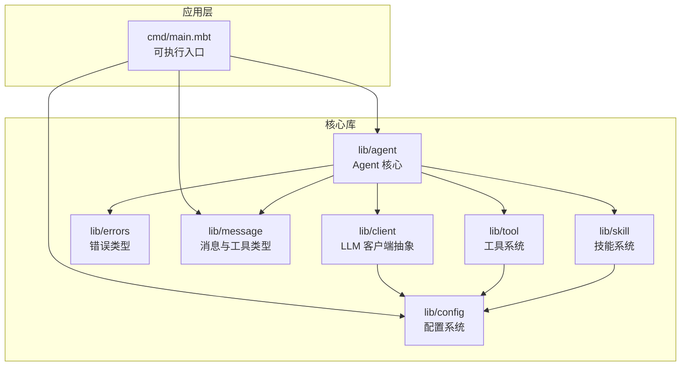
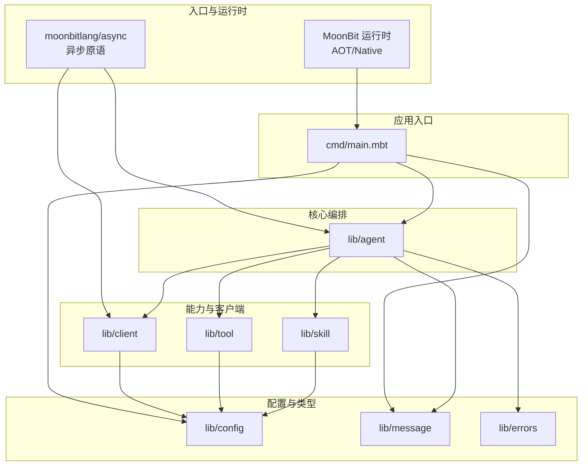
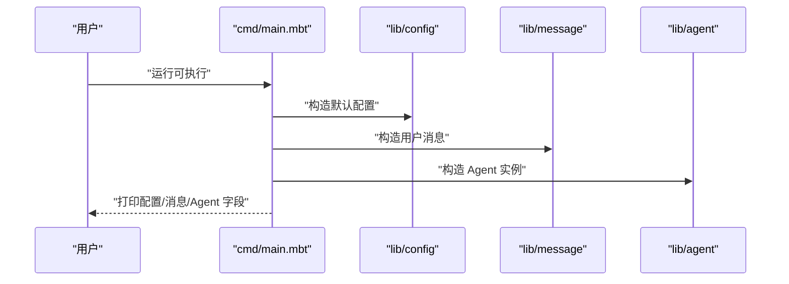
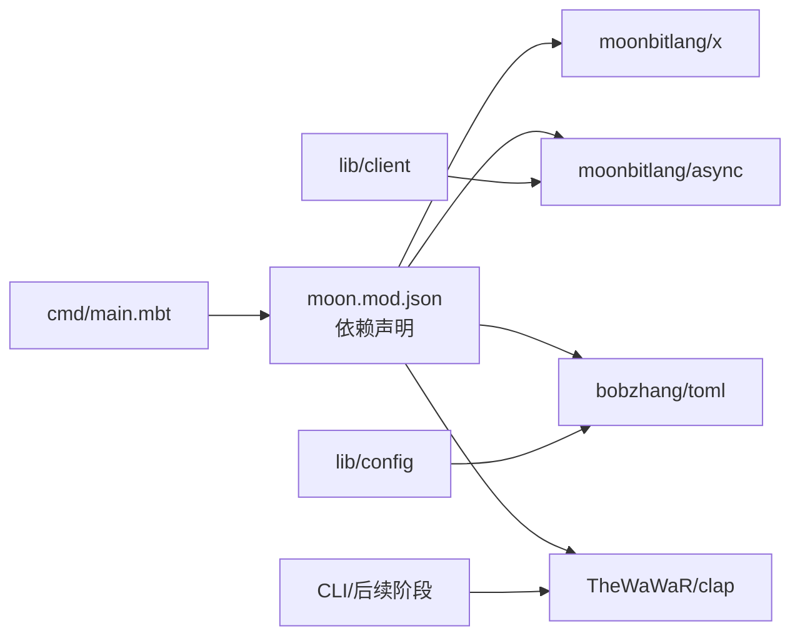

# 核心模块

<cite>
**本文引用的文件**
- [README.md](file://README.md)
- [moon.mod.json](file://moon.mod.json)
- [main.mbt](file://cmd/main.mbt)
</cite>

## 目录
1. [引言](#引言)
2. [项目结构](#项目结构)
3. [核心组件](#核心组件)
4. [架构总览](#架构总览)
5. [详细组件分析](#详细组件分析)
6. [依赖分析](#依赖分析)
7. [性能考量](#性能考量)
8. [故障排查指南](#故障排查指南)
9. [结论](#结论)
10. [附录](#附录)

## 引言
本文件为 MBOpenClacky 的核心模块综合性架构文档。项目以 MoonBit 语言重写原 Ruby 项目 openclacky，目标是在保留核心能力（LLM 交互、Agent 对话循环、工具系统、技能系统、多后端 LLM 抽象、CLI 与 Web UI）的同时，利用 MoonBit 的类型系统、AOT 编译、异步原语与包可见性，构建更安全、更高效、更易演化的工程结构。

项目采用“自底向上”的开发路线，当前处于脚手架与核心类型阶段（Phase 0），后续将逐步实现配置系统、HTTP 客户端与 LLM API、工具系统、Agent 核心、CLI/TUI/Web 等模块。

章节来源
- [README.md:1-181](file://README.md#L1-L181)

## 项目结构
项目采用按领域划分的模块化布局，核心模块包括：
- cmd：可执行入口，负责初始化核心类型并进行最小化验证
- lib/agent：Agent 核心（会话、状态、对话循环）
- lib/client：LLM API 客户端抽象
- lib/config：配置加载（TOML / 环境变量 / 路径）
- lib/errors：统一错误类型层次
- lib/message：消息与工具调用等核心类型
- lib/skill：技能系统（可扩展能力）
- lib/tool：工具系统（文件读写、Shell 等）

图表来源
- [README.md:83-108](file://README.md#L83-L108)
- [main.mbt:1-27](file://cmd/main.mbt#L1-L27)

章节来源
- [README.md:83-108](file://README.md#L83-L108)
- [moon.mod.json:1-16](file://moon.mod.json#L1-L16)
- [main.mbt:1-27](file://cmd/main.mbt#L1-L27)

## 核心组件
- cmd/main.mbt：当前仅进行核心类型的最小化自检，验证配置、消息与 Agent 实例的构造与基本字段输出，确保脚手架与类型系统工作正常。
- lib/message：定义消息、角色、工具调用与工具结果等核心数据结构，作为 Agent 与 LLM/工具交互的数据契约。
- lib/config：负责从 TOML、环境变量与路径加载配置，为其他模块提供统一配置源。
- lib/client：抽象 LLM 后端接口，屏蔽不同供应商（如 OpenAI、Anthropic 等）差异，支持同步与流式响应（SSE）。
- lib/tool：提供可扩展的工具系统，支持内置工具与未来扩展。
- lib/skill：提供可扩展的“技能”机制，用于封装复杂能力与流程。
- lib/agent：在上述模块之上实现对话循环、工具调用调度、成本追踪与状态管理。
- lib/errors：统一错误类型层次，结合 MoonBit 的 checked error handling，提升可靠性。

章节来源
- [main.mbt:8-22](file://cmd/main.mbt#L8-L22)
- [README.md:93-99](file://README.md#L93-L99)

## 架构总览
系统采用“模块化分层 + 组合式接口”的架构模式：
- 分层：cmd -> config/message -> client/tool/skill -> agent
- 组合：通过 struct + trait 的组合模式替代 Ruby 的 mixin，明确能力边界与依赖
- 抽象：client 层抽象 LLM 后端差异，tool/skill 层抽象可扩展能力，agent 层编排对话与工具调用
- 异步：借助 moonbitlang/async 的统一异步原语，简化并发与流式处理

图表来源
- [README.md:71-76](file://README.md#L71-L76)
- [README.md:93-99](file://README.md#L93-L99)
- [moon.mod.json:4-8](file://moon.mod.json#L4-L8)

## 详细组件分析

### 组件：cmd/main.mbt
- 职责：最小化验证核心类型构造与字段输出，确保脚手架与类型系统可用
- 关键交互：构造默认配置、用户消息与 Agent 实例，打印关键字段值
- 设计要点：通过入口验证类型系统与模块可见性，为后续阶段提供稳定基座

图表来源
- [main.mbt:8-22](file://cmd/main.mbt#L8-L22)

章节来源
- [main.mbt:1-27](file://cmd/main.mbt#L1-L27)

### 组件：lib/message（消息与工具类型）
- 职责：定义消息、角色、工具调用与工具结果等核心数据结构
- 交互：被 agent、client、tool/skill 等模块消费，作为数据契约
- 设计要点：以结构体与枚举表达核心领域对象，配合 checked error handling 保证数据一致性

章节来源
- [README.md:97](file://README.md#L97)

### 组件：lib/config（配置系统）
- 职责：从 TOML、环境变量与路径加载配置，提供统一配置源
- 依赖：使用 bobzhang/toml 进行 TOML 解析
- 设计要点：配置优先级与覆盖策略需在后续阶段明确，当前为抽象层

章节来源
- [README.md:95](file://README.md#L95)
- [moon.mod.json:7](file://moon.mod.json#L7)

### 组件：lib/client（LLM 客户端抽象）
- 职责：抽象 LLM 后端差异，支持同步与流式响应（SSE）
- 依赖：moonbitlang/async 提供统一异步原语
- 设计要点：通过 trait 将“请求/响应”与“流式处理”解耦，便于接入多供应商

章节来源
- [README.md:94](file://README.md#L94)
- [README.md:71-76](file://README.md#L71-L76)
- [moon.mod.json:6](file://moon.mod.json#L6)

### 组件：lib/tool（工具系统）
- 职责：提供可扩展的工具集合，支持文件读写、Shell 等内置能力
- 设计要点：通过 trait 定义工具接口，便于未来扩展与第三方集成

章节来源
- [README.md:99](file://README.md#L99)

### 组件：lib/skill（技能系统）
- 职责：提供可扩展的“技能”机制，封装复杂能力与流程
- 设计要点：与 tool 协同，skill 更偏向“业务流程”，tool 更偏向“原子操作”

章节来源
- [README.md:98](file://README.md#L98)

### 组件：lib/agent（Agent 核心）
- 职责：实现对话循环、工具调用调度、成本追踪与状态管理
- 交互：依赖 client、tool、skill、message、errors 等模块
- 设计要点：以 struct + trait 组合替代 mixin，明确扩展点与依赖边界

章节来源
- [README.md:93](file://README.md#L93)

### 组件：lib/errors（错误类型）
- 职责：统一错误类型层次，结合 checked error handling 提升可靠性
- 设计要点：为所有模块提供一致的错误传播与处理约定

章节来源
- [README.md:96](file://README.md#L96)

## 依赖分析
- MoonBit 工具链与目标：preferred-target 为 native，要求 moon 工具链版本满足脚手架阶段需求
- 第三方依赖：
  - moonbitlang/x：基础库与工具
  - moonbitlang/async：异步原语（HTTP、WebSocket、Process）
  - bobzhang/toml：TOML 解析
  - TheWaWaR/clap：CLI 参数解析
- 依赖管理：通过 moon.mod.json 声明，moon update/install 提供可复现构建

图表来源
- [moon.mod.json:4-8](file://moon.mod.json#L4-L8)
- [README.md:71-76](file://README.md#L71-L76)

章节来源
- [moon.mod.json:1-16](file://moon.mod.json#L1-L16)
- [README.md:110-117](file://README.md#L110-L117)

## 性能考量
- 启动与运行时：AOT 编译到原生代码，相较 Ruby 解释执行显著降低启动与运行延迟
- 内存占用：无 VM 与 GC 元数据负担，二进制可分发，部署更轻量
- 异步与并发：借助 moonbitlang/async 的统一异步原语，简化流式 LLM 响应与并发工具调用
- 类型安全：静态强类型 + 代数数据类型 + checked error handling，减少运行时开销与故障面

章节来源
- [README.md:58-70](file://README.md#L58-L70)

## 故障排查指南
- 类型与语法检查：使用 moon check 快速发现类型与语法问题
- 构建与运行：使用 moon build 与 moon run 验证可执行文件生成与运行
- 依赖更新：使用 moon update 与 moon install 更新与安装依赖
- 日志与调试：在 cmd/main.mbt 中添加最小化日志输出，验证核心类型初始化是否成功

章节来源
- [README.md:125-129](file://README.md#L125-L129)
- [README.md:131-139](file://README.md#L131-L139)
- [README.md:141-149](file://README.md#L141-L149)
- [main.mbt:1-27](file://cmd/main.mbt#L1-L27)

## 结论
MBOpenClacky 以 MoonBit 重构 openclacky，通过模块化分层与 struct + trait 的组合模式，实现了更清晰的职责边界、更强的类型安全与更好的可维护性。当前处于脚手架与核心类型阶段，后续将按阶段推进配置、HTTP 客户端、工具与技能系统、Agent 核心与界面层，逐步形成完整的 AI Agent CLI 工具链。

## 附录
- 开发路线（节选）：按 12 阶段自底向上推进，当前处于 Phase 0（脚手架 + 核心类型）
- 环境要求：MoonBit 工具链与 native 目标，支持 Windows/macOS/Linux
- 许可证：MIT，与上游保持一致

章节来源
- [README.md:159-177](file://README.md#L159-L177)
- [README.md:110-117](file://README.md#L110-L117)
- [README.md:17-26](file://README.md#L17-L26)