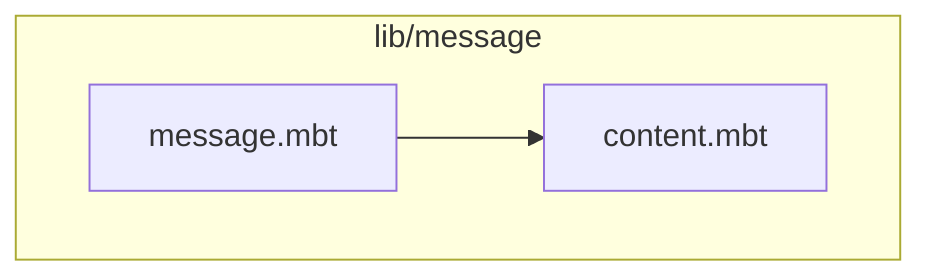
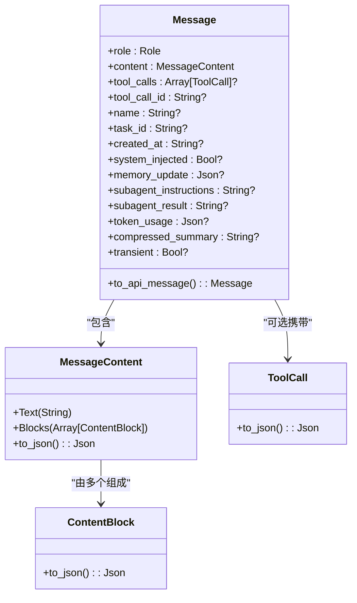
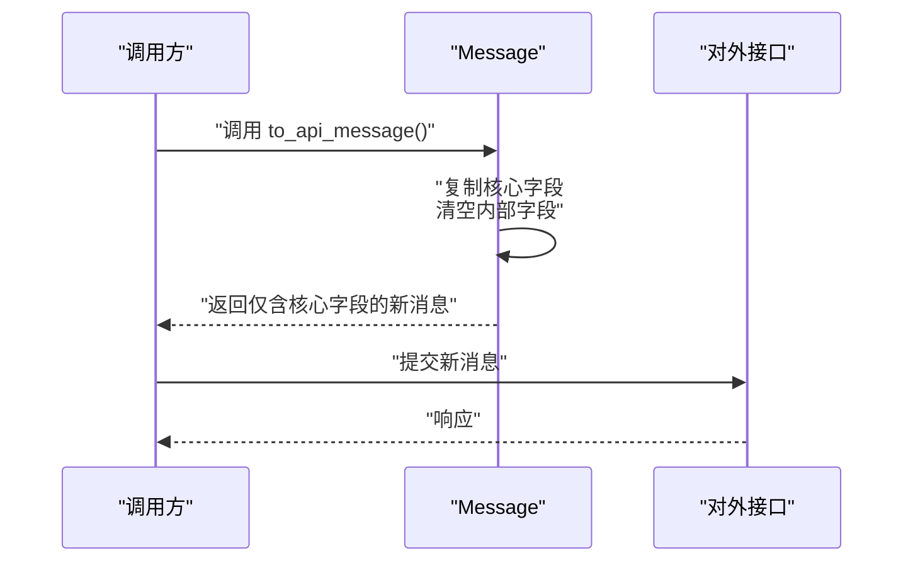
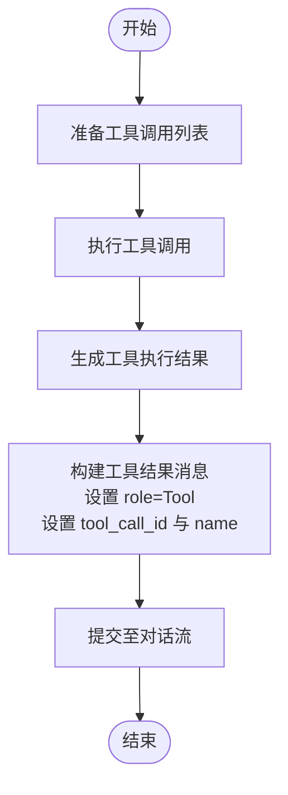
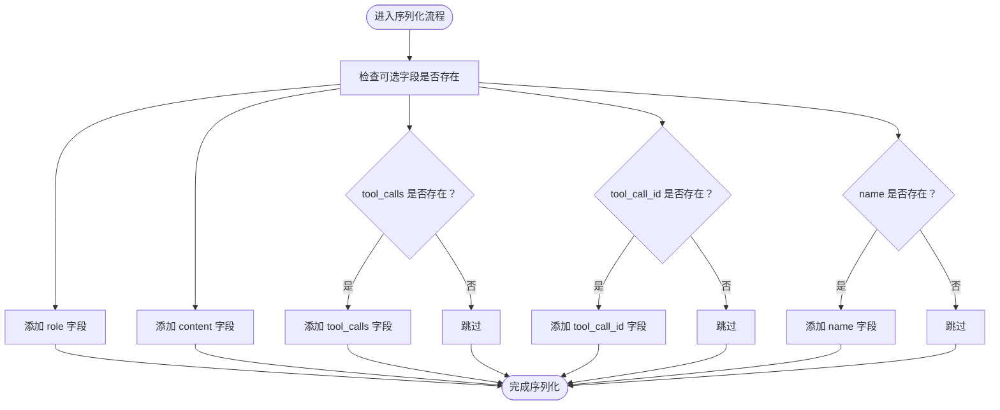
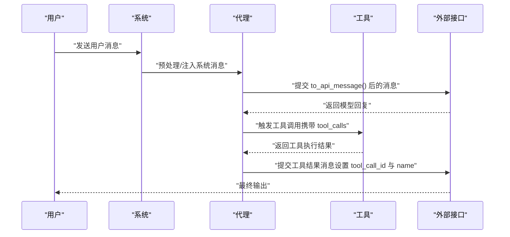
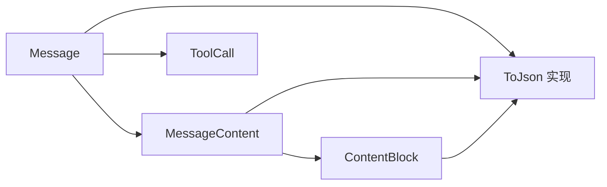

# 消息处理

<cite>
**本文引用的文件**
- [message.mbt](file://lib/message/message.mbt)
- [content.mbt](file://lib/message/content.mbt)
</cite>

## 目录
1. [简介](#简介)
2. [项目结构](#项目结构)
3. [核心组件](#核心组件)
4. [架构总览](#架构总览)
5. [详细组件分析](#详细组件分析)
6. [依赖分析](#依赖分析)
7. [性能考虑](#性能考虑)
8. [故障排查指南](#故障排查指南)
9. [结论](#结论)
10. [附录](#附录)

## 简介
本文件面向消息处理模块，围绕消息结构体 Message 的设计与实现进行系统化技术文档编写。重点涵盖以下方面：
- 四种角色类型（用户、助手、系统、工具）的语义与用途
- 内容块系统 MessageContent 的设计，支持纯文本与复杂内容结构
- to_api_message() 方法的实现原理与 API 兼容性处理
- 工具调用 ToolCall 的函数调用机制与参数传递
- 消息序列化、反序列化与格式转换的实践路径
- 消息在代理系统中的流转过程与数据一致性保障

## 项目结构
消息处理模块位于 lib/message 目录，包含两个关键源文件：
- message.mbt：定义消息主体 Message、角色枚举 Role、消息内容 MessageContent 及其序列化逻辑
- content.mbt：定义内容块 ContentBlock 的结构与序列化逻辑

图表来源
- [message.mbt:1-165](file://lib/message/message.mbt#L1-L165)
- [content.mbt:1-60](file://lib/message/content.mbt#L1-L60)

章节来源
- [message.mbt:1-165](file://lib/message/message.mbt#L1-L165)
- [content.mbt:1-60](file://lib/message/content.mbt#L1-L60)

## 核心组件
本节从设计与实现角度，系统梳理消息处理模块的核心类型与方法。

- 角色枚举 Role
  - 用户（User）：代表来自外部用户的输入或请求
  - 助手（Assistant）：代表模型生成的回复或中间推理结果
  - 系统（System）：代表系统级提示词或上下文注入
  - 工具（Tool）：代表工具执行后的结果回传

- 消息内容 MessageContent
  - 支持两种形式：纯文本（Text）与内容块数组（Blocks）
  - 序列化时直接委托给底层实现，保持与 API 的兼容性

- 消息结构体 Message
  - 核心字段（发送到 API）：role、content、tool_calls、tool_call_id、name
  - 内部字段（提交 API 前会被剥离）：task_id、created_at、system_injected、memory_update、subagent_instructions、subagent_result、token_usage、compressed_summary、transient
  - 提供 to_api_message() 方法用于生成仅包含核心字段的消息副本，确保对外接口的一致性与安全性

- 工具调用 ToolCall
  - 作为消息的一部分，通过 Message 的 tool_calls 字段承载
  - 参数传递与调用细节由工具系统负责，消息层仅负责承载与序列化

- 内容块 ContentBlock
  - 作为复杂内容结构的基础单元，支持多模态或多片段内容
  - 序列化时按各自类型进行 JSON 转换

章节来源
- [message.mbt:2-6](file://lib/message/message.mbt#L2-L6)
- [message.mbt:16-37](file://lib/message/message.mbt#L16-L37)
- [message.mbt:39-55](file://lib/message/message.mbt#L39-L55)
- [message.mbt:146-164](file://lib/message/message.mbt#L146-L164)
- [content.mbt:17-39](file://lib/message/content.mbt#L17-L39)

## 架构总览
消息处理模块采用“内容即结构”的设计思路：Message 以 MessageContent 承载内容，MessageContent 可为纯文本或内容块数组；内容块 ContentBlock 则进一步扩展为复杂内容结构。序列化阶段，Message 将核心字段映射为 JSON 对象，并根据是否存在可选字段决定是否包含某些键值对。to_api_message() 方法则在提交前对内部字段进行清理，确保对外输出符合 API 规范。

图表来源
- [message.mbt:2-6](file://lib/message/message.mbt#L2-L6)
- [message.mbt:16-37](file://lib/message/message.mbt#L16-L37)
- [message.mbt:39-55](file://lib/message/message.mbt#L39-L55)
- [message.mbt:146-164](file://lib/message/message.mbt#L146-L164)
- [content.mbt:17-39](file://lib/message/content.mbt#L17-L39)

## 详细组件分析

### 角色类型与用途
- 用户（User）：用于承载用户输入，通常为自然语言文本
- 助手（Assistant）：用于承载模型生成的回复或中间推理结果
- 系统（System）：用于注入系统级提示词或上下文信息
- 工具（Tool）：用于承载工具执行后的结果，需配合 tool_call_id 与 name 进行关联

章节来源
- [message.mbt:59-76](file://lib/message/message.mbt#L59-L76)
- [message.mbt:80-97](file://lib/message/message.mbt#L80-L97)
- [message.mbt:101-118](file://lib/message/message.mbt#L101-L118)
- [message.mbt:122-143](file://lib/message/message.mbt#L122-L143)

### 内容块系统 MessageContent
- 纯文本（Text）：最简内容表达，适合简单回复或提示
- 复杂内容（Blocks）：由多个 ContentBlock 组成，支持更丰富的结构化内容
- 序列化策略：Text 直接序列化为字符串；Blocks 序列化为数组

章节来源
- [message.mbt:2-6](file://lib/message/message.mbt#L2-L6)
- [message.mbt:9-14](file://lib/message/message.mbt#L9-L14)
- [content.mbt:17-39](file://lib/message/content.mbt#L17-L39)

### to_api_message() 实现与 API 兼容性
- 目标：在提交 API 前剥离内部字段，仅保留核心字段
- 行为：复制原始消息的 role、content、tool_calls、tool_call_id、name，并将所有内部字段置空
- 作用：确保对外输出与 API 规范一致，避免泄露内部状态

图表来源
- [message.mbt:146-164](file://lib/message/message.mbt#L146-L164)

章节来源
- [message.mbt:146-164](file://lib/message/message.mbt#L146-L164)

### 工具调用机制与参数传递
- 工具调用通过 Message 的 tool_calls 字段承载，类型为可选数组
- 工具执行后，结果以工具消息（Tool 角色）回传，并设置 tool_call_id 与 name 以便关联
- 参数传递：工具调用的具体参数由工具系统解析与执行，消息层仅负责承载与序列化

图表来源
- [message.mbt:122-143](file://lib/message/message.mbt#L122-L143)
- [message.mbt:24-25](file://lib/message/message.mbt#L24-L25)

章节来源
- [message.mbt:122-143](file://lib/message/message.mbt#L122-L143)
- [message.mbt:24-25](file://lib/message/message.mbt#L24-L25)

### 消息序列化与格式转换
- Message 的序列化：核心字段 role、content 必填；tool_calls、tool_call_id、name 在存在时才加入对象
- MessageContent 的序列化：Text 直接序列化为字符串；Blocks 序列化为数组
- ContentBlock 的序列化：按各自类型进行 JSON 转换
- to_api_message()：在序列化前生成仅包含核心字段的消息副本，确保对外输出符合 API 规范

图表来源
- [message.mbt:39-55](file://lib/message/message.mbt#L39-L55)
- [message.mbt:9-14](file://lib/message/message.mbt#L9-L14)
- [content.mbt:17-39](file://lib/message/content.mbt#L17-L39)

章节来源
- [message.mbt:39-55](file://lib/message/message.mbt#L39-L55)
- [message.mbt:9-14](file://lib/message/message.mbt#L9-L14)
- [content.mbt:17-39](file://lib/message/content.mbt#L17-L39)

### 消息在代理系统中的流转与一致性
- 输入阶段：用户消息（User）进入系统，可能被系统消息（System）预处理或增强
- 推理阶段：助手消息（Assistant）承载模型输出；若涉及工具调用，则在消息中携带 tool_calls
- 工具阶段：工具消息（Tool）回传执行结果，通过 tool_call_id 与对应调用建立关联
- 输出阶段：to_api_message() 清理内部字段，确保对外输出符合 API 规范
- 一致性保障：通过固定的核心字段集与严格的序列化规则，保证消息在不同阶段与不同系统间的可解析性与可追溯性

图表来源
- [message.mbt:146-164](file://lib/message/message.mbt#L146-L164)
- [message.mbt:122-143](file://lib/message/message.mbt#L122-L143)
- [message.mbt:59-76](file://lib/message/message.mbt#L59-L76)
- [message.mbt:101-118](file://lib/message/message.mbt#L101-L118)

章节来源
- [message.mbt:146-164](file://lib/message/message.mbt#L146-L164)
- [message.mbt:122-143](file://lib/message/message.mbt#L122-L143)
- [message.mbt:59-76](file://lib/message/message.mbt#L59-L76)
- [message.mbt:101-118](file://lib/message/message.mbt#L101-L118)

## 依赖分析
- Message 依赖 MessageContent 作为内容容器
- MessageContent 依赖 ContentBlock 作为复杂内容的基础单元
- Message 的序列化逻辑依赖 ToJson 实现
- to_api_message() 依赖 Message 的字段复制与清理

图表来源
- [message.mbt:2-6](file://lib/message/message.mbt#L2-L6)
- [message.mbt:16-37](file://lib/message/message.mbt#L16-L37)
- [message.mbt:39-55](file://lib/message/message.mbt#L39-L55)
- [message.mbt:146-164](file://lib/message/message.mbt#L146-L164)
- [content.mbt:17-39](file://lib/message/content.mbt#L17-L39)

章节来源
- [message.mbt:2-6](file://lib/message/message.mbt#L2-L6)
- [message.mbt:16-37](file://lib/message/message.mbt#L16-L37)
- [message.mbt:39-55](file://lib/message/message.mbt#L39-L55)
- [message.mbt:146-164](file://lib/message/message.mbt#L146-L164)
- [content.mbt:17-39](file://lib/message/content.mbt#L17-L39)

## 性能考虑
- 序列化开销：Message 的序列化仅包含核心字段与必要的可选字段，避免不必要的数据传输
- 内容块处理：ContentBlock 的序列化按类型进行，建议在构建内容块时尽量减少层级深度与冗余字段
- 工具调用批量化：当存在多个工具调用时，优先合并相关操作以减少消息数量与往返次数
- 内存占用：内部字段在 to_api_message() 中被清空，有助于降低对外传输的数据体积

## 故障排查指南
- API 返回字段缺失：确认消息中是否包含 tool_calls、tool_call_id、name 等可选字段，必要时通过 to_api_message() 生成对外消息
- 内容序列化异常：检查 MessageContent 的类型选择（Text 或 Blocks），确保与实际内容结构一致
- 工具调用关联失败：核对工具结果消息中的 tool_call_id 与 name 是否与调用记录一致
- 内部状态泄露：确保在对外提交前调用 to_api_message()，避免内部字段（如 task_id、created_at 等）被意外暴露

章节来源
- [message.mbt:39-55](file://lib/message/message.mbt#L39-L55)
- [message.mbt:146-164](file://lib/message/message.mbt#L146-L164)
- [message.mbt:122-143](file://lib/message/message.mbt#L122-L143)

## 结论
消息处理模块通过清晰的角色划分、灵活的内容块系统与严格的序列化策略，实现了与外部 API 的良好兼容性。to_api_message() 方法在消息流转过程中起到关键的“净化”作用，确保对外输出的稳定性与一致性。结合工具调用机制，消息层能够有效承载复杂交互场景下的多模态内容与函数式调用，为代理系统的可靠运行提供基础支撑。

## 附录
- 代码示例路径（不展示具体代码内容，仅供定位参考）：
  - 创建用户消息：[message.mbt:59-76](file://lib/message/message.mbt#L59-L76)
  - 创建助手消息：[message.mbt:80-97](file://lib/message/message.mbt#L80-L97)
  - 创建系统消息：[message.mbt:101-118](file://lib/message/message.mbt#L101-L118)
  - 创建工具结果消息：[message.mbt:122-143](file://lib/message/message.mbt#L122-L143)
  - 序列化消息内容：[message.mbt:9-14](file://lib/message/message.mbt#L9-L14)
  - 序列化内容块：[content.mbt:17-39](file://lib/message/content.mbt#L17-L39)
  - 生成对外消息副本：[message.mbt:146-164](file://lib/message/message.mbt#L146-L164)