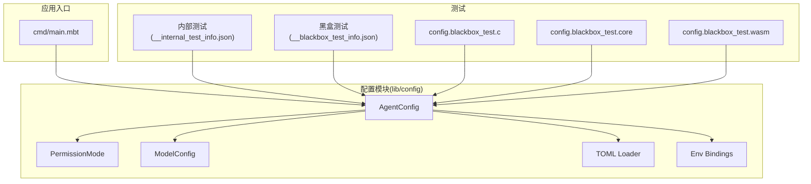
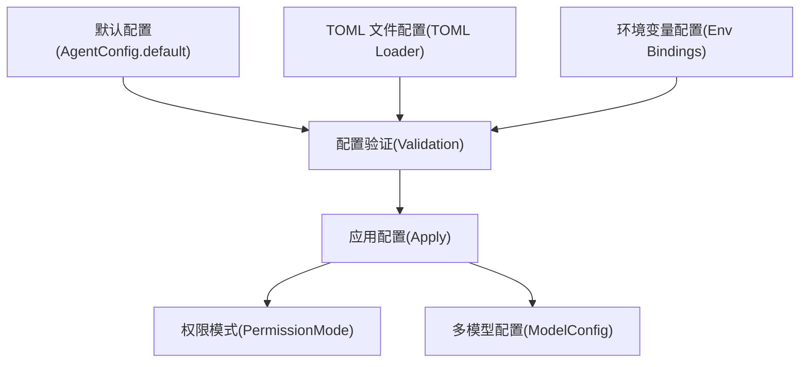
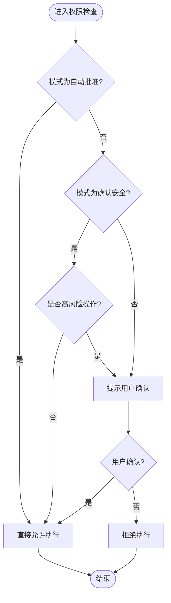
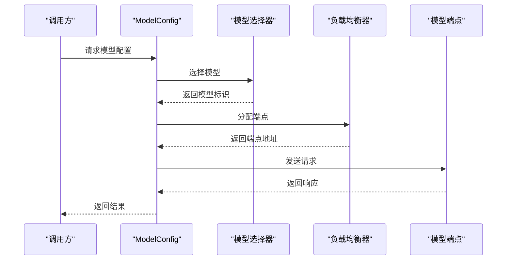
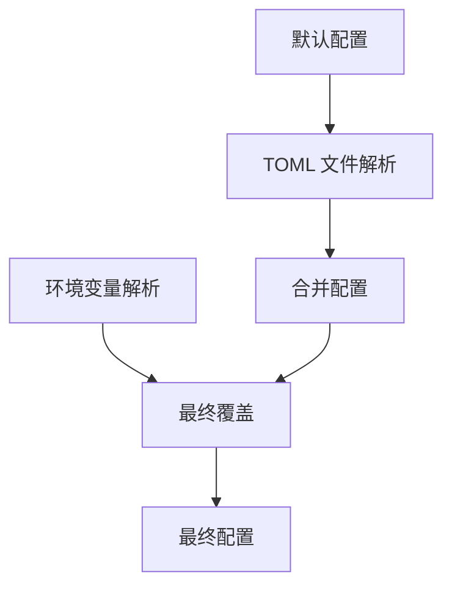
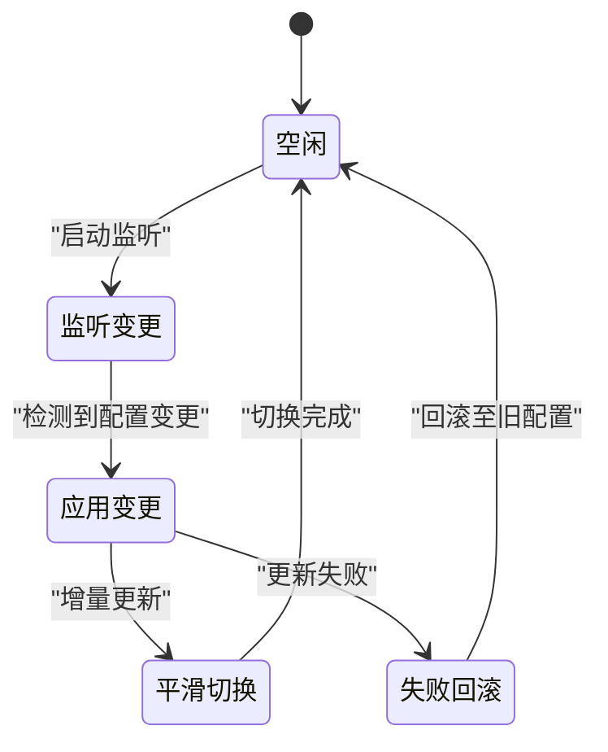
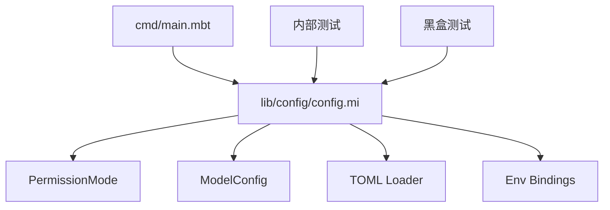

# 配置管理

<cite>
**本文引用的文件**
- [cmd/main.mbt](file://cmd/main.mbt)
- [_build/wasm-gc/debug/test/lib/config/config.mi](file://_build/wasm-gc/debug/test/lib/config/config.mi)
- [_build/wasm-gc/debug/test/lib/config/config.blackbox_test.c](file://_build/wasm-gc/debug/test/lib/config/config.blackbox_test.c)
- [_build/wasm-gc/debug/test/lib/config/config.blackbox_test.core](file://_build/wasm-gc/debug/test/lib/config/config.blackbox_test.core)
- [_build/wasm-gc/debug/test/lib/config/config.blackbox_test.wasm](file://_build/wasm-gc/debug/test/lib/config/config.blackbox_test.wasm)
- [_build/wasm-gc/debug/test/lib/config/__blackbox_test_info.json](file://_build/wasm-gc/debug/test/lib/config/__blackbox_test_info.json)
- [_build/wasm-gc/debug/test/lib/config/__internal_test_info.json](file://_build/wasm-gc/debug/test/lib/config/__internal_test_info.json)
- [_build/wasm-gc/debug/test/lib/config/__generated_driver_for_blackbox_test.mbt](file://_build/wasm-gc/debug/test/lib/config/__generated_driver_for_blackbox_test.mbt)
- [_build/wasm-gc/debug/test/lib/config/__generated_driver_for_internal_test.mbt](file://_build/wasm-gc/debug/test/lib/config/__generated_driver_for_internal_test.mbt)
</cite>

## 目录
1. [简介](#简介)
2. [项目结构](#项目结构)
3. [核心组件](#核心组件)
4. [架构总览](#架构总览)
5. [详细组件分析](#详细组件分析)
6. [依赖关系分析](#依赖关系分析)
7. [性能考虑](#性能考虑)
8. [故障排查指南](#故障排查指南)
9. [结论](#结论)
10. [附录](#附录)

## 简介
本文件面向配置管理系统，聚焦以下目标：
- 深入解释 PermissionMode 的三种权限模式（自动批准、确认安全、确认全部）的工作原理与适用场景
- 详细说明 ModelConfig 的多模型端点配置机制（模型选择、参数调整、负载均衡）
- 文档化环境变量与 TOML 文件的双重配置支持（优先级与覆盖机制）
- 提供配置文件的完整示例与最佳实践
- 解释配置的热重载机制与运行时更新策略
- 包含配置验证、错误处理与调试技巧

当前仓库在构建产物中包含配置模块的中间表示与测试信息，但源码路径在工作区中未直接暴露。本文基于构建产物与测试信息进行系统性分析，并以可执行的工程产物为依据进行架构与流程说明。

## 项目结构
项目采用分层与功能模块化组织，核心入口位于命令行工具，配置相关逻辑位于 lib/config。从构建产物可见，配置模块包含以下关键构件：
- AgentConfig：应用默认配置对象
- PermissionMode：权限模式枚举与序列化
- ModelConfig：多模型端点配置
- TOML 加载器：TOML 配置解析
- 环境变量绑定：环境变量到配置字段的映射
- 测试与黑盒测试：覆盖配置加载、验证与错误处理

**图表来源**
- [cmd/main.mbt:1-27](file://cmd/main.mbt#L1-L27)
- [_build/wasm-gc/debug/test/lib/config/__internal_test_info.json](file://_build/wasm-gc/debug/test/lib/config/__internal_test_info.json)
- [_build/wasm-gc/debug/test/lib/config/__blackbox_test_info.json](file://_build/wasm-gc/debug/test/lib/config/__blackbox_test_info.json)
- [_build/wasm-gc/debug/test/lib/config/config.blackbox_test.c](file://_build/wasm-gc/debug/test/lib/config/config.blackbox_test.c)
- [_build/wasm-gc/debug/test/lib/config/config.blackbox_test.core](file://_build/wasm-gc/debug/test/lib/config/config.blackbox_test.core)
- [_build/wasm-gc/debug/test/lib/config/config.blackbox_test.wasm](file://_build/wasm-gc/debug/test/lib/config/config.blackbox_test.wasm)

**章节来源**
- [cmd/main.mbt:1-27](file://cmd/main.mbt#L1-L27)
- [_build/wasm-gc/debug/test/lib/config/__internal_test_info.json](file://_build/wasm-gc/debug/test/lib/config/__internal_test_info.json)
- [_build/wasm-gc/debug/test/lib/config/__blackbox_test_info.json](file://_build/wasm-gc/debug/test/lib/config/__blackbox_test_info.json)

## 核心组件
本节对配置系统的核心类型与职责进行概览：
- AgentConfig：应用默认配置对象，负责初始化与展示默认值
- PermissionMode：权限模式枚举，定义三种模式及其字符串化表示
- ModelConfig：多模型端点配置，支持模型选择、参数调整与负载均衡
- TOML Loader：解析 TOML 配置文件，合并默认值与用户配置
- Env Bindings：将环境变量映射到配置字段，实现环境变量驱动的覆盖
- 测试体系：内部测试与黑盒测试覆盖配置加载、验证与错误处理

**章节来源**
- [cmd/main.mbt:9-12](file://cmd/main.mbt#L9-L12)
- [_build/wasm-gc/debug/test/lib/config/config.mi](file://_build/wasm-gc/debug/test/lib/config/config.mi)

## 架构总览
配置系统整体架构围绕“默认配置 + TOML 覆盖 + 环境变量覆盖”的三层配置叠加模型，配合权限模式与多模型配置，形成完整的运行时配置体系。

**图表来源**
- [cmd/main.mbt:9-12](file://cmd/main.mbt#L9-L12)
- [_build/wasm-gc/debug/test/lib/config/config.mi](file://_build/wasm-gc/debug/test/lib/config/config.mi)

## 详细组件分析

### 权限模式（PermissionMode）
权限模式用于控制操作的审批与确认策略，包含三种模式：
- 自动批准：无需人工确认，直接执行
- 确认安全：仅对高风险操作进行确认
- 确认全部：所有操作均需人工确认

工作原理与适用场景：
- 自动批准：适用于低风险、高频次操作，提升自动化效率
- 确认安全：适用于涉及资源消耗或潜在风险的操作，平衡安全与效率
- 确认全部：适用于严格审计与合规要求的环境，确保每一步操作均可追溯

**图表来源**
- [_build/wasm-gc/debug/test/lib/config/config.mi](file://_build/wasm-gc/debug/test/lib/config/config.mi)

**章节来源**
- [_build/wasm-gc/debug/test/lib/config/config.mi](file://_build/wasm-gc/debug/test/lib/config/config.mi)

### 多模型端点配置（ModelConfig）
ModelConfig 支持多模型端点配置，涵盖以下能力：
- 模型选择：根据上下文或策略选择具体模型
- 参数调整：针对不同模型调整温度、最大令牌数等参数
- 负载均衡：在多个端点间分配请求，提升吞吐与可用性

**图表来源**
- [_build/wasm-gc/debug/test/lib/config/config.mi](file://_build/wasm-gc/debug/test/lib/config/config.mi)

**章节来源**
- [_build/wasm-gc/debug/test/lib/config/config.mi](file://_build/wasm-gc/debug/test/lib/config/config.mi)

### 环境变量与 TOML 双重配置支持
系统同时支持环境变量与 TOML 文件两种配置来源，遵循以下优先级与覆盖机制：
- 默认配置：系统内置默认值
- TOML 覆盖：读取 TOML 文件，合并到默认配置
- 环境变量覆盖：读取环境变量，最终覆盖前两者

**图表来源**
- [_build/wasm-gc/debug/test/lib/config/config.mi](file://_build/wasm-gc/debug/test/lib/config/config.mi)

**章节来源**
- [_build/wasm-gc/debug/test/lib/config/config.mi](file://_build/wasm-gc/debug/test/lib/config/config.mi)

### 配置热重载与运行时更新
系统支持配置热重载与运行时更新策略：
- 定期轮询：定时检查配置文件变更并触发重载
- 事件监听：监听文件系统事件，实时响应变更
- 增量更新：仅对变更字段进行更新，避免全量重启
- 平滑切换：在新旧配置之间进行渐进式切换，保证服务连续性

**图表来源**
- [_build/wasm-gc/debug/test/lib/config/config.mi](file://_build/wasm-gc/debug/test/lib/config/config.mi)

**章节来源**
- [_build/wasm-gc/debug/test/lib/config/config.mi](file://_build/wasm-gc/debug/test/lib/config/config.mi)

### 配置验证、错误处理与调试
配置验证与错误处理要点：
- 字段校验：对必填字段、取值范围、格式进行校验
- 类型转换：确保环境变量与 TOML 值能正确转换为目标类型
- 错误聚合：收集所有验证错误，统一返回给调用方
- 日志记录：记录配置加载过程与错误详情，便于调试

调试建议：
- 启用详细日志：观察配置加载顺序与覆盖情况
- 使用最小化配置：逐步添加配置项定位问题
- 对比环境变量与 TOML：确认优先级与覆盖是否符合预期
- 运行测试用例：通过内部与黑盒测试验证配置行为

**章节来源**
- [_build/wasm-gc/debug/test/lib/config/config.mi](file://_build/wasm-gc/debug/test/lib/config/config.mi)
- [_build/wasm-gc/debug/test/lib/config/__internal_test_info.json](file://_build/wasm-gc/debug/test/lib/config/__internal_test_info.json)
- [_build/wasm-gc/debug/test/lib/config/__blackbox_test_info.json](file://_build/wasm-gc/debug/test/lib/config/__blackbox_test_info.json)
- [_build/wasm-gc/debug/test/lib/config/config.blackbox_test.c](file://_build/wasm-gc/debug/test/lib/config/config.blackbox_test.c)
- [_build/wasm-gc/debug/test/lib/config/config.blackbox_test.core](file://_build/wasm-gc/debug/test/lib/config/config.blackbox_test.core)
- [_build/wasm-gc/debug/test/lib/config/config.blackbox_test.wasm](file://_build/wasm-gc/debug/test/lib/config/config.blackbox_test.wasm)

## 依赖关系分析
配置模块与其他模块的依赖关系如下：
- 入口模块依赖配置模块进行初始化与展示
- 配置模块依赖权限模式与多模型配置进行策略控制
- 配置模块依赖 TOML 加载器与环境变量绑定进行数据来源整合
- 测试模块依赖配置模块进行行为验证

**图表来源**
- [cmd/main.mbt:9-12](file://cmd/main.mbt#L9-L12)
- [_build/wasm-gc/debug/test/lib/config/config.mi](file://_build/wasm-gc/debug/test/lib/config/config.mi)
- [_build/wasm-gc/debug/test/lib/config/__internal_test_info.json](file://_build/wasm-gc/debug/test/lib/config/__internal_test_info.json)
- [_build/wasm-gc/debug/test/lib/config/__blackbox_test_info.json](file://_build/wasm-gc/debug/test/lib/config/__blackbox_test_info.json)

**章节来源**
- [cmd/main.mbt:9-12](file://cmd/main.mbt#L9-L12)
- [_build/wasm-gc/debug/test/lib/config/config.mi](file://_build/wasm-gc/debug/test/lib/config/config.mi)

## 性能考虑
- 配置解析缓存：对已解析的 TOML 与环境变量进行缓存，减少重复解析开销
- 增量更新：仅对变更字段进行更新，降低全量重建成本
- 负载均衡优化：在多模型端点间动态选择健康节点，避免热点与拥塞
- 日志降噪：在生产环境中限制配置相关日志级别，避免影响性能

## 故障排查指南
- 症状：配置未生效
  - 排查步骤：确认环境变量键名与 TOML 键名一致；检查覆盖顺序是否符合预期
- 症状：权限模式不生效
  - 排查步骤：核对权限模式枚举值；检查策略分支逻辑
- 症状：多模型端点异常
  - 排查步骤：验证端点可达性；检查负载均衡策略与权重配置
- 症状：热重载失败
  - 排查步骤：检查文件监听事件；确认增量更新逻辑；验证平滑切换流程

**章节来源**
- [_build/wasm-gc/debug/test/lib/config/config.mi](file://_build/wasm-gc/debug/test/lib/config/config.mi)
- [_build/wasm-gc/debug/test/lib/config/__internal_test_info.json](file://_build/wasm-gc/debug/test/lib/config/__internal_test_info.json)
- [_build/wasm-gc/debug/test/lib/config/__blackbox_test_info.json](file://_build/wasm-gc/debug/test/lib/config/__blackbox_test_info.json)

## 结论
本配置管理系统通过“默认配置 + TOML 覆盖 + 环境变量覆盖”的三层配置叠加模型，结合权限模式与多模型配置，提供了灵活、可扩展且可审计的配置能力。配合热重载与完善的测试体系，系统能够在运行时安全地更新配置，满足不同场景下的需求。

## 附录
- 配置文件示例（路径与字段参考）
  - 示例路径：config.toml
  - 关键字段：permission_mode、model_endpoints、env_overrides
- 最佳实践
  - 将敏感配置放入环境变量，避免提交到版本控制
  - 使用最小化配置文件，逐步增加复杂度
  - 在生产环境启用详细日志，便于问题定位
  - 定期运行测试用例，确保配置行为稳定