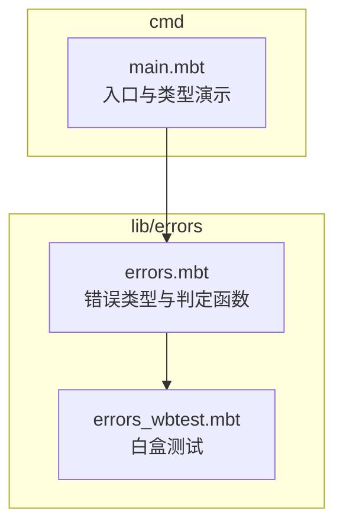
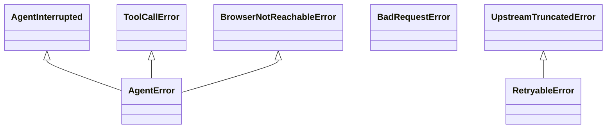
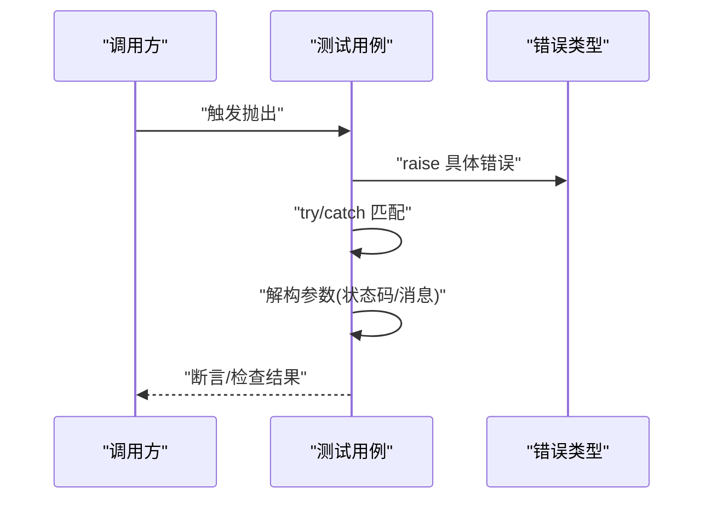
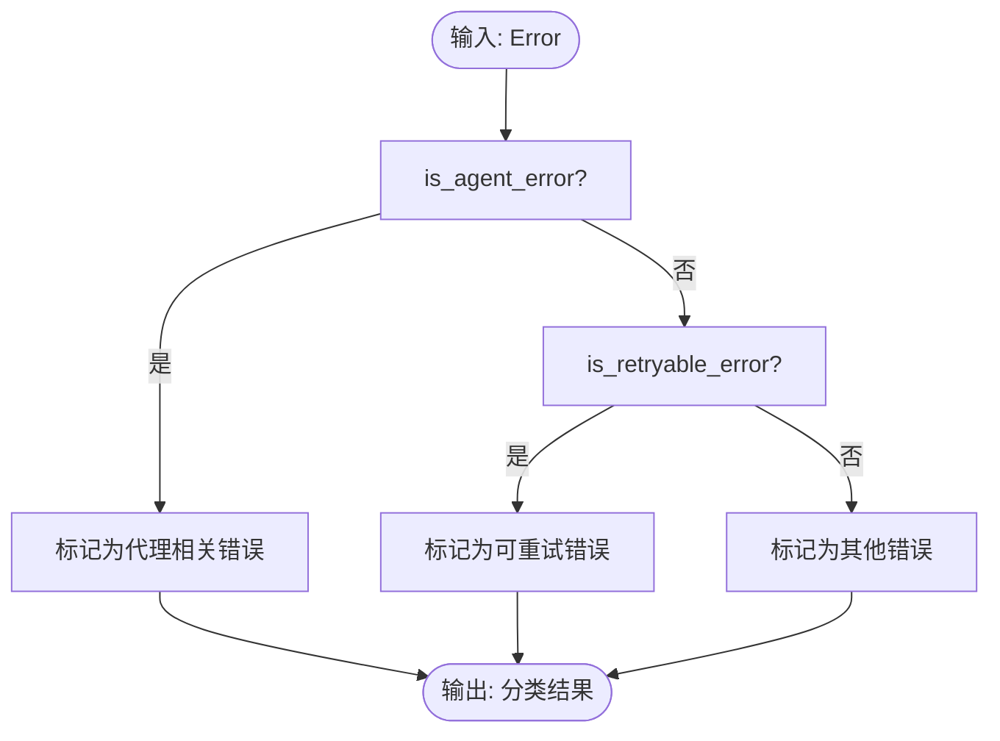
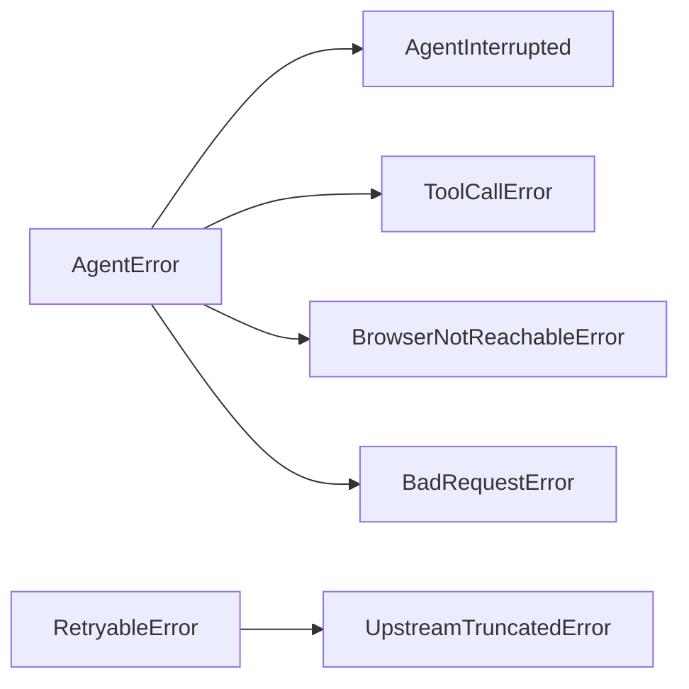

# 错误处理

<cite>
**本文引用的文件**
- [lib/errors/errors.mbt](file://lib/errors/errors.mbt)
- [lib/errors/errors_wbtest.mbt](file://lib/errors/errors_wbtest.mbt)
- [cmd/main.mbt](file://cmd/main.mbt)
</cite>

## 目录
1. [引言](#引言)
2. [项目结构](#项目结构)
3. [核心组件](#核心组件)
4. [架构总览](#架构总览)
5. [详细组件分析](#详细组件分析)
6. [依赖关系分析](#依赖关系分析)
7. [性能考量](#性能考量)
8. [故障排查指南](#故障排查指南)
9. [结论](#结论)
10. [附录](#附录)

## 引言
本技术文档聚焦于项目中的错误处理模块，系统阐述统一错误类型层次结构的设计理念、错误分类与判定函数、错误信息格式化能力，以及在当前代码库中可观察到的错误传播机制（抛出与捕获）、上下文保留与堆栈跟踪现状。同时，结合现有错误类型，给出常见错误场景的处理策略建议、最佳实践指引、日志与监控告警思路、调试支持方案，以及测试策略与质量保证措施。

## 项目结构
错误处理模块位于 lib/errors 目录，包含错误类型定义与配套的白盒测试用例；命令行入口文件 cmd/main.mbt 展示了基础类型初始化流程，便于理解错误类型在整个应用生命周期中的使用位置。

**图表来源**
- [lib/errors/errors.mbt](file://lib/errors/errors.mbt)
- [lib/errors/errors_wbtest.mbt](file://lib/errors/errors_wbtest.mbt)
- [cmd/main.mbt](file://cmd/main.mbt)

**章节来源**
- [lib/errors/errors.mbt](file://lib/errors/errors.mbt)
- [lib/errors/errors_wbtest.mbt](file://lib/errors/errors_wbtest.mbt)
- [cmd/main.mbt](file://cmd/main.mbt)

## 核心组件
- 统一错误类型层次结构
  - 基础错误：AgentError
  - 用户中断：AgentInterrupted
  - 工具调用错误：ToolCallError
  - 浏览器不可达：BrowserNotReachableError
  - HTTP 客户端错误：BadRequestError
  - 可重试错误：RetryableError
  - 上游截断错误：UpstreamTruncatedError
- 判定函数
  - is_agent_error：判断是否属于 AgentError 家族
  - is_retryable_error：判断是否属于可重试错误家族

这些类型均派生了 Debug 能力，并在部分类型上派生了 ToJson 能力，便于序列化与调试输出。

**章节来源**
- [lib/errors/errors.mbt](file://lib/errors/errors.mbt)

## 架构总览
错误类型与判定函数共同构成“类型分层 + 分类判定”的错误处理架构。上层业务逻辑通过抛出具体错误类型表达失败语义，下层通过判定函数进行分类处理（如区分是否可重试、是否属于 Agent 家族），从而决定后续的重试、降级或终止策略。

**图表来源**
- [lib/errors/errors.mbt](file://lib/errors/errors.mbt)

## 详细组件分析

### 错误类型层次与设计要点
- 分层设计
  - 将“用户中断”“工具调用失败”“浏览器不可达”“HTTP 客户端错误”等归入 AgentError 家族，体现与代理执行流程强相关性。
  - 将“可重试错误”“上游截断错误”独立为可重试家族，便于统一的退避与重试策略。
- 数据承载
  - 部分错误类型携带状态码与消息，便于下游根据状态码采取差异化处理。
- 序列化与调试
  - 多数类型派生 Debug，利于日志打印与调试。
  - 部分类型派生 ToJson，便于在需要时进行结构化输出。

**章节来源**
- [lib/errors/errors.mbt](file://lib/errors/errors.mbt)

### 错误传播机制（抛出与捕获）
- 抛出与捕获
  - 白盒测试展示了对各错误类型的抛出与捕获，验证了模式匹配的正确性与上下文提取能力。
- 上下文保留
  - 捕获分支能够解构并保留错误携带的参数（如状态码、工具名、消息），用于后续处理或日志记录。
- 堆栈跟踪
  - 当前仓库未发现显式的堆栈跟踪记录与传播实现；若需增强，可在捕获后追加上下文并重新抛出，或引入专用的上下文包装器以保留原始堆栈。

**图表来源**
- [lib/errors/errors_wbtest.mbt](file://lib/errors/errors_wbtest.mbt)

**章节来源**
- [lib/errors/errors_wbtest.mbt](file://lib/errors/errors_wbtest.mbt)

### 错误分类与判定函数
- is_agent_error
  - 将 AgentError、BadRequestError、ToolCallError、BrowserNotReachableError 归为一类，便于统一处理代理相关错误。
- is_retryable_error
  - 将 RetryableError、UpstreamTruncatedError 归为一类，便于统一重试策略。

**图表来源**
- [lib/errors/errors.mbt](file://lib/errors/errors.mbt)

**章节来源**
- [lib/errors/errors.mbt](file://lib/errors/errors.mbt)

### 常见错误场景的处理策略（基于现有类型）
- 网络异常
  - 现状：仓库未直接暴露网络错误类型。
  - 建议：若出现连接失败、超时、TLS 错误等，可映射为 RetryableError 或在上层捕获后转换为 RetryableError 并记录状态码与消息，以便统一重试。
- API 错误
  - 现状：存在 BadRequestError（携带状态码与消息）。
  - 建议：根据状态码决定是否重试或终止；对于 4xx 非 429/5xx，通常不重试；对于 429/5xx，纳入 RetryableError 家族统一处理。
- 配置错误
  - 现状：仓库未直接暴露配置错误类型。
  - 建议：将配置校验失败封装为 AgentError 子类，避免与运行时错误混淆；在入口处尽早校验并提示用户修正。
- 权限错误
  - 现状：仓库未直接暴露权限错误类型。
  - 建议：将鉴权失败或权限不足封装为 AgentError 子类，明确区分于网络与上游错误，便于用户反馈与日志定位。

[本节为策略建议，不直接分析具体文件，故无“章节来源”]

### 最佳实践指南
- 错误恢复
  - 对于可重试错误（is_retryable_error 为真），采用指数退避+抖动策略，设置最大重试次数与超时上限。
- 降级策略
  - 在上游不稳定时，回退到本地缓存或简化流程；对关键路径进行熔断保护。
- 用户反馈
  - 对于用户可感知的错误（如配置错误、工具调用失败），提供清晰的提示与修复建议；对内部错误仅记录详细日志。
- 上下文包装
  - 在捕获错误后，添加上下文（如操作名、请求 ID、时间戳），并重新抛出或记录，便于追踪。
- 日志与监控
  - 使用结构化日志记录错误类型、状态码、消息与上下文；对高频错误建立告警阈值。

[本节为通用实践，不直接分析具体文件，故无“章节来源”]

### 错误日志记录、监控告警与调试支持
- 日志记录
  - 利用派生的 Debug 能力输出错误摘要；对关键错误派生 ToJson 输出完整结构。
- 监控告警
  - 基于 is_agent_error 与 is_retryable_error 的分类结果，统计错误分布与趋势，设置告警规则。
- 调试支持
  - 在捕获点补充上下文信息，必要时引入错误包装以保留原始堆栈；对复杂流程增加关键节点的日志快照。

[本节为通用实践，不直接分析具体文件，故无“章节来源”]

## 依赖关系分析
- 类型依赖
  - AgentInterrupted、ToolCallError、BrowserNotReachableError、BadRequestError 均继承自 AgentError，形成代理相关错误的统一基类。
  - UpstreamTruncatedError 继承自 RetryableError，形成可重试错误的细分。
- 判定函数依赖
  - is_agent_error 与 is_retryable_error 依赖上述类型定义，作为分类决策依据。
- 运行时依赖
  - 错误类型派生 Debug/ToJson，依赖语言内置的调试与序列化能力。

**图表来源**
- [lib/errors/errors.mbt](file://lib/errors/errors.mbt)

**章节来源**
- [lib/errors/errors.mbt](file://lib/errors/errors.mbt)

## 性能考量
- 错误分类开销
  - 判定函数为 O(1) 匹配，成本极低；建议在高频路径中复用已分类结果，减少重复判定。
- 日志与序列化
  - 对于高频错误，避免在热路径中进行深度序列化；仅在错误发生时按需序列化。
- 重试策略
  - 合理设置退避参数与上限，避免雪崩效应；对上游限流错误优先快速失败并降级。

[本节为通用指导，不直接分析具体文件，故无“章节来源”]

## 故障排查指南
- 快速定位
  - 使用 is_agent_error 与 is_retryable_error 快速判断错误类别，缩小排查范围。
- 上下文提取
  - 在捕获分支中解构错误参数（如状态码、工具名、消息），结合日志与上下文信息进行交叉验证。
- 重现与回归
  - 借助白盒测试用例覆盖典型错误分支，确保修复不会引入回归。

**章节来源**
- [lib/errors/errors_wbtest.mbt](file://lib/errors/errors_wbtest.mbt)
- [lib/errors/errors.mbt](file://lib/errors/errors.mbt)

## 结论
本错误处理模块以“类型分层 + 分类判定”为核心，提供了代理相关错误与可重试错误的清晰边界，配合 Debug/ToJson 能力满足基本的调试与序列化需求。当前仓库未提供显式的堆栈跟踪与上下文包装实现，建议在捕获点补充上下文并在需要时重新抛出以保留堆栈；同时完善网络、配置、权限等场景的错误类型映射，以提升系统的可观测性与可维护性。

## 附录

### 错误类型与判定函数一览
- 错误类型
  - AgentInterrupted、AgentError、BadRequestError、ToolCallError、BrowserNotReachableError、RetryableError、UpstreamTruncatedError
- 判定函数
  - is_agent_error、is_retryable_error

**章节来源**
- [lib/errors/errors.mbt](file://lib/errors/errors.mbt)

### 测试策略与质量保证
- 单元测试
  - 使用白盒测试验证各类错误的抛出与捕获行为，确保模式匹配与参数解构正确。
- 行为测试
  - 针对 is_agent_error 与 is_retryable_error 的分类结果进行断言，覆盖所有成员类型。
- 回归保障
  - 新增或修改错误类型时，同步更新对应测试用例，确保分类逻辑不变。

**章节来源**
- [lib/errors/errors_wbtest.mbt](file://lib/errors/errors_wbtest.mbt)