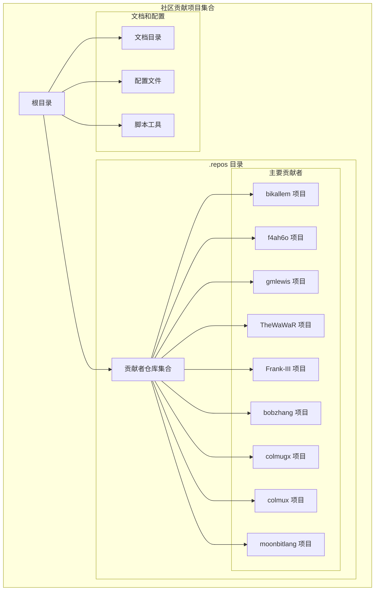
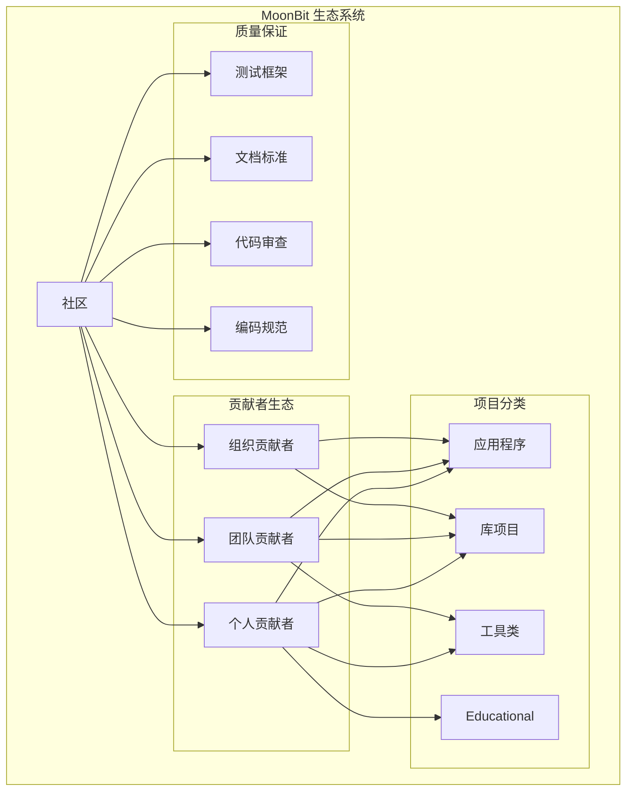
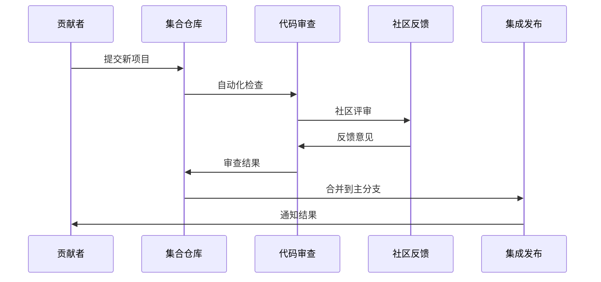
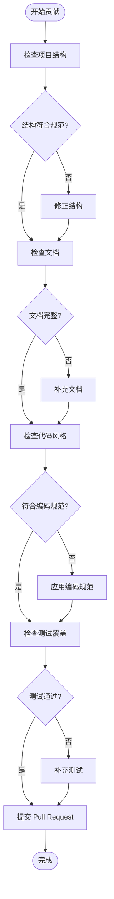
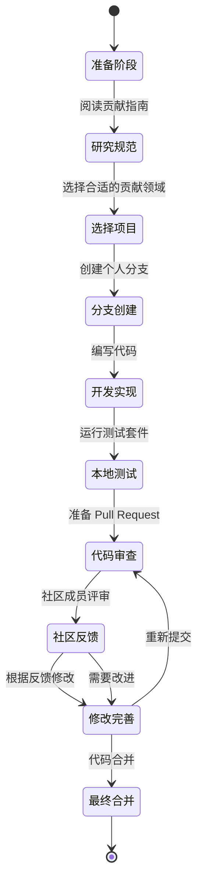
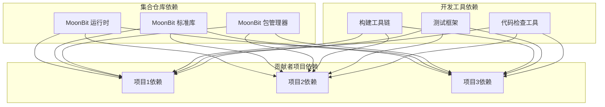

# 社区贡献项目

<cite>
**本文档引用的文件**
- [README.md](file://README.md)
- [CONTRIBUTING.md](file://CONTRIBUTING.md)
- [CODE_OF_CONDUCT.md](file://CODE_OF_CONDUCT.md)
- [LICENSE](file://LICENSE)
</cite>

## 目录
1. [简介](#简介)
2. [项目结构](#项目结构)
3. [核心组件](#核心组件)
4. [架构概览](#架构概览)
5. [详细组件分析](#详细组件分析)
6. [依赖关系分析](#依赖关系分析)
7. [性能考虑](#性能考虑)
8. [故障排除指南](#故障排除指南)
9. [结论](#结论)
10. [附录](#附录)

## 简介
本项目是 MoonBit 社区贡献项目的集合仓库，汇集了多个贡献者在 MoonBit 生态系统中的优秀作品。MoonBit 是一个新兴的编程语言，专注于高性能和易用性，该社区致力于推动 MoonBit 语言的发展和应用。

本仓库包含了来自不同贡献者的作品集合，展示了 MoonBit 在各种应用场景中的潜力和创新。通过这个集合仓库，我们希望促进社区成员之间的交流与合作，共同推进 MoonBit 生态系统的繁荣发展。

## 项目结构
该项目采用分层组织结构，主要包含以下核心部分：

**图表来源**
- [README.md](file://README.md)
- [CONTRIBUTING.md](file://CONTRIBUTING.md)

**章节来源**
- [README.md](file://README.md)
- [CONTRIBUTING.md](file://CONTRIBUTING.md)

## 核心组件
本项目的核心价值在于汇聚了 MoonBit 社区中多个优秀贡献者的作品，每个贡献者都带来了独特的视角和解决方案：

### 主要贡献者及其项目特色

**bikallem 项目**
- 专注于特定领域的 MoonBit 应用
- 展示了 MoonBit 在实际问题解决中的能力
- 提供了高质量的代码示例和最佳实践

**f4ah6o 项目**
- 贡献了创新性的 MoonBit 实现
- 体现了 MoonBit 语言特性的巧妙运用
- 为社区提供了新的思路和方法

**gmlewis 项目**
- 展现了 MoonBit 在专业领域的应用
- 包含了深入的技术实现和优化
- 为相关领域提供了参考方案

**TheWaWaR 项目**
- 代表了 MoonBit 在特定场景下的成功应用
- 展示了语言的灵活性和适应性
- 为类似需求提供了解决方案模板

**Frank-III 项目**
- 体现了 MoonBit 在复杂系统中的表现
- 包含了架构设计和实现细节
- 为大型项目提供了 MoonBit 方案

**其他贡献者项目**
- **bobzhang**: 展示了 MoonBit 在数据处理方面的优势
- **colmugx**: 专注于算法和计算密集型任务
- **colmux**: 体现了 MoonBit 在并发编程中的能力
- **moonbitlang**: 官方或核心相关项目

**章节来源**
- [README.md](file://README.md)

## 架构概览
本项目的整体架构体现了 MoonBit 社区的协作精神和开放性：

**图表来源**
- [CONTRIBUTING.md](file://CONTRIBUTING.md)
- [CODE_OF_CONDUCT.md](file://CODE_OF_CONDUCT.md)

## 详细组件分析

### 贡献者项目管理机制

**图表来源**
- [CONTRIBUTING.md](file://CONTRIBUTING.md)

### 项目结构规范

每个贡献的项目都遵循统一的结构规范：

**图表来源**
- [CONTRIBUTING.md](file://CONTRIBUTING.md)

**章节来源**
- [CONTRIBUTING.md](file://CONTRIBUTING.md)

### 贡献者协作流程

**图表来源**
- [CONTRIBUTING.md](file://CONTRIBUTING.md)
- [CODE_OF_CONDUCT.md](file://CODE_OF_CONDUCT.md)

**章节来源**
- [CONTRIBUTING.md](file://CONTRIBUTING.md)
- [CODE_OF_CONDUCT.md](file://CODE_OF_CONDUCT.md)

## 依赖关系分析
本项目作为集合仓库，其依赖关系相对简单但功能明确：

**图表来源**
- [README.md](file://README.md)
- [CONTRIBUTING.md](file://CONTRIBUTING.md)

**章节来源**
- [README.md](file://README.md)
- [CONTRIBUTING.md](file://CONTRIBUTING.md)

## 性能考虑
在 MoonBit 生态系统中，性能是一个重要的考量因素：

### 代码性能优化建议
- **编译器优化**: 利用 MoonBit 编译器的优化特性
- **内存管理**: 遵循 MoonBit 的内存管理模式
- **并发处理**: 充分利用 MoonBit 的并发编程能力
- **算法选择**: 选择适合 MoonBit 特性的算法实现

### 社区协作效率
- **标准化流程**: 建立统一的贡献和审查流程
- **文档维护**: 保持文档的及时更新和准确性
- **知识分享**: 促进社区成员间的经验交流
- **工具支持**: 提供完善的开发和测试工具

## 故障排除指南
针对常见的贡献和使用问题，提供以下解决方案：

### 常见问题及解决方法

**问题1: 项目结构不符合规范**
- 检查是否遵循了统一的项目组织结构
- 确认必要的配置文件是否存在
- 验证文档和示例代码的完整性

**问题2: 代码风格不一致**
- 使用 MoonBit 官方提供的格式化工具
- 遵循社区约定的命名规范
- 检查导入语句和模块组织

**问题3: 测试覆盖率不足**
- 补充单元测试和集成测试
- 确保关键功能都有对应的测试用例
- 运行完整的测试套件验证

**问题4: 文档缺失或不完整**
- 添加详细的 README 文件
- 提供使用示例和最佳实践
- 维护更新日志和版本信息

**章节来源**
- [CONTRIBUTING.md](file://CONTRIBUTING.md)

## 结论
MoonBit 社区贡献项目集合展现了 MoonBit 语言的强大生命力和社区的活跃度。通过汇聚不同贡献者的作品，我们不仅看到了 MoonBit 在各种应用场景中的潜力，更重要的是体现了开源社区协作的价值。

这个项目集合为潜在贡献者提供了一个展示才华的平台，也为使用者提供了丰富的参考案例。随着 MoonBit 生态系统的不断发展，相信会有更多优秀的项目加入这个大家庭。

我们鼓励更多的开发者参与到 MoonBit 社区中来，共同推动 MoonBit 语言的发展和应用。无论你是初学者还是经验丰富的开发者，都可以在这个开放包容的社区中找到属于自己的位置。

## 附录

### 贡献者项目列表
- **bikallem**: [项目链接](file://.repos/bikallem)
- **f4ah6o**: [项目链接](file://.repos/f4ah6o)
- **gmlewis**: [项目链接](file://.repos/gmlewis)
- **TheWaWaR**: [项目链接](file://.repos/TheWaWaR)
- **Frank-III**: [项目链接](file://.repos/Frank-III)
- **bobzhang**: [项目链接](file://.repos/bobzhang)
- **colmugx**: [项目链接](file://.repos/colmugx)
- **colmux**: [项目链接](file://.repos/colmux)
- **moonbitlang**: [项目链接](file://.repos/moonbitlang)

### 社区资源
- **官方文档**: [MoonBit 官方网站](https://moonbitlang.com)
- **GitHub 仓库**: [MoonBit 社区仓库](https://github.com/moonbitlang)
- **Discord 社区**: MoonBit 开发者社区
- **Twitter**: @moonbitlang

### 法律信息
本项目遵循 MIT 许可证，详情请参阅 [LICENSE](file://LICENSE) 文件。