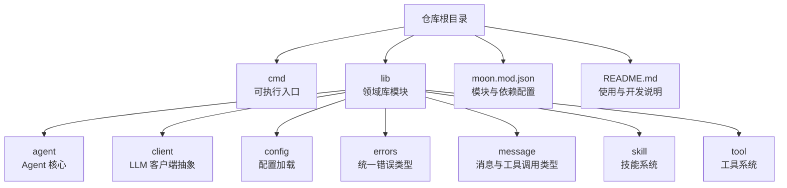
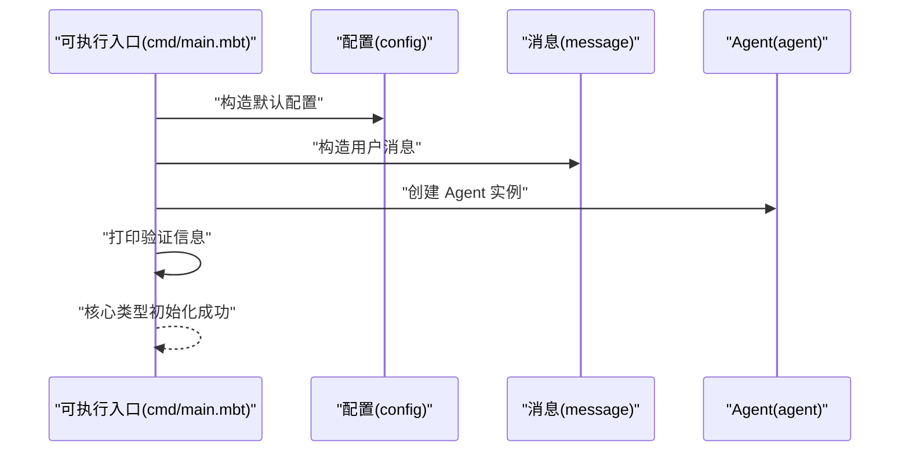
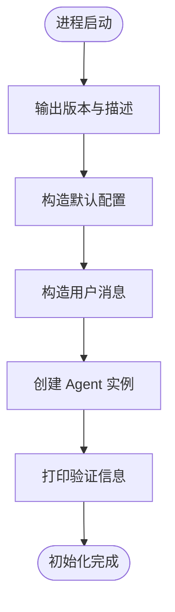
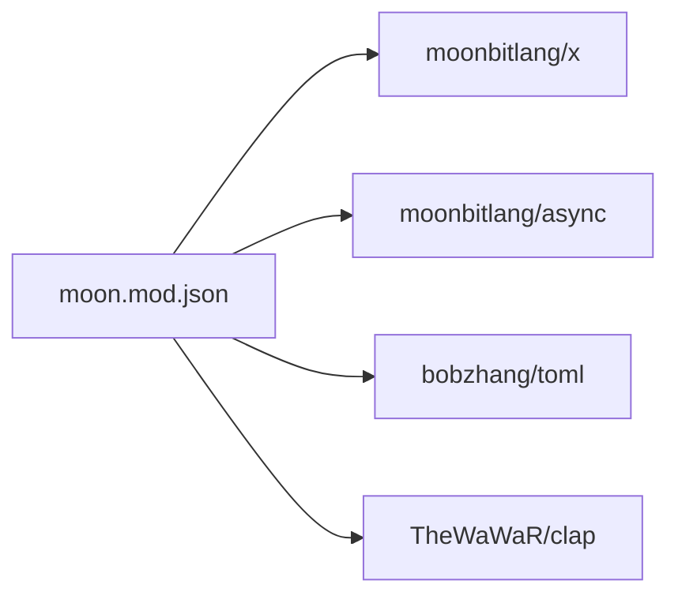

# 部署运维

<cite>
**本文引用的文件**
- [README.md](file://README.md)
- [moon.mod.json](file://moon.mod.json)
- [main.mbt](file://cmd/main.mbt)
</cite>

## 目录
1. [简介](#简介)
2. [项目结构](#项目结构)
3. [核心组件](#核心组件)
4. [架构总览](#架构总览)
5. [详细组件分析](#详细组件分析)
6. [依赖分析](#依赖分析)
7. [性能考量](#性能考量)
8. [故障排查指南](#故障排查指南)
9. [结论](#结论)
10. [附录](#附录)

## 简介
本文件面向运维与平台工程团队，提供 MBOpenClacky 的部署与运维指南。该工具为基于 MoonBit 语言实现的 AI Agent CLI 工具，当前处于早期开发阶段，核心模块已具备可运行的最小骨架。本文从构建配置、分发策略、部署选项、容器化与 CI/CD 集成、监控与日志、性能调优、备份与灾备、安全与合规、运维工具与脚本等方面，给出可操作的建议与最佳实践，帮助在本地开发、测试与生产环境中稳定运行系统。

## 项目结构
MBOpenClacky 采用 MoonBit 工程标准布局，核心目录与职责如下：
- cmd：可执行程序入口，当前包含最小化示例逻辑，用于验证核心类型初始化。
- lib：按领域拆分的库模块，包含 agent、client、config、errors、message、skill、tool 等，体现模块化与关注点分离。
- moon.mod.json：模块元信息与依赖声明，定义首选目标平台与外部依赖。
- README.md：项目说明、环境要求、构建与运行步骤、开发路线等。

图表来源
- [README.md:83-108](file://README.md#L83-L108)
- [moon.mod.json:1-16](file://moon.mod.json#L1-L16)

章节来源
- [README.md:83-108](file://README.md#L83-L108)
- [moon.mod.json:1-16](file://moon.mod.json#L1-L16)

## 核心组件
- 可执行入口（cmd/main.mbt）
  - 当前实现用于演示核心类型的构造与初始化，输出默认配置、消息与 Agent 实例的基本信息，验证脚手架完整性。
- 配置系统（lib/config）
  - 计划支持 TOML 文件、环境变量与路径组合的配置加载，作为后续阶段的实现重点。
- LLM 客户端（lib/client）
  - 计划抽象多后端（如 Claude、OpenAI、DeepSeek 等），统一接口与流式响应处理。
- 工具与技能系统（lib/tool、lib/skill）
  - 提供可扩展的能力与工具集合，支撑 Agent 的工具调用与能力扩展。
- 消息与状态（lib/message、lib/agent）
  - 定义消息、角色、工具调用与结果等核心类型，以及 Agent 的会话、状态与对话循环。
- 错误处理（lib/errors）
  - 统一错误类型层次，配合 MoonBit 的错误传播机制，提升可维护性与可观测性。

章节来源
- [main.mbt:1-27](file://cmd/main.mbt#L1-L27)
- [README.md:159-177](file://README.md#L159-L177)

## 架构总览
下图展示当前最小可运行骨架的组件交互：可执行入口初始化配置、消息与 Agent，并输出验证信息。随着开发阶段推进，LLM 客户端、工具与技能系统将接入，形成完整的 Agent 工作流。

图表来源
- [main.mbt:8-22](file://cmd/main.mbt#L8-L22)

## 详细组件分析

### 可执行入口（cmd/main.mbt）
- 当前职责
  - 输出版本与简要描述。
  - 构造默认配置、用户消息与 Agent 实例，打印关键字段值，验证核心类型初始化成功。
- 运维要点
  - 作为健康检查与启动验证的最小化流程，适合在容器启动探针与日志中复用。
  - 后续可扩展为 CLI 参数解析、子命令路由与运行模式切换。

图表来源
- [main.mbt:3-26](file://cmd/main.mbt#L3-L26)

章节来源
- [main.mbt:1-27](file://cmd/main.mbt#L1-L27)

### 配置系统（lib/config）
- 设计目标
  - 支持 TOML 文件、环境变量与路径组合的配置加载，满足不同环境的差异化需求。
- 运维建议
  - 将敏感配置（如 API 密钥）置于环境变量或密钥管理服务，避免硬编码于配置文件。
  - 为不同环境准备独立配置文件（如 dev、test、prod），通过环境变量覆盖关键参数。
  - 提供配置校验与默认值回退，确保在缺失配置时仍可安全启动。

章节来源
- [README.md:166](file://README.md#L166)

### LLM 客户端（lib/client）
- 设计目标
  - 抽象多后端 LLM 接口，统一请求、认证与流式响应（SSE）处理。
- 运维建议
  - 为每个后端配置独立的超时、重试与熔断策略。
  - 在代理与网络异常场景下提供降级与退避机制，保障稳定性。
  - 对流式响应进行缓冲与背压控制，避免内存压力。

章节来源
- [README.md:167](file://README.md#L167)

### 工具与技能系统（lib/tool、lib/skill）
- 设计目标
  - 通过 trait/接口与组合模式实现可插拔的工具与技能，便于扩展与测试。
- 运维建议
  - 将工具与技能封装为独立包，便于版本化与灰度发布。
  - 为工具调用提供权限控制与审计日志，确保合规与可追溯。

章节来源
- [README.md:168-169](file://README.md#L168-L169)

### 消息与状态（lib/message、lib/agent）
- 设计目标
  - 以强类型定义消息、角色与工具调用，Agent 负责会话、状态与对话循环。
- 运维建议
  - 对消息与工具调用进行结构化日志记录，便于问题定位与成本追踪。
  - 在 Agent 状态机中加入幂等与重放保护，提升一致性。

章节来源
- [README.md:97-98](file://README.md#L97-L98)

### 错误处理（lib/errors）
- 设计目标
  - 统一错误类型层次，结合 MoonBit 的错误传播机制，减少运行时异常。
- 运维建议
  - 将错误映射为结构化指标与告警，区分可恢复与不可恢复错误。
  - 在关键路径增加重试与熔断，避免级联故障。

章节来源
- [README.md:96](file://README.md#L96)

## 依赖分析
- 模块与依赖
  - moon.mod.json 声明了模块名称、版本、首选目标平台与外部依赖（如 async、toml、clap 等）。
- 运维建议
  - 使用 moon 工具链进行依赖更新与安装，确保构建可复现。
  - 在 CI 中固定依赖版本，避免上游变更导致的构建不一致。

图表来源
- [moon.mod.json:4-8](file://moon.mod.json#L4-L8)

章节来源
- [moon.mod.json:1-16](file://moon.mod.json#L1-L16)

## 性能考量
- 构建与运行
  - 优先使用 native 目标，减少启动与运行时开销，适合 CLI 场景。
- 网络与 I/O
  - 对 LLM 请求实施连接池、超时与重试策略；对流式响应进行缓冲与背压控制。
- 存储与缓存
  - 结合 SQLite 与加密存储，合理设置缓存大小与过期策略，平衡性能与可靠性。
- 监控与采样
  - 关键指标包括请求延迟、错误率、吞吐量与资源占用，建议启用采样与聚合。

章节来源
- [README.md:112-114](file://README.md#L112-L114)
- [README.md:167](file://README.md#L167)

## 故障排查指南
- 启动失败
  - 检查 MoonBit 工具链版本与首选目标平台是否匹配。
  - 确认依赖安装与更新是否成功，必要时清理缓存后重试。
- 配置问题
  - 核对配置文件路径与权限，确认环境变量覆盖顺序与生效范围。
  - 使用配置校验工具或在启动时打印合并后的配置快照。
- LLM 后端异常
  - 检查网络连通性、代理设置与认证凭据；查看流式响应缓冲与背压情况。
  - 在代理层引入熔断与降级，避免雪崩效应。
- 日志与可观测性
  - 为关键路径添加结构化日志，包含请求 ID、会话 ID 与时间戳。
  - 将日志输出到标准输出或集中式日志系统，便于检索与告警。

章节来源
- [README.md:118-123](file://README.md#L118-L123)
- [README.md:141-149](file://README.md#L141-L149)

## 结论
MBOpenClacky 当前处于早期开发阶段，但已具备清晰的模块化架构与可复现的构建流程。运维侧应围绕“可观察、可恢复、可扩展”三大目标，完善配置治理、网络与存储策略、监控与日志体系，并在 CI/CD 中固化质量门禁。随着后续阶段推进，LLM 客户端、工具与技能系统将逐步完善，运维策略也需同步演进。

## 附录

### 构建与分发策略
- 构建
  - 使用 moon 工具链进行类型检查、构建与测试，优先 native 目标。
- 分发
  - 生成单一可执行文件，支持多平台交叉构建；在发布页提供校验摘要。
- 版本管理
  - 采用语义化版本，结合标签与变更日志，确保发布可追溯。

章节来源
- [README.md:125-139](file://README.md#L125-L139)

### 部署选项与环境指南
- 本地开发
  - 安装 MoonBit 工具链，使用 moon run 快速验证；使用 moon test 进行单元测试。
- 测试环境
  - 使用最小化配置与受限凭据；启用结构化日志与基础监控。
- 生产环境
  - 使用只读文件系统与最小权限；通过环境变量注入敏感配置；启用健康检查与滚动更新。

章节来源
- [README.md:110-117](file://README.md#L110-L117)
- [README.md:141-149](file://README.md#L141-L149)

### 容器化部署与 CI/CD 集成
- 容器化
  - 使用多阶段构建，将构建产物复制至精简运行时镜像；暴露健康检查端点。
- CI/CD
  - 在流水线中执行 moon check、moon test 与 moon build；对构建产物进行签名与扫描。
  - 采用蓝绿/金丝雀发布，结合自动回滚与告警。

章节来源
- [README.md:131-139](file://README.md#L131-L139)

### 监控、日志与性能调优
- 监控
  - 关键指标：QPS、P95/P99 延迟、错误率、资源占用；结合告警阈值与通知渠道。
- 日志
  - 结构化日志，包含请求 ID、会话 ID、时间戳与上下文；支持日志轮转与归档。
- 性能调优
  - 优化网络请求与流式处理；调整缓存与连接池；启用采样与聚合。

章节来源
- [README.md:167](file://README.md#L167)

### 备份恢复、故障转移与灾难恢复
- 备份
  - 对配置、会话与工具调用记录进行定期备份；验证备份恢复流程。
- 故障转移
  - 在多副本部署中启用健康检查与自动切换；对关键服务实施冗余。
- 灾难恢复
  - 制定 RTO/RPO 指标；演练恢复流程；确保数据一致性与完整性。

章节来源
- [README.md:167](file://README.md#L167)

### 安全配置、访问控制与合规
- 安全
  - 最小权限原则；凭据管理与轮换；TLS 与网络隔离；输入校验与防注入。
- 访问控制
  - 基于角色的权限模型；审计日志与操作追踪；API 限流与熔断。
- 合规
  - 数据分类与加密；隐私保护与数据主体权利；合规检查清单与文档化。

章节来源
- [README.md:19-25](file://README.md#L19-L25)

### 运维工具与脚本
- 工具链
  - 使用 moon 工具链进行检查、构建、测试与文档生成；在 CI 中复用相同命令。
- 脚本
  - 提供一键安装、构建、运行与清理脚本；在容器中集成启动与健康检查脚本。

章节来源
- [README.md:118-123](file://README.md#L118-L123)
- [README.md:131-139](file://README.md#L131-L139)