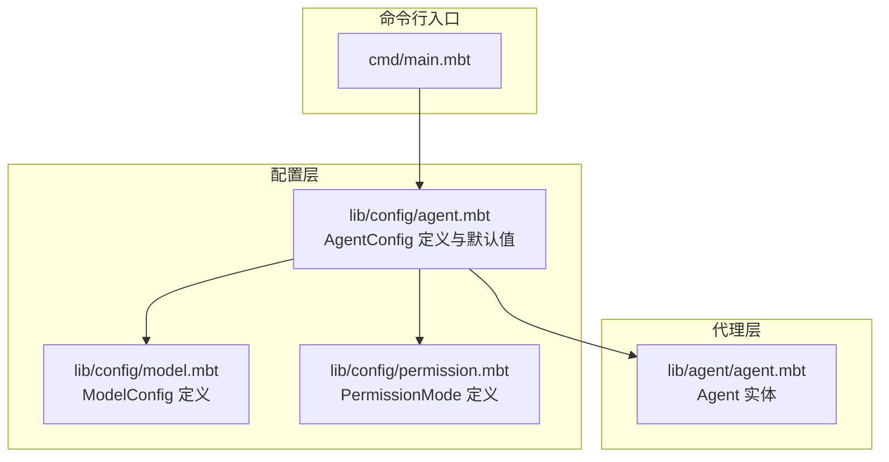
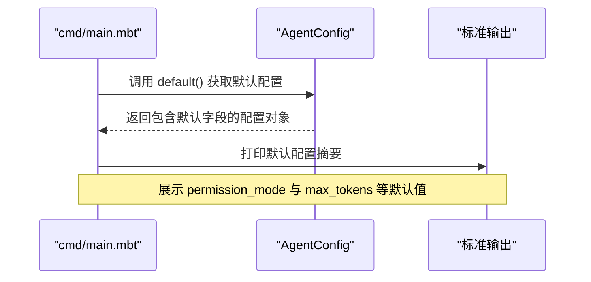
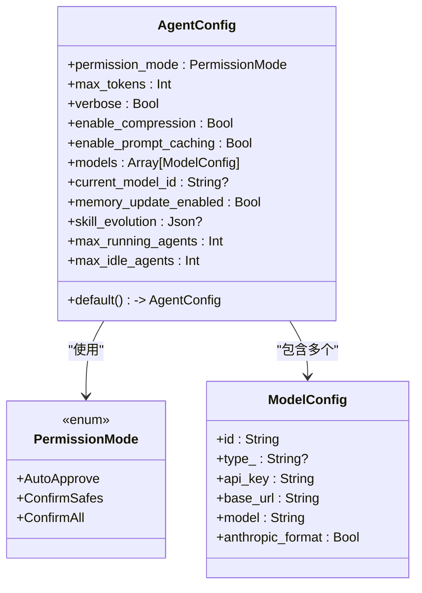
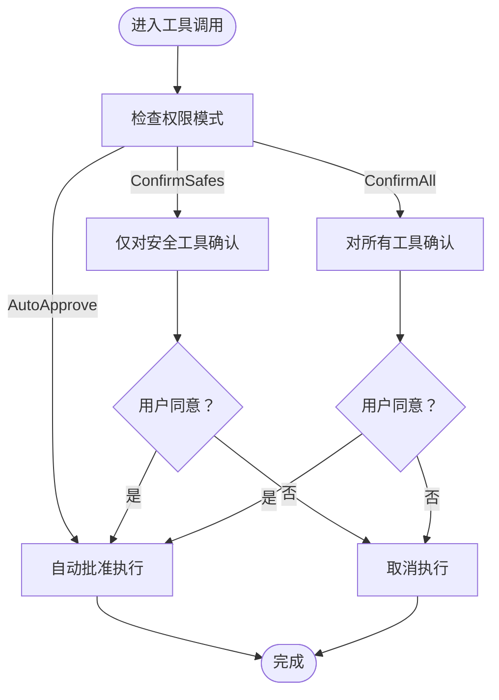
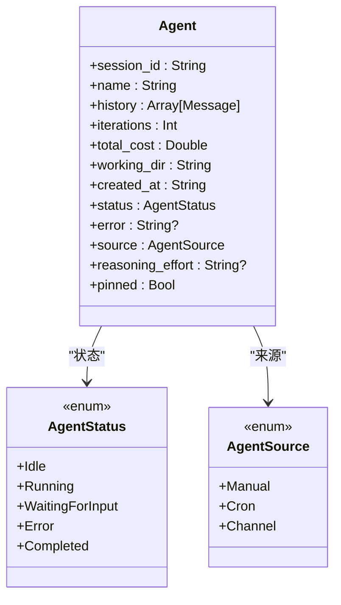
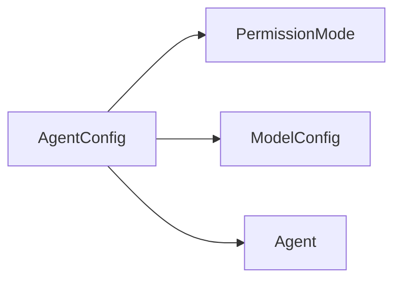

# 代理配置选项

<cite>
**本文引用的文件**
- [cmd/main.mbt](file://cmd/main.mbt)
- [lib/config/agent.mbt](file://lib/config/agent.mbt)
- [lib/config/model.mbt](file://lib/config/model.mbt)
- [lib/config/permission.mbt](file://lib/config/permission.mbt)
- [lib/agent/agent.mbt](file://lib/agent/agent.mbt)
- [README.md](file://README.md)
</cite>

## 目录
1. [简介](#简介)
2. [项目结构](#项目结构)
3. [核心组件](#核心组件)
4. [架构总览](#架构总览)
5. [详细组件分析](#详细组件分析)
6. [依赖分析](#依赖分析)
7. [性能考量](#性能考量)
8. [故障排查指南](#故障排查指南)
9. [结论](#结论)
10. [附录](#附录)

## 简介
本文件为 MBOpenClacky 的代理配置选项提供权威参考。重点围绕 AgentConfig 结构体及其关键字段进行说明，包括字段作用、默认值、推荐设置、典型使用场景与配置示例、字段间的相互影响与依赖关系，以及与性能优化相关的调优建议。内容严格基于仓库中现有源码与文档，确保准确可靠。

## 项目结构
MBOpenClacky 采用按领域划分的包结构，其中与代理配置直接相关的关键位置如下：
- 配置定义位于 lib/config 下，包含代理配置、模型配置与权限模式等
- 代理实体位于 lib/agent 下，用于承载会话状态与运行时行为
- 示例入口位于 cmd/main.mbt，演示了默认配置的构造与打印

**图表来源**
- [cmd/main.mbt:1-27](file://cmd/main.mbt#L1-L27)
- [lib/config/agent.mbt:1-34](file://lib/config/agent.mbt#L1-L34)
- [lib/config/model.mbt:1-22](file://lib/config/model.mbt#L1-L22)
- [lib/config/permission.mbt:1-48](file://lib/config/permission.mbt#L1-L48)
- [lib/agent/agent.mbt:1-40](file://lib/agent/agent.mbt#L1-L40)

**章节来源**
- [README.md:83-108](file://README.md#L83-L108)
- [cmd/main.mbt:1-27](file://cmd/main.mbt#L1-L27)

## 核心组件
本节聚焦 AgentConfig 结构体及其关键字段，结合默认值与类型约束，给出字段清单、作用说明、默认值与推荐设置。

- 字段：permission_mode
  - 类型：PermissionMode
  - 作用：控制代理在执行工具前的权限确认策略
  - 默认值：ConfirmSafes
  - 推荐设置：开发测试可使用 AutoApprove；生产环境建议 ConfirmSafes 或 ConfirmAll 以提升安全性
  - 取值范围：AutoApprove、ConfirmSafes、ConfirmAll

- 字段：max_tokens
  - 类型：Int
  - 作用：限制单次请求的最大生成长度（Token）
  - 默认值：16384
  - 推荐设置：根据所选模型上下文窗口与任务复杂度调整；高复杂推理任务可适当提高

- 字段：verbose
  - 类型：Bool
  - 作用：启用详细日志输出，便于调试与审计
  - 默认值：false
  - 推荐设置：开发与问题排查阶段开启；生产环境通常关闭以减少开销

- 字段：enable_compression
  - 类型：Bool
  - 作用：启用网络传输压缩，降低带宽占用
  - 默认值：true
  - 推荐设置：一般建议开启；若网络环境极佳或 CPU 资源紧张可评估关闭

- 字段：enable_prompt_caching
  - 类型：Bool
  - 作用：启用提示词缓存，减少重复计算与往返时间
  - 默认值：true
  - 推荐设置：建议开启；若模型后端不支持或缓存策略不适用可关闭

- 字段：models
  - 类型：Array[ModelConfig]
  - 作用：多模型后端配置列表，支持多厂商与多模型并存
  - 默认值：空数组
  - 推荐设置：至少配置一个有效模型；按需添加备用模型以提升可用性

- 字段：current_model_id
  - 类型：String?
  - 作用：当前会话使用的模型标识
  - 默认值：None
  - 推荐设置：与 models 中某条目 id 对应；未设置时由上层逻辑选择默认模型

- 字段：memory_update_enabled
  - 类型：Bool
  - 作用：启用记忆更新能力（如与长期记忆或上下文增强相关）
  - 默认值：false
  - 推荐设置：需要上下文增强或长期记忆时开启；否则保持关闭

- 字段：skill_evolution
  - 类型：Json?
  - 作用：技能演化相关配置（结构由上层解析）
  - 默认值：None
  - 推荐设置：按技能系统需求配置；未使用时保持 None

- 字段：max_running_agents
  - 类型：Int
  - 作用：最大同时运行中的代理数量
  - 默认值：10
  - 推荐设置：依据系统资源与并发需求设定；高并发场景可适度提高

- 字段：max_idle_agents
  - 类型：Int
  - 作用：最大空闲代理数量
  - 默认值：10
  - 推荐设置：与 max_running_agents 协同配置，平衡资源占用与启动延迟

**章节来源**
- [lib/config/agent.mbt:1-34](file://lib/config/agent.mbt#L1-L34)
- [lib/config/permission.mbt:1-48](file://lib/config/permission.mbt#L1-L48)
- [lib/config/model.mbt:1-22](file://lib/config/model.mbt#L1-L22)

## 架构总览
下图展示了默认配置在入口处的构造与打印流程，体现 AgentConfig 的默认值如何被消费：

**图表来源**
- [cmd/main.mbt:8-12](file://cmd/main.mbt#L8-L12)
- [lib/config/agent.mbt:18-33](file://lib/config/agent.mbt#L18-L33)

**章节来源**
- [cmd/main.mbt:1-27](file://cmd/main.mbt#L1-L27)

## 详细组件分析

### AgentConfig 类型与默认值
AgentConfig 作为代理系统的配置中枢，集中定义了权限策略、令牌上限、压缩与缓存开关、模型集合、当前模型选择、记忆更新、技能演化、并发上限等关键参数。其默认构造函数提供了合理的基线值，适合大多数起步场景。

**图表来源**
- [lib/config/agent.mbt:1-34](file://lib/config/agent.mbt#L1-L34)
- [lib/config/permission.mbt:1-48](file://lib/config/permission.mbt#L1-L48)
- [lib/config/model.mbt:1-22](file://lib/config/model.mbt#L1-L22)

**章节来源**
- [lib/config/agent.mbt:1-34](file://lib/config/agent.mbt#L1-L34)
- [lib/config/permission.mbt:1-48](file://lib/config/permission.mbt#L1-L48)
- [lib/config/model.mbt:1-22](file://lib/config/model.mbt#L1-L22)

### 权限模式（PermissionMode）
权限模式决定代理在执行工具前是否需要用户确认，以及确认粒度。默认为 ConfirmSafes，兼顾安全与效率。

- AutoApprove：自动批准，适合可信环境与自动化流水线
- ConfirmSafes：仅对“安全”工具确认，适合多数日常使用
- ConfirmAll：对所有工具均要求确认，适合高风险环境

**图表来源**
- [lib/config/permission.mbt:4-9](file://lib/config/permission.mbt#L4-L9)

**章节来源**
- [lib/config/permission.mbt:1-48](file://lib/config/permission.mbt#L1-L48)

### 模型配置（ModelConfig）
模型配置用于描述一个 LLM 后端的连接信息与行为特征。AgentConfig 的 models 字段允许注册多个模型，current_model_id 指定当前会话使用的模型。

- 关键字段：id、type_、api_key、base_url、model、anthropic_format
- 默认构造：提供简洁初始化方法，便于快速配置

**章节来源**
- [lib/config/model.mbt:1-22](file://lib/config/model.mbt#L1-L22)

### Agent 实体与配置的关系
Agent 实体承载会话历史、迭代次数、成本统计、工作目录、状态与来源等信息。虽然 AgentConfig 不直接包含这些字段，但 Agent 的生命周期与并发上限（max_running_agents、max_idle_agents）密切相关。

**图表来源**
- [lib/agent/agent.mbt:1-40](file://lib/agent/agent.mbt#L1-L40)

**章节来源**
- [lib/agent/agent.mbt:1-40](file://lib/agent/agent.mbt#L1-L40)

## 依赖分析
- AgentConfig 依赖 PermissionMode 与 ModelConfig
- AgentConfig 与 Agent 实体在运行时通过并发上限参数产生耦合
- 默认配置在入口处被构造与打印，形成从配置到运行的最小闭环

**图表来源**
- [lib/config/agent.mbt:1-34](file://lib/config/agent.mbt#L1-L34)
- [lib/config/permission.mbt:1-48](file://lib/config/permission.mbt#L1-L48)
- [lib/config/model.mbt:1-22](file://lib/config/model.mbt#L1-L22)
- [lib/agent/agent.mbt:1-40](file://lib/agent/agent.mbt#L1-L40)

**章节来源**
- [lib/config/agent.mbt:1-34](file://lib/config/agent.mbt#L1-L34)
- [lib/config/permission.mbt:1-48](file://lib/config/permission.mbt#L1-L48)
- [lib/config/model.mbt:1-22](file://lib/config/model.mbt#L1-L22)
- [lib/agent/agent.mbt:1-40](file://lib/agent/agent.mbt#L1-L40)

## 性能考量
- 令牌上限（max_tokens）与上下文窗口：过小会导致截断，过大可能增加延迟与成本。建议结合任务复杂度与模型能力进行权衡。
- 压缩与缓存：默认开启压缩与提示词缓存可降低网络与计算开销，建议在大多数场景保持开启。
- 并发上限：max_running_agents 与 max_idle_agents 影响资源占用与响应延迟。高并发场景可适度提高上限，但需监控 CPU、内存与网络带宽。
- 权限模式：ConfirmAll 会引入额外的人机交互等待，可能降低吞吐；AutoApprove 提升吞吐但风险较高。
- 模型选择：多模型配置可提升可用性，但切换与初始化会带来额外开销，建议合理规划 current_model_id 与热备策略。

[本节为通用性能指导，不直接分析具体文件]

## 故障排查指南
- 默认配置打印：入口程序会打印默认配置摘要，可用于快速验证配置是否正确加载与生效
- 权限确认失败：若处于 ConfirmAll 模式，确认流程被中断会导致执行暂停；可切换至 AutoApprove 或 ConfirmSafes 进行排查
- 并发异常：当运行中代理数接近或超过 max_running_agents 时可能出现排队或拒绝；可通过增大上限或释放空闲代理缓解
- 模型不可用：若 current_model_id 指向的模型未在 models 中配置，将导致初始化失败；请检查模型列表与 ID 匹配

**章节来源**
- [cmd/main.mbt:8-12](file://cmd/main.mbt#L8-L12)
- [lib/config/agent.mbt:18-33](file://lib/config/agent.mbt#L18-L33)
- [lib/config/permission.mbt:1-48](file://lib/config/permission.mbt#L1-L48)

## 结论
AgentConfig 为 MBOpenClacky 的代理系统提供了集中而清晰的配置入口。通过合理设置权限模式、令牌上限、压缩与缓存、模型集合与并发上限，可在安全性、性能与易用性之间取得良好平衡。建议在不同场景下进行针对性调优，并结合默认配置与运行时日志进行持续观测与优化。

[本节为总结性内容，不直接分析具体文件]

## 附录

### 配置示例与推荐设置
以下示例适用于常见场景，请根据实际环境与需求调整：

- 开发测试
  - 权限模式：AutoApprove
  - 令牌上限：适中（如 8192 或 16384）
  - 压缩与缓存：开启
  - 并发上限：较小（如 max_running_agents=5, max_idle_agents=5）
  - 目的：快速迭代与调试，降低交互成本

- 生产部署
  - 权限模式：ConfirmSafes 或 ConfirmAll（视安全策略而定）
  - 令牌上限：依据模型上下文窗口与任务复杂度设定
  - 压缩与缓存：开启
  - 并发上限：中等（如 max_running_agents=10~20, max_idle_agents=10）
  - 目的：稳定运行与成本可控

- 高并发场景
  - 权限模式：ConfirmSafes
  - 令牌上限：适当提高
  - 压缩与缓存：开启
  - 并发上限：较大（如 max_running_agents=20+, max_idle_agents=10+）
  - 目的：最大化吞吐与资源利用率

[本节为通用示例说明，不直接分析具体文件]