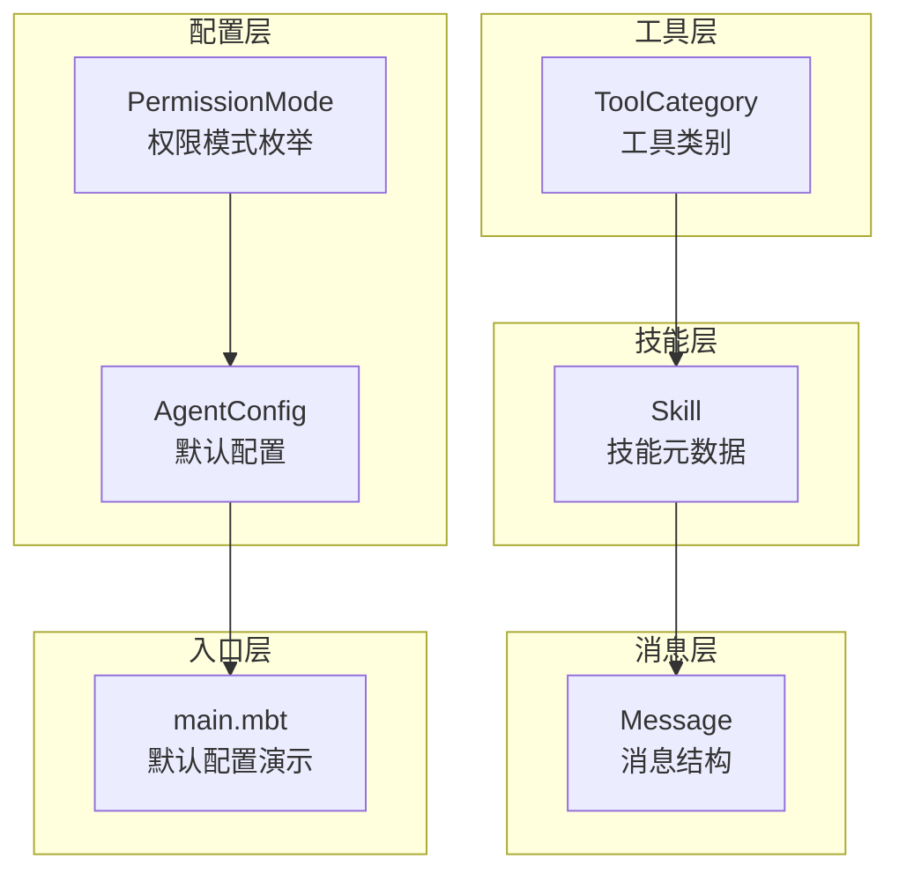
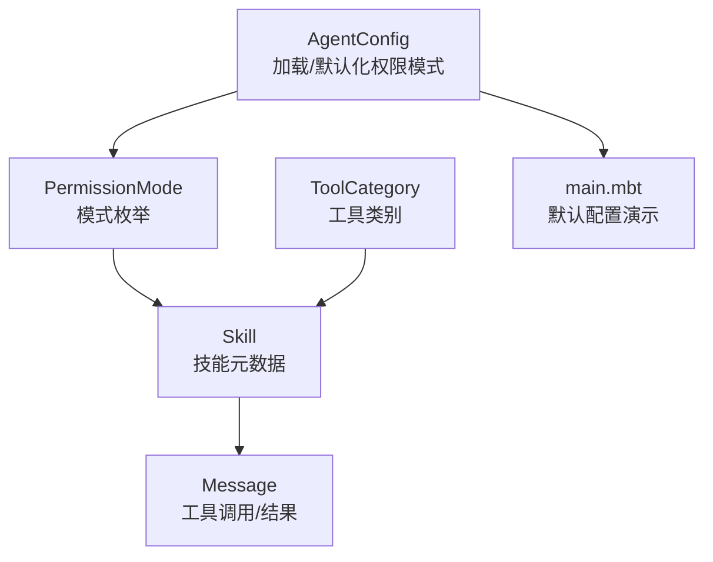
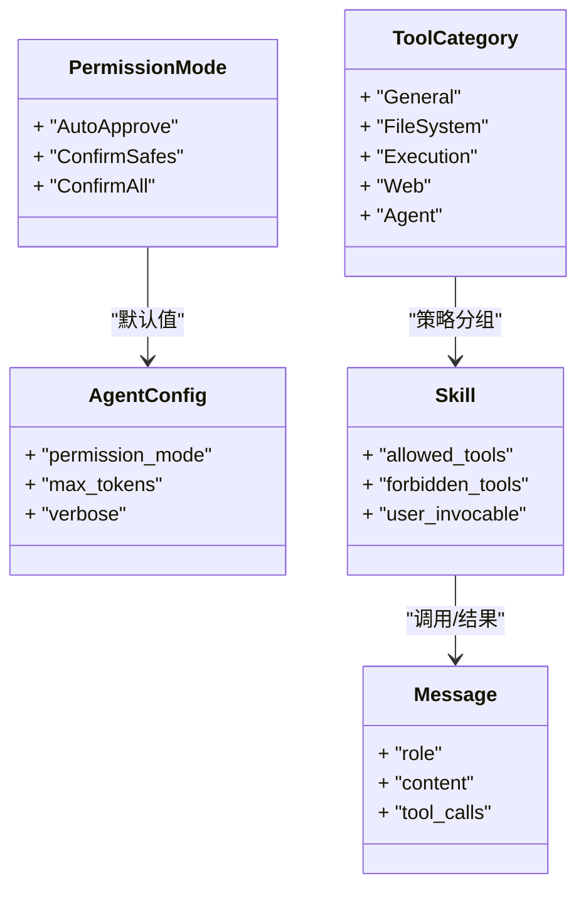
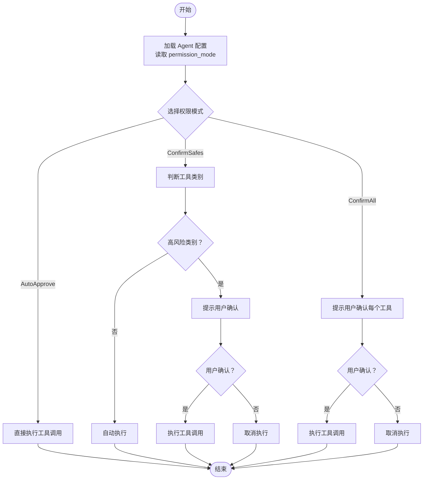
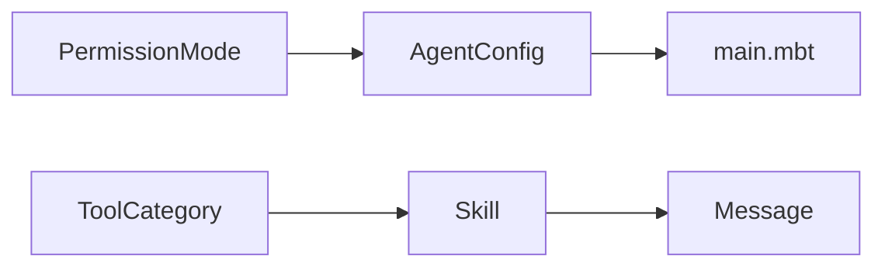

# 权限模式配置

<cite>
**本文引用的文件**
- [cmd/main.mbt](file://cmd/main.mbt)
- [lib/config/permission.mbt](file://lib/config/permission.mbt)
- [lib/config/agent.mbt](file://lib/config/agent.mbt)
- [lib/tool/types.mbt](file://lib/tool/types.mbt)
- [lib/skill/skill.mbt](file://lib/skill/skill.mbt)
- [lib/message/message.mbt](file://lib/message/message.mbt)
- [README.md](file://README.md)
</cite>

## 目录
1. [简介](#简介)
2. [项目结构](#项目结构)
3. [核心组件](#核心组件)
4. [架构总览](#架构总览)
5. [详细组件分析](#详细组件分析)
6. [依赖分析](#依赖分析)
7. [性能考量](#性能考量)
8. [故障排查指南](#故障排查指南)
9. [结论](#结论)
10. [附录](#附录)

## 简介
本文件聚焦于 MBOpenClacky 的“权限模式”配置，系统性阐述三种权限模式的工作原理、安全级别、适用场景与风险评估，并给出配置示例、最佳实践、权限决策流程图以及常见配置陷阱的规避方法。权限模式用于控制代理在执行工具前是否需要用户确认，直接影响工具调用与技能执行的安全控制。

## 项目结构
围绕权限模式的相关代码分布在以下模块：
- 配置层：定义权限模式枚举及其序列化/反序列化逻辑，以及默认配置。
- 工具层：定义工具类别，为后续“确认安全（ConfirmSafes）”策略提供分类依据。
- 技能层：描述技能元数据，体现工具访问控制与执行边界。
- 消息层：承载工具调用与结果的消息结构，是工具执行前后交互的基础。
- 入口层：演示默认配置初始化与权限模式字符串值展示。

**图表来源**
- [lib/config/permission.mbt:5-9](file://lib/config/permission.mbt#L5-L9)
- [lib/config/agent.mbt:3-15](file://lib/config/agent.mbt#L3-L15)
- [lib/tool/types.mbt:3-9](file://lib/tool/types.mbt#L3-L9)
- [lib/skill/skill.mbt:5-23](file://lib/skill/skill.mbt#L5-L23)
- [lib/message/message.mbt:20-37](file://lib/message/message.mbt#L20-L37)
- [cmd/main.mbt:9-12](file://cmd/main.mbt#L9-L12)

**章节来源**
- [README.md:83-108](file://README.md#L83-L108)
- [cmd/main.mbt:9-12](file://cmd/main.mbt#L9-L12)
- [lib/config/permission.mbt:5-9](file://lib/config/permission.mbt#L5-L9)
- [lib/config/agent.mbt:3-15](file://lib/config/agent.mbt#L3-L15)
- [lib/tool/types.mbt:3-9](file://lib/tool/types.mbt#L3-L9)
- [lib/skill/skill.mbt:5-23](file://lib/skill/skill.mbt#L5-L23)
- [lib/message/message.mbt:20-37](file://lib/message/message.mbt#L20-L37)

## 核心组件
- 权限模式枚举（PermissionMode）
  - 定义三种模式：自动批准（AutoApprove）、确认安全（ConfirmSafes）、确认全部（ConfirmAll）。
  - 提供字符串序列化/反序列化，支持 JSON/TOML 配置。
- 默认配置（AgentConfig）
  - 默认权限模式为“确认安全（ConfirmSafes）”，体现安全优先的默认策略。
  - 包含最大 Token 数、详细日志开关、压缩与提示缓存开关、模型列表等。
- 工具类别（ToolCategory）
  - 为工具分组，便于“确认安全”策略按类别进行差异化处理。
- 技能（Skill）
  - 描述技能的可调用性、允许/禁止工具集合、上下文与钩子等，为权限策略提供执行边界。
- 消息（Message）
  - 承载工具调用与结果的消息结构，是工具执行前后交互的基础载体。

**章节来源**
- [lib/config/permission.mbt:5-9](file://lib/config/permission.mbt#L5-L9)
- [lib/config/permission.mbt:13-19](file://lib/config/permission.mbt#L13-L19)
- [lib/config/permission.mbt:23-30](file://lib/config/permission.mbt#L23-L30)
- [lib/config/agent.mbt:19-33](file://lib/config/agent.mbt#L19-L33)
- [lib/tool/types.mbt:3-9](file://lib/tool/types.mbt#L3-L9)
- [lib/skill/skill.mbt:5-23](file://lib/skill/skill.mbt#L5-L23)
- [lib/message/message.mbt:20-37](file://lib/message/message.mbt#L20-L37)

## 架构总览
权限模式在系统中的作用位置如下：
- 配置层负责加载与默认化权限模式；
- 工具与技能层提供执行边界与访问控制；
- 消息层承载工具调用与结果；
- 入口层演示默认配置初始化。

**图表来源**
- [lib/config/agent.mbt:3-15](file://lib/config/agent.mbt#L3-L15)
- [lib/config/permission.mbt:5-9](file://lib/config/permission.mbt#L5-L9)
- [lib/tool/types.mbt:3-9](file://lib/tool/types.mbt#L3-L9)
- [lib/skill/skill.mbt:5-23](file://lib/skill/skill.mbt#L5-L23)
- [lib/message/message.mbt:20-37](file://lib/message/message.mbt#L20-L37)
- [cmd/main.mbt:9-12](file://cmd/main.mbt#L9-L12)

## 详细组件分析

### 权限模式工作原理与安全级别
- 自动批准（AutoApprove）
  - 安全级别：低。不进行用户确认，直接执行工具调用。
  - 适用场景：高度可信环境、自动化流水线、内部工具链。
  - 风险评估：若工具具备高危能力（如文件系统写入、进程执行），可能导致未授权修改或执行。
- 确认安全（ConfirmSafes）
  - 安全级别：中高。仅对高风险工具类别进行确认，低风险类别自动执行。
  - 适用场景：日常开发与运维、需要平衡效率与安全的场景。
  - 风险评估：通过工具类别区分降低风险，但仍需确保类别划分合理与用户确认流程可靠。
- 确认全部（ConfirmAll）
  - 安全级别：高。每次工具调用均需用户确认。
  - 适用场景：高敏感环境、审计严格场景、首次上线或变更窗口。
  - 风险评估：最高安全性，但可能显著降低效率，需配合批量确认与模板化操作。

**章节来源**
- [lib/config/permission.mbt:5-9](file://lib/config/permission.mbt#L5-L9)
- [lib/config/agent.mbt:19-33](file://lib/config/agent.mbt#L19-L33)

### 权限模式与工具/技能的关系
- 工具类别（ToolCategory）为“确认安全”策略提供分类依据，不同类别可映射到不同的安全阈值。
- 技能（Skill）可声明允许/禁止工具集合，作为权限策略的补充边界，限制具体技能可使用的工具范围。
- 消息（Message）承载工具调用与结果，是权限策略生效后的消息流转基础。

**图表来源**
- [lib/config/permission.mbt:5-9](file://lib/config/permission.mbt#L5-L9)
- [lib/config/agent.mbt:3-15](file://lib/config/agent.mbt#L3-L15)
- [lib/tool/types.mbt:3-9](file://lib/tool/types.mbt#L3-L9)
- [lib/skill/skill.mbt:5-23](file://lib/skill/skill.mbt#L5-L23)
- [lib/message/message.mbt:20-37](file://lib/message/message.mbt#L20-L37)

**章节来源**
- [lib/tool/types.mbt:3-9](file://lib/tool/types.mbt#L3-L9)
- [lib/skill/skill.mbt:5-23](file://lib/skill/skill.mbt#L5-L23)
- [lib/message/message.mbt:20-37](file://lib/message/message.mbt#L20-L37)

### 权限决策流程（概念性）
下图展示了权限决策的典型流程，帮助理解三种模式在工具调用前的决策点与交互：

[此图为概念性流程图，不直接映射具体源文件，故不提供图表来源]

### 配置示例与最佳实践
- 配置示例（基于默认值与字符串表示）
  - 默认配置中，权限模式默认为“确认安全（ConfirmSafes）”。可通过配置文件或环境变量覆盖。
  - 字符串值与枚举的映射关系：
    - “auto_approve”
    - “confirm_safes”
    - “confirm_all”
- 最佳实践
  - 开发与测试环境：优先使用“确认安全（ConfirmSafes）”，在保证效率的同时提升安全性。
  - 生产与审计环境：使用“确认全部（ConfirmAll）”，确保每次工具调用均经人工确认。
  - 自动化流水线：在受控网络与沙箱内使用“自动批准（AutoApprove）”，并严格限制工具范围与权限。
  - 结合技能的 allowed_tools/forbidden_tools 控制具体技能的工具访问范围，形成“策略+边界”的双重保障。
  - 定期审查工具类别与技能权限，确保与业务场景匹配。

**章节来源**
- [lib/config/agent.mbt:19-33](file://lib/config/agent.mbt#L19-L33)
- [lib/config/permission.mbt:13-19](file://lib/config/permission.mbt#L13-L19)
- [lib/config/permission.mbt:23-30](file://lib/config/permission.mbt#L23-L30)
- [lib/skill/skill.mbt:5-23](file://lib/skill/skill.mbt#L5-L23)

### 权限模式对工具调用与技能执行的影响
- 工具调用前的确认点
  - 在“确认安全（ConfirmSafes）”与“确认全部（ConfirmAll）”模式下，系统会在工具调用前触发用户确认流程，确认后才执行。
  - 在“自动批准（AutoApprove）”模式下，工具调用直接执行，无需确认。
- 技能执行边界
  - 技能可声明 allowed_tools/forbidden_tools，限制其可使用的工具集合，作为权限策略的补充边界。
  - 结合工具类别与技能边界，可在不同模式下实现更精细的控制。

**章节来源**
- [lib/config/permission.mbt:5-9](file://lib/config/permission.mbt#L5-L9)
- [lib/skill/skill.mbt:5-23](file://lib/skill/skill.mbt#L5-L23)
- [lib/tool/types.mbt:3-9](file://lib/tool/types.mbt#L3-L9)

## 依赖分析
- 权限模式与配置层
  - AgentConfig 默认使用 ConfirmSafes，体现安全优先的默认策略。
- 权限模式与工具层
  - ToolCategory 为 ConfirmSafes 提供分类基础，不同类别可映射到不同的确认策略。
- 权限模式与技能层
  - Skill 的 allowed_tools/forbidden_tools 与权限模式共同决定技能的可执行范围。
- 权限模式与消息层
  - Message 承载工具调用与结果，权限策略生效后影响消息的生成与传递。

**图表来源**
- [lib/config/permission.mbt:5-9](file://lib/config/permission.mbt#L5-L9)
- [lib/config/agent.mbt:3-15](file://lib/config/agent.mbt#L3-L15)
- [lib/tool/types.mbt:3-9](file://lib/tool/types.mbt#L3-L9)
- [lib/skill/skill.mbt:5-23](file://lib/skill/skill.mbt#L5-L23)
- [lib/message/message.mbt:20-37](file://lib/message/message.mbt#L20-L37)
- [cmd/main.mbt:9-12](file://cmd/main.mbt#L9-L12)

**章节来源**
- [lib/config/agent.mbt:3-15](file://lib/config/agent.mbt#L3-L15)
- [lib/tool/types.mbt:3-9](file://lib/tool/types.mbt#L3-L9)
- [lib/skill/skill.mbt:5-23](file://lib/skill/skill.mbt#L5-L23)
- [lib/message/message.mbt:20-37](file://lib/message/message.mbt#L20-L37)
- [cmd/main.mbt:9-12](file://cmd/main.mbt#L9-L12)

## 性能考量
- 权限模式对性能的影响主要体现在用户交互与确认等待时间，而非工具执行本身。
- “确认全部（ConfirmAll）”模式会增加交互次数，可能降低整体吞吐；“自动批准（AutoApprove）”模式减少交互开销，但牺牲安全性。
- 建议在高吞吐场景采用“确认安全（ConfirmSafes）”并结合批量确认与模板化操作，以平衡效率与安全。

[本节为通用性能讨论，不直接分析具体文件，故不提供章节来源]

## 故障排查指南
- 配置解析错误
  - 当 permission_mode 的字符串值不在允许范围内时，JSON 解析会抛出解码错误。请检查配置字符串是否为“auto_approve”、“confirm_safes”或“confirm_all”之一。
- 默认值与预期不符
  - 默认权限模式为“确认安全（ConfirmSafes）”。若期望其他模式，请在配置文件中显式设置。
- 工具调用未触发确认
  - 若处于“自动批准（AutoApprove）”模式，工具调用不会触发确认；若处于“确认安全（ConfirmSafes）”模式，请确认工具类别是否属于高风险类别。
- 技能无法执行
  - 检查技能的 allowed_tools/forbidden_tools 设置，确保工具名称与类别符合策略要求。

**章节来源**
- [lib/config/permission.mbt:38-47](file://lib/config/permission.mbt#L38-L47)
- [lib/config/agent.mbt:19-33](file://lib/config/agent.mbt#L19-L33)
- [lib/skill/skill.mbt:5-23](file://lib/skill/skill.mbt#L5-L23)

## 结论
- 权限模式是 MBOpenClacky 安全控制的关键开关，应在不同场景下选择合适的模式。
- 默认采用“确认安全（ConfirmSafes）”体现了安全优先的设计理念。
- 结合工具类别与技能边界，可实现更精细的权限控制。
- 建议在生产环境中优先采用“确认全部（ConfirmAll）”，在开发与自动化场景中根据需求选择“确认安全（ConfirmSafes）”或“自动批准（AutoApprove）”。

[本节为总结性内容，不直接分析具体文件，故不提供章节来源]

## 附录
- 字符串与枚举映射
  - “auto_approve” ↔ AutoApprove
  - “confirm_safes” ↔ ConfirmSafes
  - “confirm_all” ↔ ConfirmAll
- 默认配置要点
  - 权限模式默认值：ConfirmSafes
  - 其他关键字段：max_tokens、verbose、enable_compression、enable_prompt_caching、models、current_model_id、memory_update_enabled、skill_evolution、max_running_agents、max_idle_agents

**章节来源**
- [lib/config/permission.mbt:13-19](file://lib/config/permission.mbt#L13-L19)
- [lib/config/permission.mbt:23-30](file://lib/config/permission.mbt#L23-L30)
- [lib/config/agent.mbt:19-33](file://lib/config/agent.mbt#L19-L33)