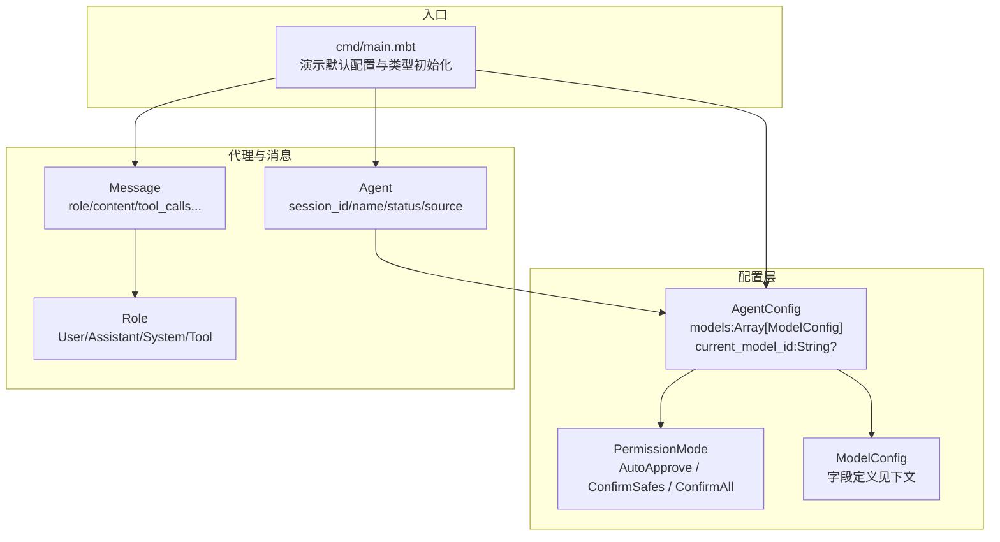
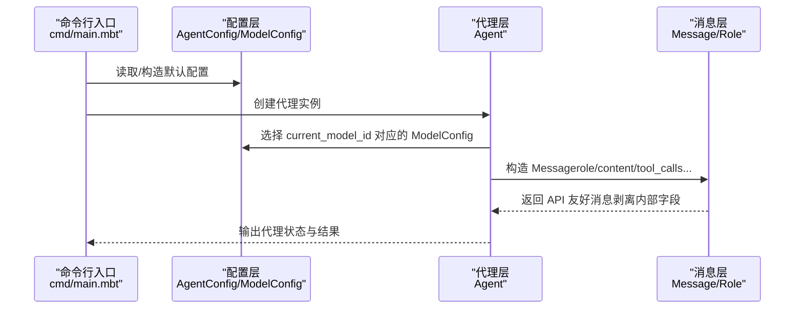
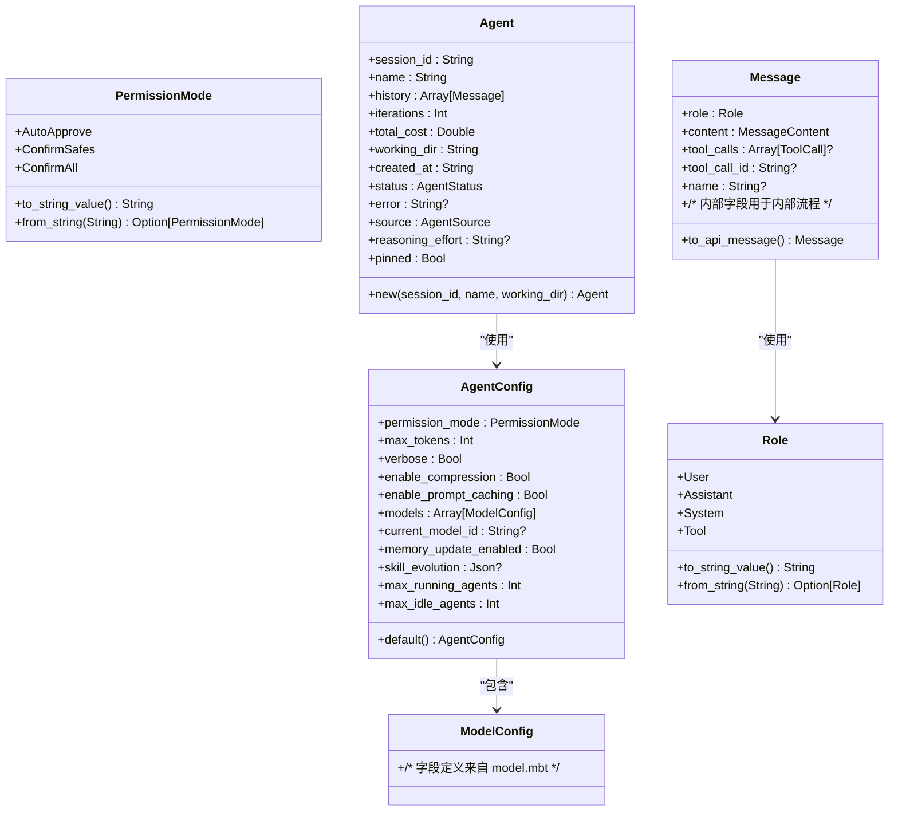
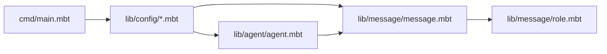

# 模型配置

<cite>
**本文引用的文件**
- [README.md](file://README.md)
- [main.mbt](file://cmd/main.mbt)
- [agent.mbt](file://lib/config/agent.mbt)
- [model.mbt](file://lib/config/model.mbt)
- [permission.mbt](file://lib/config/permission.mbt)
- [agent_core.mbt](file://lib/agent/agent.mbt)
- [status.mbt](file://lib/agent/status.mbt)
- [message.mbt](file://lib/message/message.mbt)
- [role.mbt](file://lib/message/role.mbt)
</cite>

## 目录
1. [简介](#简介)
2. [项目结构](#项目结构)
3. [核心组件](#核心组件)
4. [架构总览](#架构总览)
5. [详细组件分析](#详细组件分析)
6. [依赖分析](#依赖分析)
7. [性能考量](#性能考量)
8. [故障排查指南](#故障排查指南)
9. [结论](#结论)
10. [附录](#附录)

## 简介
本文件聚焦于 MBOpenClacky 的“模型配置”主题，围绕 AgentConfig 与 ModelConfig 的结构体字段、配置项、权限模式、以及与客户端抽象的关系进行系统化说明。根据仓库现有内容，项目采用 MoonBit 语言，核心类型与配置定义位于 lib/config 与 lib/agent、lib/message 等模块中。本文将帮助读者理解：
- AgentConfig 的字段与默认值
- ModelConfig 的字段与用途
- 权限模式与工具执行策略
- 模型切换、负载均衡与故障转移的实现思路
- 性能优化与成本控制建议
- 配置验证与调试方法

## 项目结构
MBOpenClacky 的核心类型与配置定义集中在 lib 子模块中，其中：
- lib/config：包含 AgentConfig、ModelConfig、PermissionMode 等配置相关类型
- lib/agent：包含 Agent、AgentStatus、AgentSource 等会话与状态类型
- lib/message：包含 Message、Role 等消息与角色类型
- cmd/main.mbt：演示了 AgentConfig.default() 的使用与核心类型的初始化

图表来源
- [agent.mbt](file://lib/config/agent.mbt)
- [permission.mbt](file://lib/config/permission.mbt)
- [model.mbt](file://lib/config/model.mbt)
- [agent_core.mbt](file://lib/agent/agent.mbt)
- [message.mbt](file://lib/message/message.mbt)
- [role.mbt](file://lib/message/role.mbt)
- [main.mbt](file://cmd/main.mbt)

章节来源
- [README.md](file://README.md)
- [main.mbt](file://cmd/main.mbt)

## 核心组件
本节聚焦于模型配置相关的核心结构体与枚举。

- AgentConfig
  - 字段概览（来源于配置模块定义）
    - permission_mode: PermissionMode
    - max_tokens: 整数
    - verbose: 布尔
    - enable_compression: 布尔
    - enable_prompt_caching: 布尔
    - models: 数组[ModelConfig]
    - current_model_id: 字符串?（可空）
    - memory_update_enabled: 布尔
    - skill_evolution: Json?（可空）
    - max_running_agents: 整数
    - max_idle_agents: 整数
  - 默认值：由 AgentConfig::default() 提供，包含合理的缺省行为（如权限模式、Token 上限、压缩与提示缓存开关、最大并发与空闲代理数等）

- PermissionMode
  - 枚举值：AutoApprove、ConfirmSafes、ConfirmAll
  - 作用：控制代理在执行工具前是否需要确认，以及确认范围

- ModelConfig
  - 字段定义：来源于配置模块中的结构体定义（具体字段名称与类型需参考 model.mbt）
  - 用途：描述具体模型提供商、端点、认证方式、参数覆盖等

- Agent
  - 字段概览：session_id、name、history、iterations、total_cost、working_dir、created_at、status、error、source、reasoning_effort、pinned
  - 作用：承载一次会话的上下文、状态与统计信息

- Message / Role
  - Message：role、content、tool_calls、tool_call_id、name 等核心字段；内部字段用于内部流程（如 token_usage、memory_update 等）
  - Role：User、Assistant、System、Tool

章节来源
- [agent.mbt](file://lib/config/agent.mbt)
- [permission.mbt](file://lib/config/permission.mbt)
- [model.mbt](file://lib/config/model.mbt)
- [agent_core.mbt](file://lib/agent/agent.mbt)
- [message.mbt](file://lib/message/message.mbt)
- [role.mbt](file://lib/message/role.mbt)

## 架构总览
从配置到执行的总体流程如下：
- 配置层：AgentConfig 聚合多个 ModelConfig，并通过 current_model_id 指定当前使用的模型
- 执行层：Agent 负责会话与状态管理；Message/Role 描述对话内容与角色
- 权限层：PermissionMode 控制工具执行前的确认策略

图表来源
- [main.mbt](file://cmd/main.mbt)
- [agent.mbt](file://lib/config/agent.mbt)
- [model.mbt](file://lib/config/model.mbt)
- [agent_core.mbt](file://lib/agent/agent.mbt)
- [message.mbt](file://lib/message/message.mbt)
- [role.mbt](file://lib/message/role.mbt)

## 详细组件分析

### AgentConfig 与 ModelConfig
- AgentConfig
  - 关键字段与职责
    - permission_mode：决定工具执行前的确认策略
    - max_tokens：限制单次请求的最大 Token 数
    - enable_compression / enable_prompt_caching：控制压缩与提示缓存策略
    - models：模型列表，每个元素为 ModelConfig
    - current_model_id：当前生效的模型标识
    - memory_update_enabled / skill_evolution：与记忆与技能演化相关的开关
    - max_running_agents / max_idle_agents：并发与空闲代理上限
  - 默认值：由 AgentConfig::default() 提供，便于快速启动与演示

- ModelConfig
  - 字段定义：来源于配置模块定义（具体字段名称与类型请参考 model.mbt）
  - 用途：描述模型提供商、端点、认证方式、参数覆盖等

图表来源
- [agent.mbt](file://lib/config/agent.mbt)
- [permission.mbt](file://lib/config/permission.mbt)
- [model.mbt](file://lib/config/model.mbt)
- [agent_core.mbt](file://lib/agent/agent.mbt)
- [message.mbt](file://lib/message/message.mbt)
- [role.mbt](file://lib/message/role.mbt)

章节来源
- [agent.mbt](file://lib/config/agent.mbt)
- [permission.mbt](file://lib/config/permission.mbt)
- [model.mbt](file://lib/config/model.mbt)
- [agent_core.mbt](file://lib/agent/agent.mbt)
- [message.mbt](file://lib/message/message.mbt)
- [role.mbt](file://lib/message/role.mbt)

### 权限模式与工具执行策略
- AutoApprove：自动批准工具执行，适合可信环境
- ConfirmSafes：仅对“安全工具”进行确认
- ConfirmAll：对所有工具执行均进行确认
- 该策略直接影响代理在执行工具前的交互方式与安全性

章节来源
- [permission.mbt](file://lib/config/permission.mbt)

### 模型切换机制
- current_model_id：指向 models 数组中的某一个 ModelConfig
- 切换逻辑：当需要更换模型时，更新 AgentConfig.current_model_id 即可
- 注意事项：确保 models 中包含对应的 ModelConfig，否则可能导致运行时错误

章节来源
- [agent.mbt](file://lib/config/agent.mbt)

### 负载均衡与故障转移策略
- 负载均衡：可在 models 中配置多个同类型模型，结合 current_model_id 与外部调度策略实现轮询或权重分配
- 故障转移：当某个模型不可用时，可通过切换 current_model_id 快速切换到备用模型
- 建议：在配置层增加健康检查与失败计数，以便自动切换

（本节为概念性说明，不直接对应具体源码文件）

### 性能优化与成本控制
- Token 上限：通过 max_tokens 控制单次请求的长度，避免过度消耗
- 压缩与缓存：启用 enable_compression 与 enable_prompt_caching 可减少传输与重复计算
- 并发控制：通过 max_running_agents 与 max_idle_agents 控制代理并发度，避免资源争用
- 成本追踪：Agent.total_cost 可用于记录累计成本，便于成本控制

章节来源
- [agent.mbt](file://lib/config/agent.mbt)
- [agent_core.mbt](file://lib/agent/agent.mbt)

### 配置验证与调试
- 默认配置验证：cmd/main.mbt 展示了如何构造 AgentConfig::default() 并输出关键字段，可用于快速验证配置结构
- 消息序列化：Message.to_api_message() 将内部字段剥离，便于调试 API 请求内容
- 角色与权限：Role 与 PermissionMode 提供字符串化与反序列化能力，便于日志与配置校验

章节来源
- [main.mbt](file://cmd/main.mbt)
- [message.mbt](file://lib/message/message.mbt)
- [role.mbt](file://lib/message/role.mbt)
- [permission.mbt](file://lib/config/permission.mbt)

## 依赖分析
- 配置层依赖
  - AgentConfig 依赖 PermissionMode 与 ModelConfig
  - ModelConfig 作为配置载体，被 AgentConfig 引用
- 执行层依赖
  - Agent 依赖 AgentConfig 以获取模型与策略
  - Message/Role 为 API 交互的基础数据结构
- 入口依赖
  - cmd/main.mbt 依赖配置层与代理层，用于演示默认配置与类型初始化

图表来源
- [main.mbt](file://cmd/main.mbt)
- [agent.mbt](file://lib/config/agent.mbt)
- [model.mbt](file://lib/config/model.mbt)
- [agent_core.mbt](file://lib/agent/agent.mbt)
- [message.mbt](file://lib/message/message.mbt)
- [role.mbt](file://lib/message/role.mbt)

章节来源
- [main.mbt](file://cmd/main.mbt)
- [agent.mbt](file://lib/config/agent.mbt)
- [model.mbt](file://lib/config/model.mbt)
- [agent_core.mbt](file://lib/agent/agent.mbt)
- [message.mbt](file://lib/message/message.mbt)
- [role.mbt](file://lib/message/role.mbt)

## 性能考量
- 减少不必要的 Token 使用：合理设置 max_tokens，避免过长上下文
- 启用压缩与缓存：在网络带宽与存储允许的前提下，开启 enable_compression 与 enable_prompt_caching
- 控制并发：通过 max_running_agents 与 max_idle_agents 平衡吞吐与资源占用
- 日志与调试：使用 verbose 输出关键信息，但注意在生产环境关闭以减少开销

（本节为通用指导，不直接引用具体源码文件）

## 故障排查指南
- 配置结构验证：使用 cmd/main.mbt 中的默认配置构造与打印，确认字段存在且类型正确
- 模型切换问题：检查 AgentConfig.models 是否包含 current_model_id 指向的模型
- 权限确认问题：根据 PermissionMode 的字符串化输出，确认配置解析是否正确
- API 请求问题：使用 Message.to_api_message() 输出 API 友好消息，核对角色与内容字段

章节来源
- [main.mbt](file://cmd/main.mbt)
- [agent.mbt](file://lib/config/agent.mbt)
- [permission.mbt](file://lib/config/permission.mbt)
- [message.mbt](file://lib/message/message.mbt)

## 结论
本文基于仓库现有源码，梳理了 MBOpenClacky 的模型配置相关结构体与流程，明确了 AgentConfig、ModelConfig、PermissionMode、Agent、Message/Role 的职责与关系。对于模型提供商、API 端点与认证方式的具体实现细节，由于当前仓库尚未包含相应客户端抽象与模型实现，本文提供了概念性的配置思路与最佳实践建议，便于后续在配置层与客户端层扩展。

## 附录
- 模型配置字段清单（依据配置模块定义）
  - AgentConfig
    - permission_mode: PermissionMode
    - max_tokens: 整数
    - verbose: 布尔
    - enable_compression: 布尔
    - enable_prompt_caching: 布尔
    - models: 数组[ModelConfig]
    - current_model_id: 字符串?
    - memory_update_enabled: 布尔
    - skill_evolution: Json?
    - max_running_agents: 整数
    - max_idle_agents: 整数
  - ModelConfig（字段定义请参考 model.mbt）
  - PermissionMode：AutoApprove / ConfirmSafes / ConfirmAll
  - Agent：session_id、name、history、iterations、total_cost、working_dir、created_at、status、error、source、reasoning_effort、pinned
  - Message：role、content、tool_calls、tool_call_id、name 等核心字段；内部字段用于内部流程
  - Role：User、Assistant、System、Tool

章节来源
- [agent.mbt](file://lib/config/agent.mbt)
- [permission.mbt](file://lib/config/permission.mbt)
- [model.mbt](file://lib/config/model.mbt)
- [agent_core.mbt](file://lib/agent/agent.mbt)
- [message.mbt](file://lib/message/message.mbt)
- [role.mbt](file://lib/message/role.mbt)