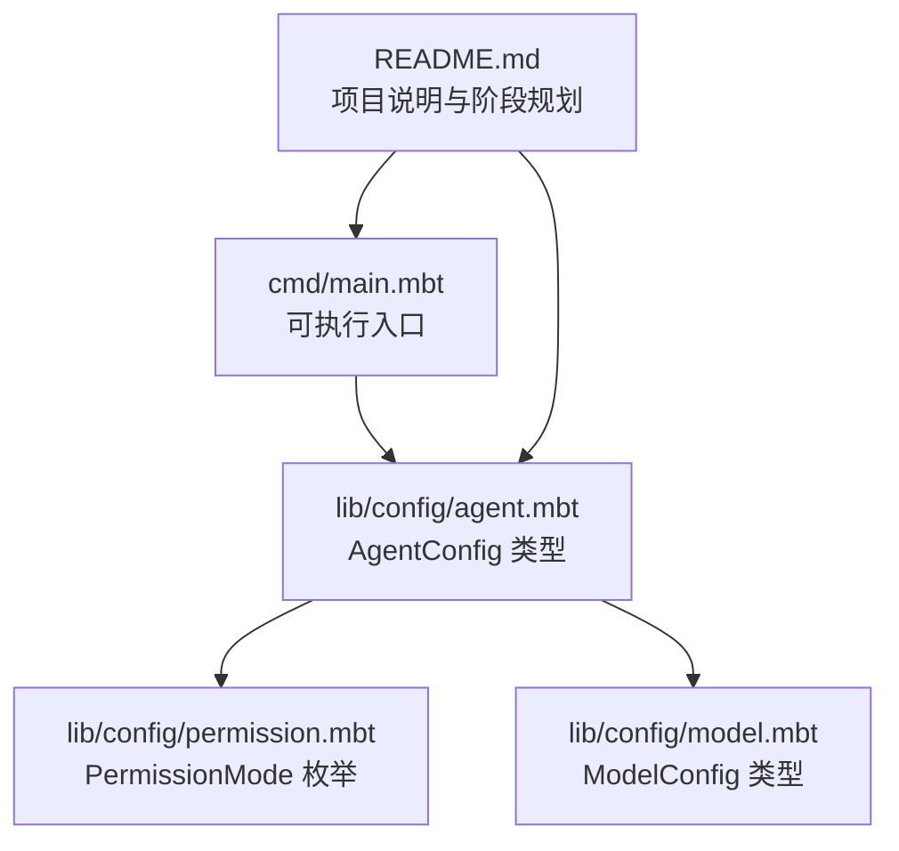
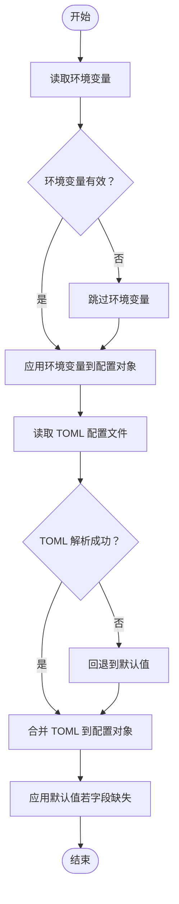
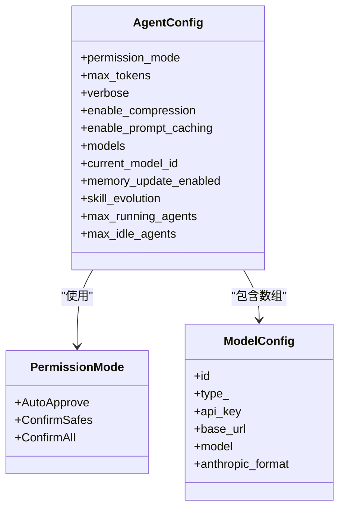

# 环境变量配置

<cite>
**本文引用的文件**
- [README.md](file://README.md)
- [cmd/main.mbt](file://cmd/main.mbt)
- [lib/config/agent.mbt](file://lib/config/agent.mbt)
- [lib/config/permission.mbt](file://lib/config/permission.mbt)
- [lib/config/model.mbt](file://lib/config/model.mbt)
</cite>

## 目录
1. [简介](#简介)
2. [项目结构](#项目结构)
3. [核心组件](#核心组件)
4. [架构总览](#架构总览)
5. [详细组件分析](#详细组件分析)
6. [依赖分析](#依赖分析)
7. [性能考量](#性能考量)
8. [故障排查指南](#故障排查指南)
9. [结论](#结论)
10. [附录](#附录)

## 简介
本章节面向 MBOpenClacky 的环境变量配置，提供从“支持的环境变量清单”、“与 TOML 配置的优先级与合并策略”、“最佳实践（敏感信息保护、多环境管理）”、“Docker/Kubernetes 示例”、“覆盖机制与调试方法”到“常见问题排查”的完整说明。  
根据当前仓库内容，配置系统处于开发初期阶段，核心类型定义已就绪，环境变量解析与合并逻辑尚未在仓库中出现具体实现。因此，本文件在“支持的环境变量清单”和“优先级/合并策略”部分采用“建议性规范”，以便在后续实现中保持一致性。

## 项目结构
- 顶层模块与依赖声明位于模块元信息文件中，配置相关能力由社区依赖提供（例如 TOML 解析），并在 lib/config 下定义了 AgentConfig、PermissionMode、ModelConfig 等核心配置类型。
- 当前 cmd/main.mbt 仅用于最小化验证，未展示环境变量的实际加载流程。

**图示来源**
- [cmd/main.mbt:1-27](file://cmd/main.mbt#L1-L27)
- [lib/config/agent.mbt:1-34](file://lib/config/agent.mbt#L1-L34)
- [lib/config/permission.mbt:1-48](file://lib/config/permission.mbt#L1-L48)
- [lib/config/model.mbt:1-21](file://lib/config/model.mbt#L1-L21)
- [README.md:83-106](file://README.md#L83-L106)

**章节来源**
- [README.md:83-106](file://README.md#L83-L106)
- [cmd/main.mbt:1-27](file://cmd/main.mbt#L1-L27)

## 核心组件
- AgentConfig：定义 Agent 的运行参数，包含权限模式、最大 Token 数、压缩与提示缓存开关、模型列表、当前模型 ID、内存更新开关、技能演化配置、并发代理上限等。
- PermissionMode：控制工具执行前的确认策略（自动批准、仅确认安全操作、全部确认）。
- ModelConfig：描述单个 LLM 模型端点的配置（ID、类型、API 密钥、基础地址、模型名、Anthropic 格式兼容标记）。

这些类型为环境变量映射提供了稳定的字段清单，便于后续实现“环境变量 → TOML → 默认值”的三层配置加载与合并。

**章节来源**
- [lib/config/agent.mbt:1-34](file://lib/config/agent.mbt#L1-L34)
- [lib/config/permission.mbt:1-48](file://lib/config/permission.mbt#L1-L48)
- [lib/config/model.mbt:1-21](file://lib/config/model.mbt#L1-L21)

## 架构总览
下图展示了“环境变量 → TOML → 默认值”的配置加载顺序与合并策略建议。该图为概念性架构图，用于指导实现与运维实践。

[本图为概念性架构图，不对应具体源码文件，故不提供图示来源]

## 详细组件分析

### 支持的环境变量清单（建议性规范）
为保证与 AgentConfig、PermissionMode、ModelConfig 的字段一一对应，建议采用“层级化命名 + 下划线分隔”的风格，将嵌套结构扁平化为单层键名。以下清单基于现有类型字段整理，便于后续实现与运维统一：

- 权限与行为
  - AGENT_PERMISSION_MODE：字符串，取值范围来自 PermissionMode 的序列化值（例如 auto_approve、confirm_safes、confirm_all）。作用于 AgentConfig.permission_mode。
  - AGENT_VERBOSE：布尔值，作用于 AgentConfig.verbose。
  - AGENT_ENABLE_COMPRESSION：布尔值，作用于 AgentConfig.enable_compression。
  - AGENT_ENABLE_PROMPT_CACHING：布尔值，作用于 AgentConfig.enable_prompt_caching。
  - AGENT_MEMORY_UPDATE_ENABLED：布尔值，作用于 AgentConfig.memory_update_enabled。
  - AGENT_MAX_RUNNING_AGENTS：整数，作用于 AgentConfig.max_running_agents。
  - AGENT_MAX_IDLE_AGENTS：整数，作用于 AgentConfig.max_idle_agents。

- 模型与 LLM
  - AGENT_MODELS_N_ID：字符串，第 N 个模型的唯一标识，作用于 ModelConfig.id。
  - AGENT_MODELS_N_TYPE：字符串，第 N 个模型的类型，作用于 ModelConfig.type_。
  - AGENT_MODELS_N_API_KEY：字符串，第 N 个模型的 API 密钥，作用于 ModelConfig.api_key。
  - AGENT_MODELS_N_BASE_URL：字符串，第 N 个模型的基础地址，作用于 ModelConfig.base_url。
  - AGENT_MODELS_N_MODEL：字符串，第 N 个模型的名称，作用于 ModelConfig.model。
  - AGENT_MODELS_N_ANTHROPIC_FORMAT：布尔值，第 N 个模型的 Anthropic 兼容标记，作用于 ModelConfig.anthropic_format。
  - AGENT_CURRENT_MODEL_ID：字符串，当前模型 ID，作用于 AgentConfig.current_model_id。

- 其他
  - AGENT_SKILL_EVOLUTION：JSON 字符串，作用于 AgentConfig.skill_evolution（需确保 JSON 可被解析）。

说明
- “N”表示数组索引（从 0 开始），当存在多个模型时，按顺序读取并合并为 AgentConfig.models。
- 若某字段未设置，则按“TOML → 默认值”的顺序继续填充。
- 建议对敏感字段（如 API 密钥）在环境变量层面进行严格访问控制与最小权限原则。

[本节为建议性清单，不直接分析具体源码文件，故不提供章节来源]

### 与 TOML 配置的优先级与合并策略（建议性规范）
- 优先级顺序（从高到低）：环境变量 > TOML 配置文件 > 默认值。
- 合并策略：
  - 标量字段：环境变量覆盖 TOML；若环境变量为空则回退到 TOML；若 TOML 也为空则使用默认值。
  - 数组字段（如 models）：建议采用“整体替换”或“按索引合并”的策略。若采用“整体替换”，则环境变量可提供完整的数组；若采用“按索引合并”，则按 AGENT_MODELS_N_* 的索引进行逐项覆盖。
  - 可选字段（如 current_model_id、skill_evolution）：若环境变量提供空值或无效值，应回退到 TOML 或默认值。
- TOML 解析失败时：记录错误并回退到默认值，避免启动中断。

[本节为建议性策略，不直接分析具体源码文件，故不提供章节来源]

### 最佳实践
- 敏感信息保护
  - 将 API 密钥、数据库密码等敏感字段放入环境变量，并限制容器/主机的访问权限。
  - 在 CI/CD 中使用受控的密钥管理服务（如 HashiCorp Vault、KMS、GitOps Secrets）注入环境变量。
- 多环境配置管理
  - 使用环境变量前缀区分环境（如 DEV_、STAGE_、PROD_），并通过部署平台（Docker/K8s）注入。
  - 对不同环境的差异字段（如日志级别、并发上限）采用“环境变量覆盖 TOML”的方式，保持基线配置不变。
- 命名与可读性
  - 采用层级化命名（下划线分隔）以提升可读性与一致性。
  - 为每个字段提供明确的注释与默认值，便于新成员快速理解。

[本节为通用最佳实践，不直接分析具体源码文件，故不提供章节来源]

### Docker 与 Kubernetes 环境下的配置示例（建议性规范）
- Docker
  - 使用 docker run -e 或 docker compose env_file 注入环境变量。
  - 将敏感配置通过 secrets 或外部密钥管理服务挂载为只读文件，再由启动脚本写入环境变量。
- Kubernetes
  - 使用 ConfigMap 管理非敏感配置，使用 Secret 管理敏感配置。
  - 通过 envFrom 将 ConfigMap/Secret 注入 Pod 环境变量。
  - 对于多模型配置，可通过环境变量数组索引方式批量注入（例如 AGENT_MODELS_0_ID、AGENT_MODELS_1_ID…）。

[本节为通用示例，不直接分析具体源码文件，故不提供章节来源]

### 覆盖机制与调试方法（建议性规范）
- 覆盖机制
  - 环境变量优先级最高，TOML 次之，最后回退到默认值。
  - 对于数组字段，建议提供“清空/替换”或“按索引覆盖”的开关或约定。
- 调试方法
  - 启动时打印最终生效的配置摘要（不含敏感字段）。
  - 提供“配置校验”命令或标志位，仅输出解析后的配置而不启动业务逻辑。
  - 在关键路径增加日志级别，输出“字段来源”（来自环境变量/来自 TOML/来自默认值）。

[本节为建议性方法，不直接分析具体源码文件，故不提供章节来源]

## 依赖分析
- 配置类型依赖
  - AgentConfig 依赖 PermissionMode（枚举）与 ModelConfig（结构体数组）。
  - PermissionMode 提供字符串序列化/反序列化能力，便于与环境变量/ TOML 的字符串字段对接。
  - ModelConfig 描述模型端点的关键字段，为环境变量映射提供基础。

**图示来源**
- [lib/config/agent.mbt:1-34](file://lib/config/agent.mbt#L1-L34)
- [lib/config/permission.mbt:1-48](file://lib/config/permission.mbt#L1-L48)
- [lib/config/model.mbt:1-21](file://lib/config/model.mbt#L1-L21)

**章节来源**
- [lib/config/agent.mbt:1-34](file://lib/config/agent.mbt#L1-L34)
- [lib/config/permission.mbt:1-48](file://lib/config/permission.mbt#L1-L48)
- [lib/config/model.mbt:1-21](file://lib/config/model.mbt#L1-L21)

## 性能考量
- 环境变量解析与合并应尽量避免重复计算与深层拷贝，优先采用“就地覆盖 + 快速路径”的策略。
- 对于大型数组（如多模型配置），建议在解析阶段进行长度限制与字段校验，防止异常输入导致资源耗尽。
- 日志与调试输出应按级别控制，避免在生产环境产生过多 IO。

[本节为通用性能建议，不直接分析具体源码文件，故不提供章节来源]

## 故障排查指南
- 症状：启动后行为不符合预期
  - 排查步骤：
    - 检查环境变量是否正确注入（大小写、拼写、空值）。
    - 检查 TOML 文件是否存在语法错误或字段类型不匹配。
    - 查看最终配置摘要（不含敏感字段）确认字段来源。
- 症状：API 密钥无法生效
  - 排查步骤：
    - 确认环境变量键名是否符合建议性清单。
    - 确认密钥未被其他环境变量覆盖。
    - 在 CI/CD 中核对密钥注入流程与权限。
- 症状：多模型配置不生效
  - 排查步骤：
    - 确认索引连续且从 0 开始。
    - 确认每个模型的必要字段均已提供。
    - 检查数组合并策略是否与实现一致。

[本节为通用排查建议，不直接分析具体源码文件，故不提供章节来源]

## 结论
- 当前仓库已具备配置类型定义与项目说明，环境变量解析与合并逻辑尚未实现。
- 建议按照“层级化命名 + 下划线分隔”的规范，将 AgentConfig、PermissionMode、ModelConfig 的字段映射到环境变量，并制定“环境变量 > TOML > 默认值”的优先级与合并策略。
- 在 Docker/Kubernetes 环境中，结合密钥管理与多环境配置实践，确保安全与可维护性。
- 通过“配置摘要打印 + 校验命令 + 来源标注日志”的调试手段，快速定位配置问题。

[本节为总结性内容，不直接分析具体源码文件，故不提供章节来源]

## 附录
- 关键类型与默认值参考
  - AgentConfig.default：提供合理的默认值集合，作为最终回退基准。
  - PermissionMode：提供字符串序列化/反序列化，便于与环境变量/ TOML 的字符串字段对接。
  - ModelConfig.new：提供最小化构造器，便于通过环境变量逐项填充。

**章节来源**
- [lib/config/agent.mbt:18-33](file://lib/config/agent.mbt#L18-L33)
- [lib/config/permission.mbt:12-30](file://lib/config/permission.mbt#L12-L30)
- [lib/config/model.mbt:12-21](file://lib/config/model.mbt#L12-L21)