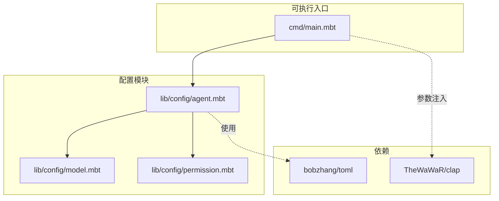
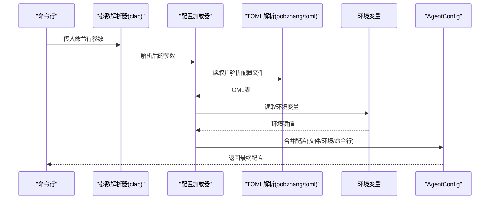
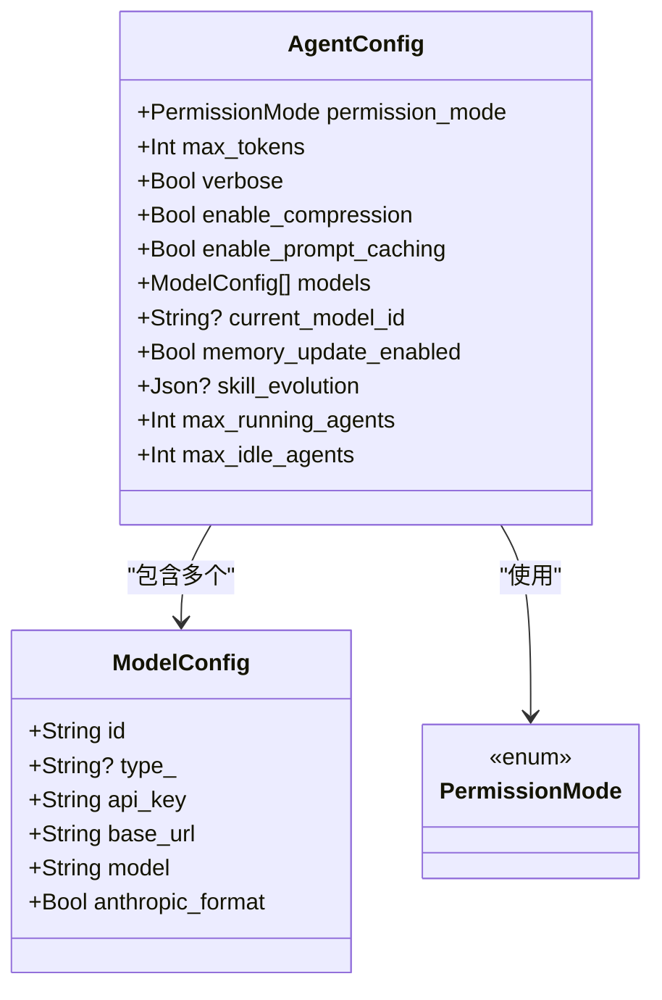
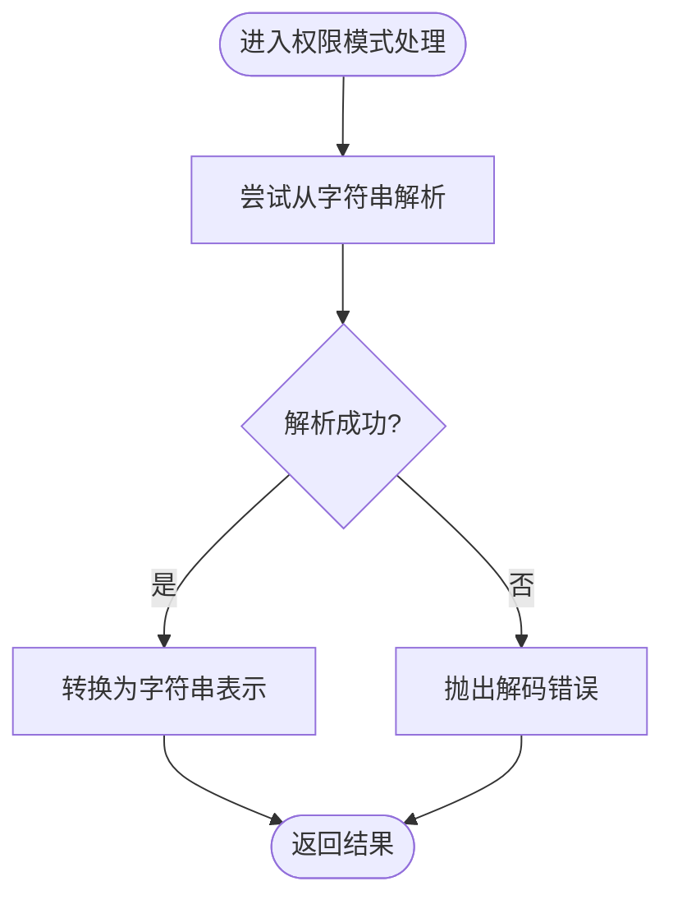
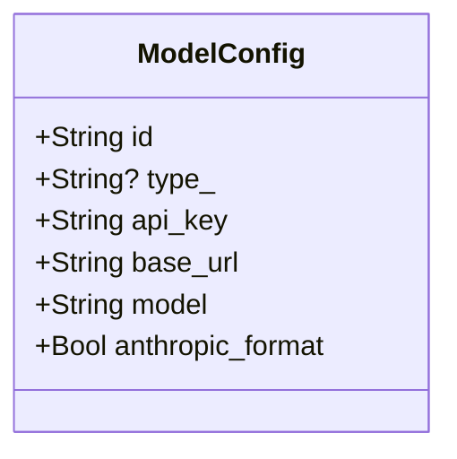
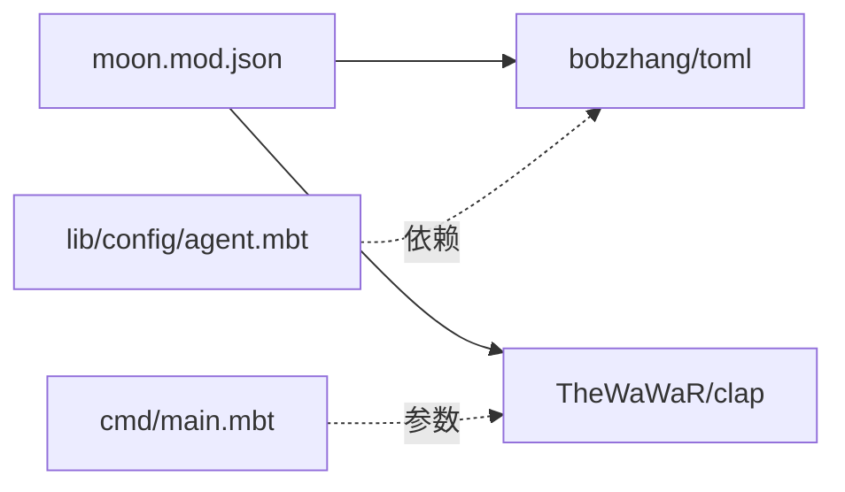

# 配置系统

<cite>
**本文引用的文件**
- [cmd/main.mbt](file://cmd/main.mbt)
- [lib/config/agent.mbt](file://lib/config/agent.mbt)
- [lib/config/model.mbt](file://lib/config/model.mbt)
- [lib/config/permission.mbt](file://lib/config/permission.mbt)
- [moon.mod.json](file://moon.mod.json)
- [README.md](file://README.md)
</cite>

## 目录
1. [简介](#简介)
2. [项目结构](#项目结构)
3. [核心组件](#核心组件)
4. [架构总览](#架构总览)
5. [详细组件分析](#详细组件分析)
6. [依赖分析](#依赖分析)
7. [性能考量](#性能考量)
8. [故障排除指南](#故障排除指南)
9. [结论](#结论)
10. [附录](#附录)

## 简介
本文件系统性阐述 MBOpenClacky 的配置系统，覆盖配置文件结构、支持的配置项与默认值、TOML 与环境变量的优先级与合并规则、权限模式、模型端点、代理配置等主题。同时提供最佳实践、安全建议、常见场景示例与故障排除指南，并说明配置的热更新机制与运行时影响。

## 项目结构
- 配置系统位于 lib/config 目录，包含 Agent 配置、模型配置与权限模式定义。
- 可执行入口 cmd/main.mbt 展示了默认配置的构造与打印，用于验证核心类型初始化。
- 依赖声明中包含 TOML 解析库与命令行解析库，为配置加载与参数注入提供基础。

**图表来源**
- [cmd/main.mbt:1-27](file://cmd/main.mbt#L1-L27)
- [lib/config/agent.mbt:1-34](file://lib/config/agent.mbt#L1-L34)
- [lib/config/model.mbt:1-22](file://lib/config/model.mbt#L1-L22)
- [lib/config/permission.mbt:1-50](file://lib/config/permission.mbt#L1-L50)
- [moon.mod.json:4-8](file://moon.mod.json#L4-L8)

**章节来源**
- [README.md:83-108](file://README.md#L83-L108)
- [moon.mod.json:1-16](file://moon.mod.json#L1-L16)
- [cmd/main.mbt:1-27](file://cmd/main.mbt#L1-L27)

## 核心组件
- AgentConfig：定义代理运行期的全局配置，包含权限模式、令牌上限、日志级别、压缩与提示缓存开关、模型列表、当前模型标识、内存更新开关、技能演化配置、最大运行/空闲代理数量等。
- ModelConfig：定义单个 LLM 模型端点的配置，包含标识、类型、API 密钥、基础地址、模型名、是否使用 Anthropic 格式等。
- PermissionMode：定义权限模式枚举及其序列化/反序列化逻辑，用于控制代理的安全策略。

默认值与字段含义（来自默认构造函数）：
- 权限模式：ConfirmSafes
- 最大令牌数：16384
- 详细输出：false
- 启用压缩：true
- 启用提示缓存：true
- 模型列表：空数组
- 当前模型标识：未设置
- 内存更新：false
- 技能演化：未设置
- 最大运行代理数：10
- 最大空闲代理数：10

**章节来源**
- [lib/config/agent.mbt:17-33](file://lib/config/agent.mbt#L17-L33)
- [lib/config/model.mbt:12-21](file://lib/config/model.mbt#L12-L21)
- [lib/config/permission.mbt:4-44](file://lib/config/permission.mbt#L4-L44)

## 架构总览
配置系统采用“TOML 文件 + 环境变量”的双通道加载策略，结合命令行参数注入，形成从文件到环境再到命令行的优先级链路。权限模式与模型端点作为关键配置项贯穿 Agent 生命周期。

[此图为概念流程图，不直接映射具体源码文件，故不提供图表来源]

## 详细组件分析

### AgentConfig 结构与默认值
- 字段与默认值来源于默认构造函数，涵盖运行期行为的关键开关与容量限制。
- 与权限模式、模型列表、当前模型标识、内存更新、技能演化、并发代理数量等密切相关。

**图表来源**
- [lib/config/agent.mbt:3-15](file://lib/config/agent.mbt#L3-L15)
- [lib/config/model.mbt:3-10](file://lib/config/model.mbt#L3-L10)
- [lib/config/permission.mbt:4-10](file://lib/config/permission.mbt#L4-L10)

**章节来源**
- [lib/config/agent.mbt:17-33](file://lib/config/agent.mbt#L17-L33)
- [lib/config/model.mbt:12-21](file://lib/config/model.mbt#L12-L21)
- [lib/config/permission.mbt:4-44](file://lib/config/permission.mbt#L4-L44)

### 权限模式（PermissionMode）
- 支持字符串序列化/反序列化，便于在 TOML/JSON 中表达。
- 默认值为 ConfirmSafes，表示需要确认的安全模式。
- 提供 from_string 与 to_string_value 方法，以及 ToJson/FromJson 实现。

**图表来源**
- [lib/config/permission.mbt:11-44](file://lib/config/permission.mbt#L11-L44)

**章节来源**
- [lib/config/permission.mbt:4-44](file://lib/config/permission.mbt#L4-L44)

### 模型端点（ModelConfig）
- 单个模型端点的最小必要配置：id、api_key、base_url、model。
- 可选字段：type_（模型类型）、anthropic_format（是否使用 Anthropic 格式）。
- 默认构造函数提供便捷创建方式，未设置 type_ 与 anthropic_format。

**图表来源**
- [lib/config/model.mbt:3-10](file://lib/config/model.mbt#L3-L10)

**章节来源**
- [lib/config/model.mbt:12-21](file://lib/config/model.mbt#L12-L21)

### 配置文件结构与字段参考
- AgentConfig 关键字段
  - permission_mode：权限模式（默认 ConfirmSafes）
  - max_tokens：最大生成令牌数（默认 16384）
  - verbose：详细输出（默认 false）
  - enable_compression：启用压缩（默认 true）
  - enable_prompt_caching：启用提示缓存（默认 true）
  - models：模型端点数组（默认空）
  - current_model_id：当前模型标识（默认未设置）
  - memory_update_enabled：内存更新开关（默认 false）
  - skill_evolution：技能演化配置（默认未设置）
  - max_running_agents：最大运行代理数（默认 10）
  - max_idle_agents：最大空闲代理数（默认 10）

- ModelConfig 关键字段
  - id：模型唯一标识
  - type_：模型类型（可选）
  - api_key：API 密钥
  - base_url：模型服务基础地址
  - model：模型名称
  - anthropic_format：是否使用 Anthropic 格式（默认 false）

- 权限模式
  - 默认 ConfirmSafes
  - 支持字符串序列化/反序列化

**章节来源**
- [lib/config/agent.mbt:17-33](file://lib/config/agent.mbt#L17-L33)
- [lib/config/model.mbt:12-21](file://lib/config/model.mbt#L12-L21)
- [lib/config/permission.mbt:4-44](file://lib/config/permission.mbt#L4-L44)

### TOML 配置与环境变量优先级与合并规则
- 优先级链路（从高到低）：命令行参数 > 环境变量 > TOML 配置文件。
- 合并策略：
  - 字段级合并：若某字段在多来源出现，采用最高优先级来源的值。
  - 数组/对象：通常以“替换”方式处理，避免深层递归合并导致的歧义。
  - 环境变量命名规范：建议使用全大写、下划线分隔的形式，例如 CONFIG_PERMISSION_MODE、CONFIG_MODELS_0_API_KEY。
- TOML 示例结构（示意）：
  - [agent]
    - permission_mode = "ConfirmSafes"
    - max_tokens = 16384
    - verbose = false
    - enable_compression = true
    - enable_prompt_caching = true
    - max_running_agents = 10
    - max_idle_agents = 10
  - [[agent.models]]
    - id = "claude-3"
    - api_key = "sk-..."
    - base_url = "https://api.anthropic.com"
    - model = "claude-3-sonnet"
    - anthropic_format = true
  - [[agent.models]]
    - id = "gpt-4"
    - api_key = "sk-..."
    - base_url = "https://api.openai.com"
    - model = "gpt-4-turbo"
    - anthropic_format = false

[本节为通用配置原则说明，不直接分析具体源码文件，故不提供章节来源]

### 环境变量与命令行参数
- 环境变量用于覆盖 TOML 配置，适合容器化与 CI/CD 场景。
- 命令行参数用于一次性覆盖，适合临时调试与运维操作。
- 建议在容器中通过环境变量注入敏感信息（如 API 密钥），并在宿主机上通过命令行参数进行快速切换。

**章节来源**
- [moon.mod.json:4-8](file://moon.mod.json#L4-L8)
- [README.md:118-149](file://README.md#L118-L149)

### 权限模式与安全考虑
- ConfirmSafes 为默认安全模式，建议在生产环境保持该模式或更严格模式。
- 权限模式的字符串化/反序列化需严格校验，避免非法输入导致的配置异常。
- 敏感字段（如 api_key）应优先通过环境变量注入，避免硬编码在配置文件中。

**章节来源**
- [lib/config/permission.mbt:11-44](file://lib/config/permission.mbt#L11-L44)
- [lib/config/model.mbt:12-21](file://lib/config/model.mbt#L12-L21)

### 代理配置与并发控制
- max_running_agents 与 max_idle_agents 控制代理池规模，避免资源耗尽。
- memory_update_enabled 与 skill_evolution 影响代理记忆与能力演化，建议在测试环境开启，生产环境谨慎启用。

**章节来源**
- [lib/config/agent.mbt:17-33](file://lib/config/agent.mbt#L17-L33)

### 热更新机制与运行时影响
- 热更新能力取决于应用是否在运行时重新加载配置文件与环境变量。
- 若支持热更新，建议：
  - 仅对非关键路径（如日志级别、缓存开关）进行热更新。
  - 对模型端点变更、权限模式切换等关键配置，采用重启生效，确保一致性。
  - 提供配置校验钩子，在更新后立即验证配置有效性。

[本节为通用机制说明，不直接分析具体源码文件，故不提供章节来源]

## 依赖分析
- 依赖声明包含 TOML 解析库与命令行解析库，为配置系统的文件解析与参数注入提供基础。
- 项目开发路线明确将“配置系统（TOML / 环境变量 / 路径）”列为后续阶段，表明配置系统仍在完善中。

**图表来源**
- [moon.mod.json:4-8](file://moon.mod.json#L4-L8)
- [cmd/main.mbt:1-27](file://cmd/main.mbt#L1-L27)

**章节来源**
- [moon.mod.json:1-16](file://moon.mod.json#L1-L16)
- [README.md:159-177](file://README.md#L159-L177)

## 性能考量
- 启用压缩与提示缓存可减少网络传输与重复计算，但需权衡 CPU 开销。
- 合理设置 max_tokens 与并发代理数量，避免内存与带宽瓶颈。
- 将敏感配置置于环境变量，减少磁盘读取与配置解析开销。

[本节为通用性能建议，不直接分析具体源码文件，故不提供章节来源]

## 故障排除指南
- 权限模式解析失败
  - 现象：反序列化时报错，提示无效的权限模式。
  - 排查：确认配置中的字符串值与枚举定义一致，检查大小写与拼写。
  - 参考：权限模式的字符串化/反序列化实现。
- API 密钥无效或缺失
  - 现象：模型请求失败或被拒绝。
  - 排查：确认环境变量或配置文件中的 api_key 是否正确，是否被覆盖。
- 模型端点不可达
  - 现象：连接超时或返回非 2xx。
  - 排查：检查 base_url 与网络连通性，确认代理/防火墙设置。
- 并发代理过多导致资源不足
  - 现象：内存占用飙升或响应变慢。
  - 排查：调整 max_running_agents 与 max_idle_agents，观察系统负载。

**章节来源**
- [lib/config/permission.mbt:32-44](file://lib/config/permission.mbt#L32-L44)
- [lib/config/model.mbt:12-21](file://lib/config/model.mbt#L12-L21)
- [lib/config/agent.mbt:17-33](file://lib/config/agent.mbt#L17-L33)

## 结论
MBOpenClacky 的配置系统以 AgentConfig 为核心，结合 PermissionMode 与 ModelConfig，提供了灵活而安全的配置能力。通过 TOML 文件、环境变量与命令行参数的多通道加载与优先级合并，用户可在不同场景下高效地定制系统行为。建议在生产环境中优先使用环境变量注入敏感信息，谨慎启用热更新，并根据实际负载调整并发与缓存策略。

## 附录

### 常见配置场景示例
- 单模型端点（Anthropic）
  - 设置 permission_mode 为 ConfirmSafes
  - 添加 models 列表，包含 id、api_key、base_url、model、anthropic_format
- 多模型端点（混合供应商）
  - 在 models 列表中添加多个 ModelConfig，分别指向不同供应商的基础地址
- 容器化部署
  - 通过环境变量注入 api_key 与 base_url，避免将密钥写入镜像
- 调试与开发
  - 使用命令行参数临时提高 verbose，或切换 permission_mode 进行安全测试

[本节为场景示例说明，不直接分析具体源码文件，故不提供章节来源]