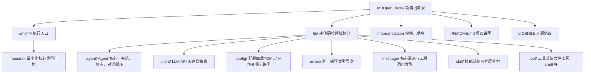
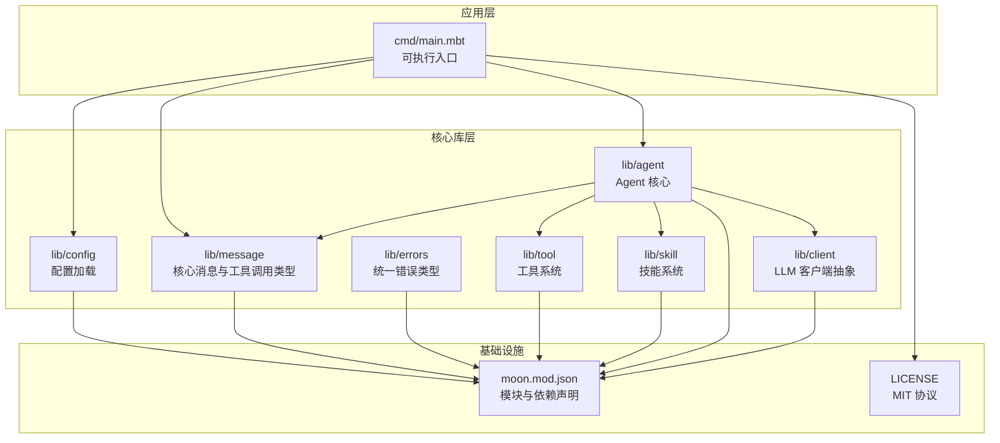
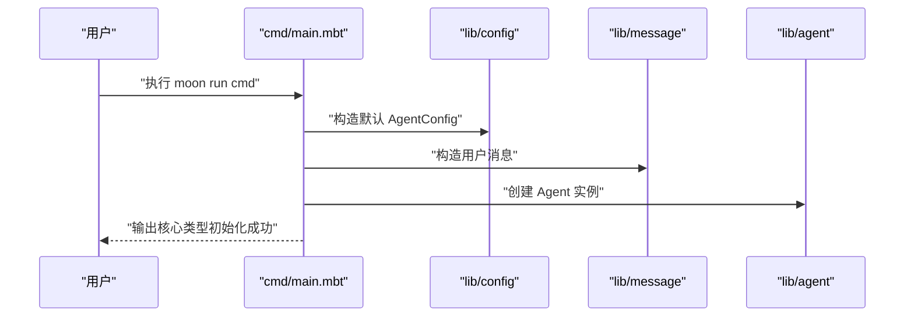
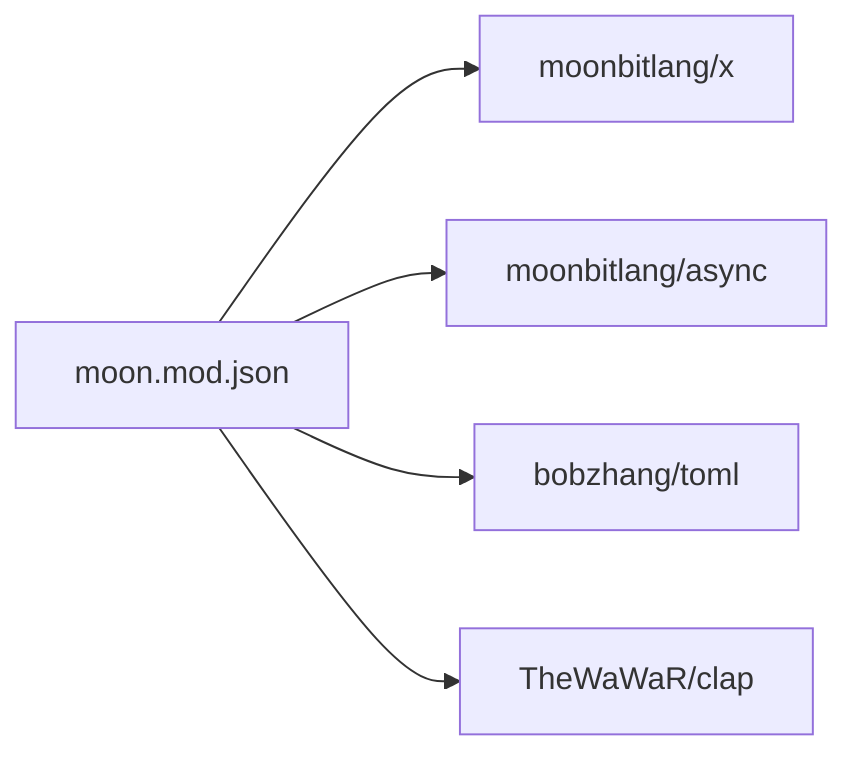

# 项目概述

<cite>
**本文引用的文件**
- [README.md](file://README.md)
- [moon.mod.json](file://moon.mod.json)
- [cmd/main.mbt](file://cmd/main.mbt)
- [LICENSE](file://LICENSE)
</cite>

## 目录
1. [简介](#简介)
2. [项目结构](#项目结构)
3. [核心组件](#核心组件)
4. [架构总览](#架构总览)
5. [详细组件分析](#详细组件分析)
6. [依赖分析](#依赖分析)
7. [性能考量](#性能考量)
8. [故障排查指南](#故障排查指南)
9. [结论](#结论)
10. [附录](#附录)

## 简介
MBOpenClacky 是开源项目 openclacky 的 MoonBit 语言重写版本，目标是在保留原项目核心能力（LLM 交互、自主 Agent、工具系统、技能系统、IM 渠道集成、CLI + Web UI）的同时，借助 MoonBit 的语言特性带来更强的类型安全、更小的运行时体积与更易演化的工程结构。

- 项目定位：业界最节省 Token 的开源 AI Agent CLI 工具（语言级重写版）
- 语言与目标：MoonBit，强调类型安全、AOT 编译、工程化改进
- 协议与版权：遵循 MIT 协议，与上游 openclacky 完全一致
- 重写动机：丰富 MoonBit 生态、个人学习与原理探索、以重写驱动深度理解

**章节来源**
- [README.md:5-26](file://README.md#L5-L26)
- [README.md:27-47](file://README.md#L27-L47)
- [README.md:178-181](file://README.md#L178-L181)

## 项目结构
项目采用按领域划分的包结构，核心模块与上游 openclacky 的核心概念一一对应：

**图表来源**
- [README.md:83-108](file://README.md#L83-L108)
- [moon.mod.json:1-16](file://moon.mod.json#L1-L16)

**章节来源**
- [README.md:83-108](file://README.md#L83-L108)
- [moon.mod.json:1-16](file://moon.mod.json#L1-L16)

## 核心组件
- cmd：可执行入口，当前包含最小化核心类型自检逻辑，用于验证脚手架搭建完成度
- lib.agent：Agent 核心，负责会话、状态与对话循环
- lib.client：LLM API 客户端抽象，支持多后端统一接口
- lib.config：配置加载，支持 TOML、环境变量与路径组合
- lib.errors：统一错误类型层次，配合 Checked Error Handling
- lib.message：核心消息与工具调用类型，提供角色、内容、工具调用等建模
- lib.skill：技能系统，提供可扩展能力机制
- lib.tool：工具系统，覆盖文件读写、shell 等内置工具

**章节来源**
- [README.md:83-108](file://README.md#L83-L108)
- [cmd/main.mbt:1-27](file://cmd/main.mbt#L1-L27)

## 架构总览
整体架构围绕“类型安全 + 结构化模块”展开，通过 MoonBit 的 struct + trait 组合替代 Ruby 的 mixin，使能力边界、依赖与扩展点在类型层面显性化。工程采用一体化工具链 moon，提供构建、检查、测试、格式化、文档与 IDE 支持。

**图表来源**
- [cmd/main.mbt:1-27](file://cmd/main.mbt#L1-L27)
- [moon.mod.json:1-16](file://moon.mod.json#L1-L16)
- [LICENSE:1-23](file://LICENSE#L1-L23)

## 详细组件分析

### 组件 A：可执行入口（cmd）
- 职责：作为 CLI 入口，当前进行最小化核心类型自检，验证配置、消息与 Agent 实例的构造
- 行为：打印版本信息与核心类型初始化结果，用于快速验证开发环境与脚手架完整性
- 扩展：后续将接入 CLI 参数解析、会话管理与完整对话循环

**图表来源**
- [cmd/main.mbt:1-27](file://cmd/main.mbt#L1-L27)

**章节来源**
- [cmd/main.mbt:1-27](file://cmd/main.mbt#L1-L27)

### 组件 B：配置系统（lib.config）
- 职责：负责从多种来源加载配置（TOML、环境变量、路径），并与上游 openclacky 的配置体系对齐
- 设计要点：结合 TOML 解析与环境变量覆盖，提供可组合的配置加载策略
- 依赖：依赖 bobzhang/toml 包

**章节来源**
- [README.md:83-108](file://README.md#L83-L108)
- [moon.mod.json:4-8](file://moon.mod.json#L4-L8)

### 组件 C：消息与工具调用（lib.message）
- 职责：定义核心消息类型、角色（如用户、助手、系统）、工具调用与工具结果等
- 设计要点：以结构体与枚举建模，确保类型安全与可读性
- 价值：为 Agent 的对话循环与工具调用提供统一的数据契约

**章节来源**
- [README.md:83-108](file://README.md#L83-L108)

### 组件 D：Agent 核心（lib.agent）
- 职责：实现会话管理、状态机、对话循环、工具调用调度与成本追踪
- 设计要点：以 trait 组合替代 Ruby mixin，使能力边界与依赖显性化
- 价值：在统一内核之上支持 CLI、TUI 与 Web UI 的协同

**章节来源**
- [README.md:83-108](file://README.md#L83-L108)

### 组件 E：客户端抽象（lib.client）
- 职责：抽象 LLM API 接口，屏蔽不同后端（如 Claude、OpenAI、DeepSeek）差异
- 设计要点：统一请求/响应模型、流式响应（SSE）与并发处理
- 价值：为上层 Agent 提供稳定、可扩展的 LLM 交互能力

**章节来源**
- [README.md:78-82](file://README.md#L78-L82)
- [README.md:71-76](file://README.md#L71-L76)

### 组件 F：工具与技能系统（lib.tool 与 lib.skill）
- 职责：工具系统提供文件读写、shell 等内置能力；技能系统提供可扩展能力机制
- 设计要点：以 trait 描述能力契约，便于动态装配与替换
- 价值：在不修改核心的前提下扩展 Agent 的外部交互能力

**章节来源**
- [README.md:83-108](file://README.md#L83-L108)

### 组件 G：错误处理（lib.errors）
- 职责：统一错误类型层次，配合 Checked Error Handling 机制
- 设计要点：使用 raise/? 与 Result 风格组合，使错误路径在编译期可追踪
- 价值：将运行时错误前置为编译期错误，降低线上故障面

**章节来源**
- [README.md:53-57](file://README.md#L53-L57)

## 依赖分析
项目依赖由 moon.mod.json 声明，核心依赖包括：
- moonbitlang/x：标准库与通用工具
- moonbitlang/async：异步原语（HTTP、WebSocket、Process）
- bobzhang/toml：TOML 配置解析
- TheWaWaR/clap：CLI 参数解析

**图表来源**
- [moon.mod.json:4-8](file://moon.mod.json#L4-L8)

**章节来源**
- [moon.mod.json:1-16](file://moon.mod.json#L1-L16)

## 性能考量
- AOT 编译到原生代码：相较 Ruby 的解释执行，启动与运行延迟显著降低，适合本地常驻或一次性命令调用
- 更低内存占用：无 Ruby VM 与 GC 元数据负担，二进制可分发，部署更轻量
- 无需运行时：终端用户无需安装 Ruby/Bundler，单一可执行文件即可运行
- 异步与并发：借助 moonbitlang/async 提供的统一异步原语，编写流式 LLM 响应处理与并发工具调用更直观

**章节来源**
- [README.md:58-62](file://README.md#L58-L62)
- [README.md:68-70](file://README.md#L68-L70)

## 故障排查指南
- 环境与工具链
  - 确认已安装 MoonBit 工具链，推荐版本与目标后端已在 moon.mod.json 中声明
  - 使用 moon update 与 moon install 获取依赖
- 构建与运行
  - 使用 moon build 进行构建，默认按 preferred-target (native) 构建
  - 使用 moon run cmd 运行可执行入口
- 类型与语法检查
  - 使用 moon check 进行类型与语法检查
- 测试
  - 使用 moon test 运行测试套件

**章节来源**
- [README.md:110-158](file://README.md#L110-L158)
- [moon.mod.json:14](file://moon.mod.json#L14)

## 结论
MBOpenClacky 以 MoonBit 语言重写 openclacky，不仅保留了原项目的核心能力，还在类型安全、性能与工程化方面带来显著提升。通过模块化与类型系统，项目为 MoonBit 生态提供了端到端的 AI Agent 实践样本，并沉淀可复用的基础组件。当前阶段已完成脚手架与核心类型自检，后续将按阶段推进配置系统、HTTP 客户端、工具系统、Agent 核心、CLI/TUI/Web 界面与技能系统等功能模块。

**章节来源**
- [README.md:159-177](file://README.md#L159-L177)
- [README.md:44-47](file://README.md#L44-L47)

## 附录

### 快速开始
- 安装 MoonBit 工具链（版本要求见环境要求）
- 获取依赖：执行 moon update 与 moon install
- 类型与语法检查：执行 moon check
- 构建：执行 moon build（默认 native 后端）
- 运行：执行 moon run cmd 或运行已构建的可执行文件
- 测试：执行 moon test

**章节来源**
- [README.md:110-158](file://README.md#L110-L158)

### 开发阶段路线（节选）
- Phase 0：项目脚手架 + 核心类型（已完成）
- Phase 1：配置系统（TOML / 环境变量 / 路径）
- Phase 2：HTTP 客户端 + LLM API（含 SSE 流式）
- Phase 3：工具系统（Tool trait + 内置工具）
- Phase 4：Agent 核心（对话循环、工具调用、成本追踪）
- Phase 5：CLI 界面（基于 clap）
- Phase 6：TUI 界面（基于 onebit-tui）
- Phase 7：Web 服务器（基于 crescent，含 WebSocket / SSE）
- Phase 8：技能系统
- Phase 9：文件 / 文档 / 图像处理
- Phase 10：数据持久化（SQLite + 加密）
- Phase 11：集成测试与性能优化

**章节来源**
- [README.md:159-177](file://README.md#L159-L177)