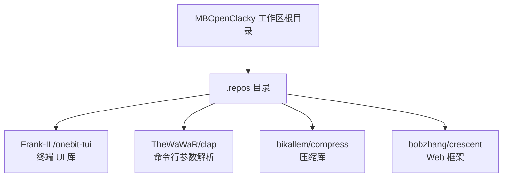
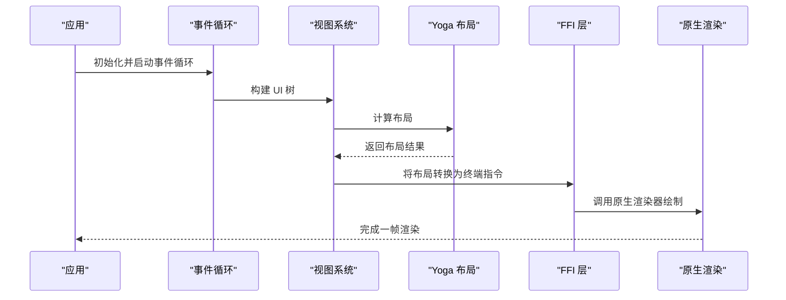
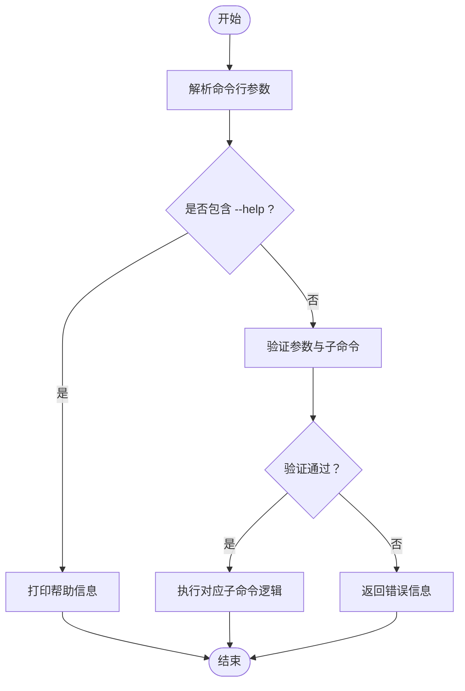
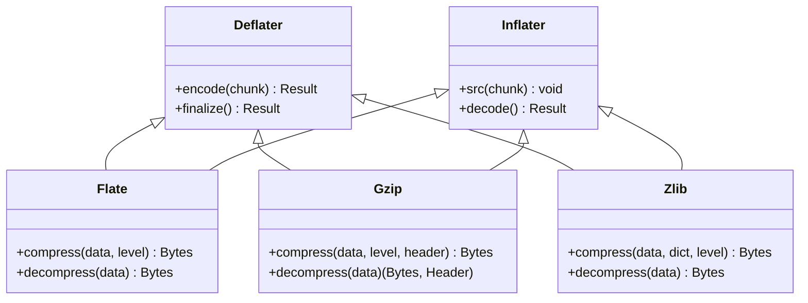
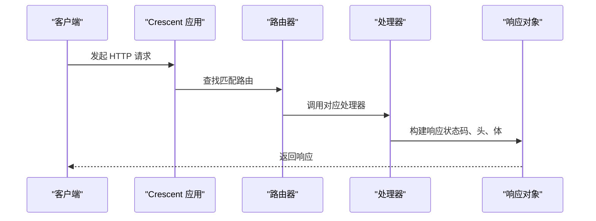
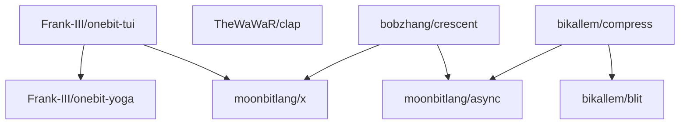

# 项目概述

<cite>
**本文档引用的文件**
- [moon.mod.json](file://.repos\Frank-III\onebit-tui\0.1.3\moon.mod.json)
- [README.md](file://.repos\Frank-III\onebit-tui\0.1.3\README.md)
- [moon.mod.json](file://.repos\TheWaWaR\clap\0.2.6\moon.mod.json)
- [README.md](file://.repos\TheWaWaR\clap\0.2.6\README.md)
- [moon.mod.json](file://.repos\bikallem\compress\0.3.4\moon.mod.json)
- [README.md](file://.repos\bikallem\compress\0.3.4\README.md)
- [moon.mod.json](file://.repos\bobzhang\crescent\0.10.0\moon.mod.json)
- [README.md](file://.repos\bobzhang\crescent\0.10.0\README.md)
</cite>

## 目录
1. [引言](#引言)
2. [项目结构](#项目结构)
3. [核心组件](#核心组件)
4. [架构总览](#架构总览)
5. [详细组件分析](#详细组件分析)
6. [依赖关系分析](#依赖关系分析)
7. [性能考虑](#性能考虑)
8. [故障排除指南](#故障排除指南)
9. [结论](#结论)

## 引言

MBOpenClacky 是一个 MoonBit 实验性项目，旨在探索 MoonBit 生态系统中多仓库协作的可能性，并通过实际组件组合展示 MoonBit 的模块化生态与跨领域能力。该项目并非单一应用，而是以“依赖管理演示”的形式，将多个 MoonBit 生态中的独立组件（终端 UI、命令行解析、压缩算法、Web 框架）进行整合与协同，形成一个可运行的示例工程。

MoonBit 是一门新兴的系统编程语言，强调简洁、安全与高性能，支持多后端编译（原生、JavaScript、WebAssembly）。在本项目中，MoonBit 的包管理器与工作区机制被用来统一管理来自不同作者与组织的模块，体现了 MoonBit 在多仓库协作上的灵活性与可扩展性。

本项目具有以下特殊性质：
- 作为依赖管理演示：通过 .repos 目录下的多个子模块，展示如何在 MoonBit 工作区内组织与管理多来源依赖。
- 跨领域能力展示：集合了终端 UI、命令行工具、压缩库与 Web 框架等不同领域的组件，体现 MoonBit 生态的多样性与互补性。
- 多仓库协作范式：通过 moon.mod.json 与 moon.pkg.json 的协作，演示如何在不修改源码的情况下实现模块间的链接与集成。

## 项目结构

项目采用“工作区 + 多仓库”结构，所有外部依赖均通过 .repos 目录集中管理。每个子模块都是一个独立的 MoonBit 包，拥有自己的 moon.mod.json、moon.pkg.json 与源码目录。这种结构便于：
- 隔离不同功能域的实现
- 独立版本控制与发布
- 在同一工程内进行多模块联调

图表来源
- [moon.mod.json:1-19](file://.repos\Frank-III\onebit-tui\0.1.3\moon.mod.json#L1-L19)
- [moon.mod.json:1-11](file://.repos\TheWaWaR\clap\0.2.6\moon.mod.json#L1-L11)
- [moon.mod.json:1-33](file://.repos\bikallem\compress\0.3.4\moon.mod.json#L1-L33)
- [moon.mod.json:1-21](file://.repos\bobzhang\crescent\0.10.0\moon.mod.json#L1-L21)

章节来源
- [moon.mod.json:1-19](file://.repos\Frank-III\onebit-tui\0.1.3\moon.mod.json#L1-L19)
- [moon.mod.json:1-11](file://.repos\TheWaWaR\clap\0.2.6\moon.mod.json#L1-L11)
- [moon.mod.json:1-33](file://.repos\bikallem\compress\0.3.4\moon.mod.json#L1-L33)
- [moon.mod.json:1-21](file://.repos\bobzhang\crescent\0.10.0\moon.mod.json#L1-L21)

## 核心组件

本项目通过四个核心组件展示了 MoonBit 生态的不同能力边界：

- 终端 UI 组件（Frank-III/onebit-tui）
  - 提供声明式视图、Yoga 布局引擎与原生渲染能力，适合构建高性能终端界面。
  - 关键特性：Flexbox 布局、事件循环、焦点管理、富边框与溢出处理。
  - 参考路径：[README.md:1-414](file://.repos\Frank-III\onebit-tui\0.1.3\README.md#L1-L414)，[moon.mod.json:1-19](file://.repos\Frank-III\onebit-tui\0.1.3\moon.mod.json#L1-L19)

- 命令行参数解析（TheWaWaR/clap）
  - 支持标志、命名与位置参数，无限层级子命令，环境变量默认值，帮助信息生成等。
  - 参考路径：[README.md:1-50](file://.repos\TheWaWaR\clap\0.2.6\README.md#L1-L50)，[moon.mod.json:1-11](file://.repos\TheWaWaR\clap\0.2.6\moon.mod.json#L1-L11)

- 压缩库（bikallem/compress）
  - 纯 MoonBit 实现的多格式压缩库，覆盖 DEFLATE、gzip、zlib、LZW、bzip2、Brotli、Zstandard、LZ4 等。
  - 特点：多目标支持（原生、JS、WASM）、硬件加速校验、信号协议流式接口、异步流。
  - 参考路径：[README.md:1-289](file://.repos\bikallem\compress\0.3.4\README.md#L1-L289)，[moon.mod.json:1-33](file://.repos\bikallem\compress\0.3.4\moon.mod.json#L1-L33)

- Web 框架（bobzhang/crescent）
  - 类型安全、原生优先的 Web 框架，支持路由、中间件、静态资源、WebSocket、CORS、错误映射等。
  - 参考路径：[README.md:1-914](file://.repos\bobzhang\crescent\0.10.0\README.md#L1-L914)，[moon.mod.json:1-21](file://.repos\bobzhang\crescent\0.10.0\moon.mod.json#L1-L21)

章节来源
- [README.md:1-414](file://.repos\Frank-III\onebit-tui\0.1.3\README.md#L1-L414)
- [moon.mod.json:1-19](file://.repos\Frank-III\onebit-tui\0.1.3\moon.mod.json#L1-L19)
- [README.md:1-50](file://.repos\TheWaWaR\clap\0.2.6\README.md#L1-L50)
- [moon.mod.json:1-11](file://.repos\TheWaWaR\clap\0.2.6\moon.mod.json#L1-L11)
- [README.md:1-289](file://.repos\bikallem\compress\0.3.4\README.md#L1-L289)
- [moon.mod.json:1-33](file://.repos\bikallem\compress\0.3.4\moon.mod.json#L1-L33)
- [README.md:1-914](file://.repos\bobzhang\crescent\0.10.0\README.md#L1-L914)
- [moon.mod.json:1-21](file://.repos\bobzhang\crescent\0.10.0\moon.mod.json#L1-L21)

## 架构总览

MBOpenClacky 的整体架构围绕“工作区 + 多模块依赖”的模式展开。各组件通过 moon.mod.json 声明依赖关系，通过 moon.pkg.json 进行导入与链接配置。下图展示了从应用层到底层依赖的分层关系：

图表来源
- [README.md:292-310](file://.repos\Frank-III\onebit-tui\0.1.3\README.md#L292-L310)
- [moon.mod.json:9-12](file://.repos\Frank-III\onebit-tui\0.1.3\moon.mod.json#L9-L12)

章节来源
- [README.md:292-310](file://.repos\Frank-III\onebit-tui\0.1.3\README.md#L292-L310)
- [moon.mod.json:9-12](file://.repos\Frank-III\onebit-tui\0.1.3\moon.mod.json#L9-L12)

## 详细组件分析

### 终端 UI 组件（onebit-tui）

- 视图系统与布局
  - 使用 Yoga Flexbox 引擎进行响应式布局，支持方向、间距、对齐与百分比尺寸等属性。
  - 参考路径：[README.md:153-166](file://.repos\Frank-III\onebit-tui\0.1.3\README.md#L153-L166)

- 事件处理与焦点管理
  - 提供全局事件处理器与组件级事件绑定；自动处理 Tab 导航与焦点高亮。
  - 参考路径：[README.md:227-266](file://.repos\Frank-III\onebit-tui\0.1.3\README.md#L227-L266)

- 内置小部件
  - 列表、输入框、按钮、进度条、滚动盒等常用 UI 组件，支持自定义渲染与样式。
  - 参考路径：[README.md:180-225](file://.repos\Frank-III\onebit-tui\0.1.3\README.md#L180-L225)

- FFI 与原生渲染
  - 通过 Zig/C 编写的渲染器提供高性能终端输出；需要在 moon.pkg.json 中配置链接标志。
  - 参考路径：[README.md:318-338](file://.repos\Frank-III\onebit-tui\0.1.3\README.md#L318-L338)

图表来源
- [README.md:292-310](file://.repos\Frank-III\onebit-tui\0.1.3\README.md#L292-L310)

章节来源
- [README.md:134-266](file://.repos\Frank-III\onebit-tui\0.1.3\README.md#L134-L266)
- [README.md:318-338](file://.repos\Frank-III\onebit-tui\0.1.3\README.md#L318-L338)

### 命令行参数解析（clap）

- 参数类型与行为
  - 支持标志、命名与位置参数；支持子命令无限层级、默认值、环境变量注入、帮助信息生成。
  - 参考路径：[README.md:4-13](file://.repos\TheWaWaR\clap\0.2.6\README.md#L4-L13)

- 使用示例
  - 展示了如何定义子命令、参数与帮助输出生成。
  - 参考路径：[README.md:15-48](file://.repos\TheWaWaR\clap\0.2.6\README.md#L15-L48)

图表来源
- [README.md:15-48](file://.repos\TheWaWaR\clap\0.2.6\README.md#L15-L48)

章节来源
- [README.md:4-48](file://.repos\TheWaWaR\clap\0.2.6\README.md#L4-L48)
- [moon.mod.json:1-11](file://.repos\TheWaWaR\clap\0.2.6\moon.mod.json#L1-L11)

### 压缩库（compress）

- 多格式支持
  - 覆盖 DEFLATE、gzip、zlib、LZW、bzip2、Brotli、Zstandard、LZ4 等主流压缩格式。
  - 参考路径：[README.md:35-48](file://.repos\bikallem\compress\0.3.4\README.md#L35-L48)

- 流式接口与异步支持
  - 所有格式提供 Deflater/Inflater 类型，采用信号协议风格的增量处理；flate/async 提供基于 @io.Reader/@io.Writer 的异步流。
  - 参考路径：[README.md:106-196](file://.repos\bikallem\compress\0.3.4\README.md#L106-L196)

- 性能基准
  - 在原生后端上与 Go 标准库对比，展示不同格式的压缩/解压速度差异。
  - 参考路径：[README.md:232-283](file://.repos\bikallem\compress\0.3.4\README.md#L232-L283)

图表来源
- [README.md:106-196](file://.repos\bikallem\compress\0.3.4\README.md#L106-L196)

章节来源
- [README.md:106-196](file://.repos\bikallem\compress\0.3.4\README.md#L106-L196)
- [README.md:232-283](file://.repos\bikallem\compress\0.3.4\README.md#L232-L283)
- [moon.mod.json:1-33](file://.repos\bikallem\compress\0.3.4\moon.mod.json#L1-L33)

### Web 框架（crescent）

- 路由与资源
  - 支持静态与动态路由、路由组、资源 CRUD、通配符匹配与参数提取。
  - 参考路径：[README.md:406-458](file://.repos\bobzhang\crescent\0.10.0\README.md#L406-L458)

- 中间件与错误处理
  - 内置安全头、请求 ID、限流与 CORS 中间件；自动将错误映射为 JSON 响应。
  - 参考路径：[README.md:722-747](file://.repos\bobzhang\crescent\0.10.0\README.md#L722-L747)

- 静态资源与 WebSocket
  - 支持 ETag、条件请求、内容协商与目录索引回退；WebSocket 广播与订阅模型。
  - 参考路径：[README.md:484-523](file://.repos\bobzhang\crescent\0.10.0\README.md#L484-L523)

图表来源
- [README.md:406-458](file://.repos\bobzhang\crescent\0.10.0\README.md#L406-L458)

章节来源
- [README.md:406-523](file://.repos\bobzhang\crescent\0.10.0\README.md#L406-L523)
- [moon.mod.json:1-21](file://.repos\bobzhang\crescent\0.10.0\moon.mod.json#L1-L21)

## 依赖关系分析

MBOpenClacky 通过 moon.mod.json 声明各模块的依赖关系，形成清晰的依赖网络。下图展示了主要依赖链路：

图表来源
- [moon.mod.json:9-12](file://.repos\Frank-III\onebit-tui\0.1.3\moon.mod.json#L9-L12)
- [moon.mod.json:4-7](file://.repos\bobzhang\crescent\0.10.0\moon.mod.json#L4-L7)
- [moon.mod.json:4-7](file://.repos\bikallem\compress\0.3.4\moon.mod.json#L4-L7)

章节来源
- [moon.mod.json:9-12](file://.repos\Frank-III\onebit-tui\0.1.3\moon.mod.json#L9-L12)
- [moon.mod.json:4-7](file://.repos\bobzhang\crescent\0.10.0\moon.mod.json#L4-L7)
- [moon.mod.json:4-7](file://.repos\bikallem\compress\0.3.4\moon.mod.json#L4-L7)

## 性能考虑

- 终端 UI 渲染
  - 通过 Zig/C 渲染器与 Yoga 布局引擎实现高性能终端绘制；建议在 moon.pkg.json 中正确配置链接标志，避免构建时缺失依赖导致的性能问题。
  - 参考路径：[README.md:318-338](file://.repos\Frank-III\onebit-tui\0.1.3\README.md#L318-L338)

- 压缩库优化
  - 多格式压缩在原生后端上具备显著性能优势，尤其在解压场景；选择合适的压缩等级与格式可平衡速度与压缩率。
  - 参考路径：[README.md:232-283](file://.repos\bikallem\compress\0.3.4\README.md#L232-L283)

- Web 框架配置
  - 合理设置连接数、请求体大小与超时时间，有助于提升服务稳定性与吞吐量。
  - 参考路径：[README.md:588-618](file://.repos\bobzhang\crescent\0.10.0\README.md#L588-L618)

## 故障排除指南

- 终端 UI 构建与链接
  - 若出现链接错误，请检查 moon.pkg.json 中的链接标志是否正确指向 .mooncakes 下的预构建库路径。
  - 参考路径：[README.md:363-370](file://.repos\Frank-III\onebit-tui\0.1.3\README.md#L363-L370)

- 压缩库兼容性
  - 确认使用的压缩格式与版本符合预期；如需异步流，请使用 flate/async 包提供的接口。
  - 参考路径：[README.md:182-196](file://.repos\bikallem\compress\0.3.4\README.md#L182-L196)

- Web 框架运行环境
  - 确保使用原生目标运行（preferred-target: "native"），并在 moon.mod.json 中声明所需依赖。
  - 参考路径：[README.md:8-12](file://.repos\bobzhang\crescent\0.10.0\README.md#L8-L12)

章节来源
- [README.md:363-370](file://.repos\Frank-III\onebit-tui\0.1.3\README.md#L363-L370)
- [README.md:182-196](file://.repos\bikallem\compress\0.3.4\README.md#L182-L196)
- [README.md:8-12](file://.repos\bobzhang\crescent\0.10.0\README.md#L8-L12)

## 结论

MBOpenClacky 以实验性的方式展示了 MoonBit 生态系统的多仓库协作潜力。通过整合终端 UI、命令行解析、压缩库与 Web 框架等组件，项目不仅验证了 MoonBit 在不同领域的能力，也为未来的多模块工程提供了参考范式。对于初学者而言，该项目提供了清晰的概念与实践路径；对于有经验的开发者，则可以通过深入理解 moon.mod.json 与 moon.pkg.json 的协作机制，进一步探索 MoonBit 的工程化边界。